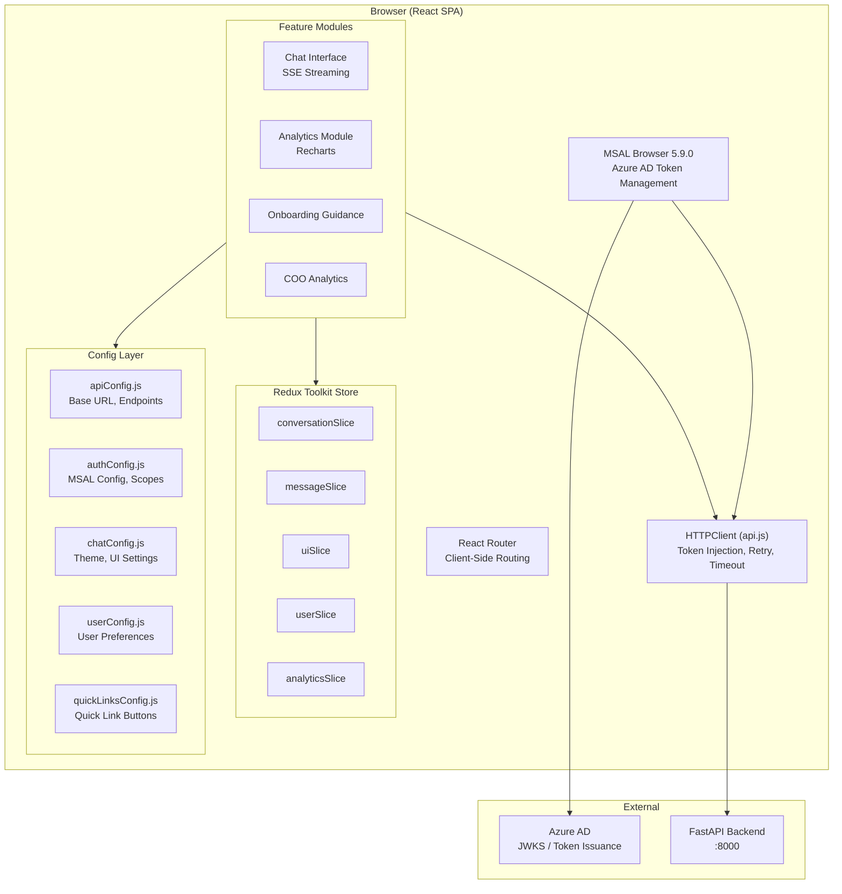

# Frontend Standards — AA-Hackathon Enterprise AI Platform

**Organization:** Aligned Automation  
**Project:** AA-Hackathon Enterprise AI Platform  
**Version:** 1.0  
**Last Updated:** 2026-06-07  
**Owner:** Platform Engineering  

---

## 1. Purpose

This document defines standards for the React frontend application of the AA-Hackathon Enterprise AI Platform. It covers architecture, component patterns, state management, authentication integration, API communication, styling, and build configuration.

---

## 2. Frontend Architecture Overview



---

## 3. Technology Stack

| Technology | Version | Role |
|-----------|---------|------|
| React | 18.3.1 | UI framework |
| Vite | 5.4.0 | Build tool and dev server |
| Redux Toolkit | 2.12.0 | Global state management |
| MSAL Browser | 5.9.0 | Azure AD OAuth2 / OIDC |
| Recharts | 3.8.1 | Data visualization |
| jsPDF | 4.2.1 | Client-side PDF export |
| React Router | Latest v6 | Client-side routing |
| DOMPurify | Latest | XSS sanitization for AI output |

---

## 4. Component Standards

### 4.1 Functional Components Only

Every component is a functional component. Class components are prohibited. No exceptions.

```jsx
// CORRECT — functional component with hooks
const ConversationPanel = ({ conversationId }) => {
  const { messages, loading } = useSelector(selectMessages(conversationId));
  const dispatch = useDispatch();

  useEffect(() => {
    dispatch(loadMessages(conversationId));
  }, [conversationId, dispatch]);

  if (loading) return <LoadingSpinner />;

  return (
    <div className="conversation-panel">
      {messages.map(msg => (
        <MessageBubble key={msg.id} message={msg} />
      ))}
    </div>
  );
};

export default ConversationPanel;
```

### 4.2 Props Down, Events Up

Data flows down via props. User actions flow up via callback props or Redux dispatches. No direct parent mutation.

```jsx
// Parent passes callback down
<MessageInput onSubmit={(content) => dispatch(sendMessage({ content }))} />

// Child calls callback — never mutates parent state directly
const MessageInput = ({ onSubmit }) => {
  const [value, setValue] = useState('');

  const handleSubmit = (e) => {
    e.preventDefault();
    if (value.trim()) {
      onSubmit(value.trim());
      setValue('');
    }
  };

  return <form onSubmit={handleSubmit}>...</form>;
};
```

### 4.3 Component File Structure

Each component lives in its own directory:

```
src/components/MessageBubble/
├── MessageBubble.jsx          → Component definition
├── MessageBubble.module.css   → Scoped styles
├── MessageBubble.test.jsx     → Unit tests
└── index.js                   → Re-export: export { default } from './MessageBubble';
```

### 4.4 No Direct DOM Manipulation

Never use `document.getElementById`, `document.querySelector`, or `innerHTML` directly. Use React refs (`useRef`) for DOM access when unavoidable (e.g., scroll behavior, focus management).

```jsx
// CORRECT — using ref for scroll behavior
const messagesEndRef = useRef(null);

useEffect(() => {
  messagesEndRef.current?.scrollIntoView({ behavior: 'smooth' });
}, [messages]);

return (
  <div className="messages-container">
    {messages.map(msg => <MessageBubble key={msg.id} message={msg} />)}
    <div ref={messagesEndRef} />
  </div>
);
```

---

## 5. State Management with Redux Toolkit

### 5.1 Slice Organization

Each domain has its own Redux slice:

| Slice | File | Manages |
|-------|------|---------|
| `conversationSlice` | `store/conversationSlice.js` | Conversation list, active conversation |
| `messageSlice` | `store/messageSlice.js` | Messages, streaming state, sources |
| `uiSlice` | `store/uiSlice.js` | Theme, sidebar, modal state |
| `userSlice` | `store/userSlice.js` | Current user profile, preferences |
| `analyticsSlice` | `store/analyticsSlice.js` | Analytics data, date ranges |
| `feedbackSlice` | `store/feedbackSlice.js` | Feedback submission state |

### 5.2 Async Actions with createAsyncThunk

```javascript
// CORRECT — createAsyncThunk for API calls
export const fetchConversations = createAsyncThunk(
  'conversations/fetchAll',
  async ({ page = 1, limit = 20 }, { rejectWithValue }) => {
    try {
      const response = await httpClient.get(`/api/conversations?page=${page}&limit=${limit}`);
      return response.data;
    } catch (error) {
      return rejectWithValue(error.response?.data ?? { message: 'Network error' });
    }
  }
);

// In slice
const conversationSlice = createSlice({
  name: 'conversations',
  initialState: { items: [], loading: false, error: null, total: 0 },
  extraReducers: (builder) => {
    builder
      .addCase(fetchConversations.pending, (state) => { state.loading = true; state.error = null; })
      .addCase(fetchConversations.fulfilled, (state, action) => {
        state.loading = false;
        state.items = action.payload.data;
        state.total = action.payload.total;
      })
      .addCase(fetchConversations.rejected, (state, action) => {
        state.loading = false;
        state.error = action.payload?.message ?? 'Failed to load conversations';
      });
  },
});
```

### 5.3 Selectors

All state access goes through selector functions defined alongside slices:

```javascript
// selectors.js
export const selectConversations = (state) => state.conversations.items;
export const selectConversationById = (id) => (state) =>
  state.conversations.items.find(c => c.id === id);
export const selectConversationsLoading = (state) => state.conversations.loading;
```

---

## 6. Authentication Integration

### 6.1 MSAL Configuration

MSAL is initialized in `src/config/authConfig.js`:

```javascript
export const msalConfig = {
  auth: {
    clientId: import.meta.env.VITE_CLIENT_ID,
    authority: `https://login.microsoftonline.com/${import.meta.env.VITE_TENANT_ID}`,
    redirectUri: import.meta.env.VITE_REDIRECT_URI,
  },
  cache: {
    cacheLocation: 'sessionStorage',
    storeAuthStateInCookie: false,
  },
};

export const loginRequest = {
  scopes: [`api://${import.meta.env.VITE_CLIENT_ID}/access_as_user`],
};
```

### 6.2 Token Injection in ALL API Calls

The `HTTPClient` class in `src/services/api.js` automatically acquires and injects the Bearer token for every request. No component or service should manually handle token acquisition.

```javascript
class HTTPClient {
  constructor() {
    this.baseURL = API_BASE_URL;
    this.maxRetries = 3;
    this.retryDelay = 1000;
  }

  async getAuthToken() {
    const accounts = msalInstance.getAllAccounts();
    if (accounts.length === 0) throw new Error('No authenticated user');

    const tokenResponse = await msalInstance.acquireTokenSilent({
      ...loginRequest,
      account: accounts[0],
    });
    return tokenResponse.accessToken;
  }

  async request(method, endpoint, options = {}) {
    const token = await this.getAuthToken();
    const url = `${this.baseURL}${endpoint}`;

    for (let attempt = 1; attempt <= this.maxRetries; attempt++) {
      try {
        const response = await fetch(url, {
          method,
          headers: {
            'Content-Type': 'application/json',
            'Authorization': `Bearer ${token}`,
            ...options.headers,
          },
          body: options.body ? JSON.stringify(options.body) : undefined,
          signal: AbortSignal.timeout(30_000),
        });

        if (!response.ok) {
          const error = await response.json();
          throw new APIError(error.error, error.message, response.status);
        }

        return await response.json();
      } catch (error) {
        if (attempt === this.maxRetries || error instanceof APIError) throw error;
        await delay(this.retryDelay * attempt);
      }
    }
  }

  get(endpoint, params) { return this.request('GET', endpoint + buildQueryString(params)); }
  post(endpoint, body) { return this.request('POST', endpoint, { body }); }
  put(endpoint, body) { return this.request('PUT', endpoint, { body }); }
  delete(endpoint) { return this.request('DELETE', endpoint); }
}

export const httpClient = new HTTPClient();
```

### 6.3 SSE Streaming with Auth

SSE requires special handling because `EventSource` does not support custom headers. Use `fetch` with `ReadableStream` instead:

```javascript
const streamChat = async (payload, onChunk, onSources, onDone) => {
  const token = await httpClient.getAuthToken();

  const response = await fetch(`${API_BASE_URL}/api/chat/stream`, {
    method: 'POST',
    headers: {
      'Content-Type': 'application/json',
      'Authorization': `Bearer ${token}`,
      'Accept': 'text/event-stream',
    },
    body: JSON.stringify(payload),
  });

  const reader = response.body.getReader();
  const decoder = new TextDecoder();
  let buffer = '';

  while (true) {
    const { done, value } = await reader.read();
    if (done) break;

    buffer += decoder.decode(value, { stream: true });
    const lines = buffer.split('\n');
    buffer = lines.pop();

    for (const line of lines) {
      if (line.startsWith('data: ')) {
        const payload = line.slice(6).trim();
        if (payload === '[DONE]') { onDone(); return; }
        const event = JSON.parse(payload);
        if (event.type === 'chunk') onChunk(event.content);
        if (event.type === 'sources') onSources(event.sources);
        if (event.type === 'error') throw new Error(event.message);
      }
    }
  }
};
```

---

## 7. Configuration Pattern

All configuration lives in `src/config/`. No magic strings or hardcoded URLs in components.

| File | Purpose |
|------|---------|
| `apiConfig.js` | API base URL, all endpoint paths as constants |
| `authConfig.js` | MSAL config, login scopes, token claims |
| `chatConfig.js` | Theme colors, font sizes, chat UI settings, dark/light mode values |
| `userConfig.js` | Default user preferences, supported locales |
| `quickLinksConfig.js` | Quick link button definitions (label, icon, prompt) |

```javascript
// apiConfig.js
export const API_BASE_URL = import.meta.env.VITE_API_URL ?? 'http://localhost:8000';

export const API_ENDPOINTS = {
  CONVERSATIONS: '/api/conversations',
  CHAT_STREAM: '/api/chat/stream',
  DOCUMENTS: '/api/documents',
  ANALYTICS_SUMMARY: '/api/analytics/summary',
  HEALTH: '/api/health',
};
```

---

## 8. Styling Standards

- CSS Modules for component-scoped styles (`.module.css`)
- CSS custom properties (variables) for all theme values — no hardcoded hex colors in JS
- Dark/light mode toggled by switching CSS variables, values defined in `chatConfig.js`
- No inline `style` props for theme-related values (colors, fonts, spacing)
- Inline styles only for truly dynamic values (e.g., progress bar width as percentage)
- Mobile-first responsive design with CSS media queries

```css
/* CORRECT — CSS variable usage */
.message-bubble {
  background-color: var(--color-bubble-bg);
  color: var(--color-text-primary);
  border-radius: var(--radius-md);
  padding: var(--spacing-sm) var(--spacing-md);
}
```

---

## 9. Performance Standards

- **Lazy loading**: Heavy modules (analytics, PDF export) use `React.lazy()` with `Suspense`
- **Code splitting**: Each feature module is a separate Vite chunk
- **Memoization**: `useMemo` and `useCallback` for expensive calculations and stable callbacks
- **List virtualization**: Use `react-window` for lists exceeding 100 items
- **Image optimization**: SVG for icons, WebP for photos, explicit width/height attributes
- **Bundle size target**: < 500KB gzipped for initial bundle

```jsx
// Lazy loading pattern
const AnalyticsModule = React.lazy(() => import('./modules/analytics/AnalyticsModule'));

const App = () => (
  <Suspense fallback={<LoadingSpinner />}>
    <AnalyticsModule />
  </Suspense>
);
```

---

## 10. Accessibility Standards

- All interactive elements have descriptive `aria-label` or `aria-labelledby`
- Keyboard navigation: Tab order follows visual order, all actions accessible via keyboard
- Focus management: Modal/drawer opening moves focus inside, closing restores focus
- Color contrast: minimum 4.5:1 ratio for text (WCAG AA)
- Screen reader announcements for streaming content via `aria-live="polite"`
- Error messages associated with form fields via `aria-describedby`

---

## 11. Build Configuration

### 11.1 Environment Variables (Vite)

Vite exposes `VITE_*` env vars to the browser. Set in `.env` files (never committed) or Docker build args.

| Variable | Description | Example |
|----------|-------------|---------|
| `VITE_API_URL` | Backend API base URL | `http://hackathon.alignedautomation.com:8000` |
| `VITE_TENANT_ID` | Azure AD tenant ID | _(GUID)_ |
| `VITE_CLIENT_ID` | MSAL app client ID | _(GUID)_ |
| `VITE_REDIRECT_URI` | MSAL redirect URI | `https://app.alignedautomation.com` |

### 11.2 Build Commands

```bash
# Development server with HMR
npm run dev

# Production build
npm run build

# Preview production build locally
npm run preview

# Lint
npm run lint

# Tests
npm run test
```

### 11.3 Vite Configuration Notes

- Output directory: `dist/`
- Source maps enabled in development, disabled in production
- Chunks: vendor chunk (React + Redux), feature chunks per module
- Asset inlining threshold: 4KB

---

## 12. Module Structure Reference

```
apps/web-ui/src/
├── components/
│   ├── ChatInterface/         → Main chat panel
│   ├── MessageBubble/         → Individual message display
│   ├── ConversationList/      → Sidebar conversation history
│   ├── QuickLinks/            → Quick link buttons
│   ├── FeedbackButtons/       → Thumbs up/down
│   ├── EscalationForm/        → Help request form
│   ├── SourceCitations/       → RAG source display
│   └── LoadingSpinner/        → Shared loading state
├── modules/
│   ├── analytics/             → Usage analytics dashboard
│   ├── onboarding-guidance/   → New joiner onboarding flows
│   └── coo-analytics/         → COO-level reporting
├── config/
│   ├── apiConfig.js
│   ├── authConfig.js
│   ├── chatConfig.js
│   ├── userConfig.js
│   └── quickLinksConfig.js
├── services/
│   └── api.js                 → HTTPClient class, streamChat
├── store/
│   ├── index.js               → Redux store setup
│   ├── conversationSlice.js
│   ├── messageSlice.js
│   ├── uiSlice.js
│   ├── userSlice.js
│   └── analyticsSlice.js
└── utils/
    ├── dateUtils.js
    ├── formatUtils.js
    └── exportUtils.js         → jsPDF integration
```
