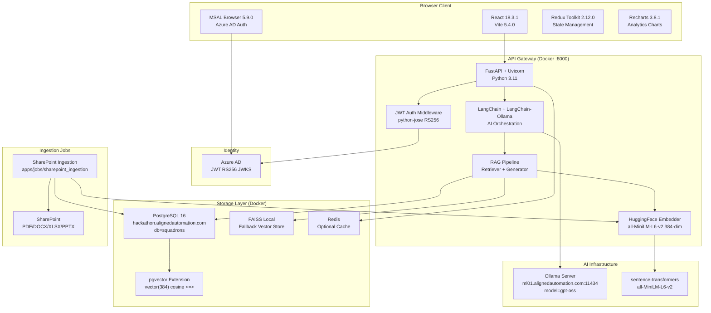

# Technical Standards — AA-Hackathon Enterprise AI Platform

**Organization:** Aligned Automation  
**Project:** AA-Hackathon Enterprise AI Platform  
**Version:** 1.0  
**Last Updated:** 2026-06-07  
**Owner:** Platform Engineering  

---

## 1. Purpose and Scope

This document defines the authoritative technical standards for the AA-Hackathon Enterprise AI Platform. All engineers contributing to this platform must adhere to these standards. Deviations require explicit approval from the platform lead and must be documented in the technical debt register.

These standards govern the full stack: backend services, AI/ML pipeline, vector search, frontend application, infrastructure, and deployment.

---

## 2. Architecture Principles

### 2.1 Core Principles

1. **Separation of Concerns** — Each service, module, and layer has a single well-defined responsibility. Business logic lives in service layers, not controllers or route handlers.

2. **Async-First** — All I/O operations (database, HTTP, file) must use async/await patterns. Blocking synchronous calls inside async contexts are strictly prohibited. Use `asyncio.to_thread()` for unavoidable blocking operations.

3. **Stateless API** — The FastAPI backend is stateless. Session state is not stored server-side. Authentication state is embedded in JWT tokens. Conversation state is stored in PostgreSQL.

4. **Security by Default** — Authentication is required on all API endpoints except `/api/health` and `/api/docs`. No secrets are stored in code or version control. PII is detected and redacted before storage.

5. **Observability** — Every request, error, and significant event is logged in structured JSON format. Logs include request IDs for tracing. Errors are never silently swallowed.

6. **Graceful Degradation** — If pgvector is unavailable, fall back to FAISS local index. If Ollama is unavailable, return a clear error rather than hanging. The platform continues to operate in degraded mode.

7. **Idempotency** — Document ingestion operations are idempotent. Re-running the SharePoint ingestion job produces the same result as running it once on unchanged data.

8. **Soft Delete** — Records are never hard-deleted through application logic. The `is_deleted` flag is set to `true`. Physical deletion is handled by scheduled cleanup jobs per the retention policy.

---

## 3. Approved Technology Stack

### 3.1 Backend

| Component | Technology | Version | Justification |
|-----------|-----------|---------|---------------|
| Language | Python | 3.11 | Stable LTS, async support, ML ecosystem |
| Web Framework | FastAPI | Latest stable | Async-native, Pydantic integration, auto-docs |
| ASGI Server | Uvicorn | Latest stable | High-performance async server for FastAPI |
| AI Orchestration | LangChain | Latest stable | Standardized LLM interface, chain composition |
| LLM Runtime | Ollama | Server at ml01.alignedautomation.com:11434 | On-premise LLM, data privacy |
| LLM Model | gpt-oss | As deployed | Internal model |
| Embedding Model | sentence-transformers/all-MiniLM-L6-v2 | Latest | 384-dim, fast, accurate |
| Alt Embedding | nomic-embed-text | Via Ollama | Same 384-dim, on-prem |
| Database | PostgreSQL | 16 | Stable, pgvector support |
| Vector Extension | pgvector | Latest | Native vector similarity in Postgres |
| Local Vector | FAISS | Latest | Fallback when pgvector unavailable |
| Auth Library | python-jose | Latest | JWT RS256 validation |
| HTTP Client | httpx / aiohttp | Latest | Async HTTP |
| DB Driver | psycopg2 | Latest | PostgreSQL driver, RealDictCursor |

### 3.2 Frontend

| Component | Technology | Version | Justification |
|-----------|-----------|---------|---------------|
| UI Framework | React | 18.3.1 | Industry standard, hooks-based |
| Build Tool | Vite | 5.4.0 | Fast HMR, modern ESM |
| State Management | Redux Toolkit | 2.12.0 | Structured global state |
| Auth Client | MSAL Browser | 5.9.0 | Azure AD integration |
| Charting | Recharts | 3.8.1 | React-native charts |
| PDF Export | jsPDF | 4.2.1 | Client-side PDF generation |

### 3.3 Infrastructure

| Component | Technology | Notes |
|-----------|-----------|-------|
| Containerization | Docker | All services containerized |
| Orchestration | Docker Compose | Development and production |
| Database Image | pgvector/pgvector:pg16 | Official pgvector image |
| Cache | Redis | Optional, for rate limiting / sessions |

---

## 4. Technology Stack Diagram



---

## 5. Prohibited Practices

The following are explicitly prohibited and will cause pull request rejection:

| Prohibited | Reason | Alternative |
|-----------|--------|-------------|
| Synchronous blocking I/O in async context | Blocks event loop, kills performance | `asyncio.to_thread()` or async alternative |
| ORM (SQLAlchemy models) for data access | Project uses raw SQL with psycopg2 for control | Raw SQL with parameterized queries |
| Secrets in source code or `.env` committed to git | Security breach risk | Environment variables, `.env` in `.gitignore` |
| Client-side secrets (API keys, tokens in JS) | Exposed to browser, easily exfiltrated | Backend proxy pattern |
| Markdown formatting in AI responses | LLM markdown is not rendered in chat UI — HTML only | Instruct model to output HTML or plain text |
| Bare `except:` clauses | Catches system exceptions, masks errors | `except SpecificException as e:` |
| String interpolation in SQL queries | SQL injection vulnerability | Parameterized queries with `%s` placeholders |
| `console.log` in production frontend | Performance, information disclosure | Remove before PR, use structured logging |
| Class components in React | Legacy pattern, inconsistent with codebase | Functional components with hooks |
| Direct DOM manipulation in React | Bypasses React reconciliation | State and refs |
| Hardcoded URLs in frontend | Breaks environment switching | `apiConfig.js` constants |

---

## 6. Version Management

### 6.1 Python Dependencies

- All Python dependencies listed in `apps/api-gateway/requirements.txt`
- Pin major and minor versions: `fastapi==0.111.0` not `fastapi>=0.111`
- Update dependencies in a dedicated PR with testing
- Security patches applied within 48 hours of CVE disclosure
- Use `pip-audit` to scan for vulnerabilities in CI

### 6.2 Node.js Dependencies

- All frontend dependencies in `apps/web-ui/package.json`
- Lock file (`package-lock.json`) committed to version control
- `npm audit` run on every build
- Major version upgrades require explicit approval and migration testing

### 6.3 Docker Images

- All images use explicit tags, never `latest` in production
- Base images: `python:3.11-slim`, `node:20-alpine`, `pgvector/pgvector:pg16`
- Image digests stored for reproducible builds
- Vulnerability scanning with `docker scout` before production deploy

---

## 7. Environment Configuration (12-Factor App)

### 7.1 Configuration Source Hierarchy

1. Environment variables (highest priority)
2. `.env` file in project root (local dev only, never committed)
3. Default values in `config.py` (non-sensitive defaults only)

### 7.2 Required Environment Variables

| Variable | Description | Example |
|----------|-------------|---------|
| `SQL_HOST` | PostgreSQL hostname | `hackathon.alignedautomation.com` |
| `SQL_PORT` | PostgreSQL port | `5432` |
| `SQL_DATABASE` | Database name | `squadrons` |
| `SQL_USER` | Database user | `admin` |
| `SQL_PASSWORD` | Database password | _(secret)_ |
| `OLLAMA_BASE_URL` | Ollama server URL | `http://ml01.alignedautomation.com:11434` |
| `OLLAMA_MODEL` | Model name | `gpt-oss` |
| `AZURE_TENANT_ID` | Azure AD tenant ID | _(GUID)_ |
| `AZURE_CLIENT_ID` | App registration client ID | _(GUID)_ |
| `SHAREPOINT_CLIENT_ID` | SharePoint app client ID | _(GUID)_ |
| `SHAREPOINT_CLIENT_SECRET` | SharePoint app secret | _(secret)_ |
| `SHAREPOINT_TENANT_ID` | SharePoint tenant | _(GUID)_ |
| `SHAREPOINT_SITE_URL` | SharePoint site URL | `https://org.sharepoint.com/sites/...` |
| `EMBEDDING_MODEL` | Embedding model name | `all-MiniLM-L6-v2` |
| `EMBEDDING_DIM` | Embedding dimension | `384` |

### 7.3 Secret Management Rules

- `.env` files added to `.gitignore` — never committed
- Secrets rotated every 90 days
- No secrets in Docker image layers (use `--secret` flag or env injection at runtime)
- Service account credentials stored in secure vault (future: Azure Key Vault)

---

## 8. Error Handling Patterns

### 8.1 Backend Error Hierarchy

```
ApplicationError (base)
├── AuthenticationError (401)
├── AuthorizationError (403)
├── NotFoundError (404)
├── ValidationError (422)
├── DatabaseError (500)
├── LLMError (500/503)
└── EmbeddingError (500)
```

### 8.2 Error Response Format

All API errors return:
```json
{
  "error": "ERROR_CODE",
  "message": "Human-readable description",
  "details": {},
  "request_id": "uuid-for-tracing"
}
```

### 8.3 Logging on Errors

All exceptions at ERROR level with full stack trace, request context, and user ID (never user content in logs — PII risk).

---

## 9. Logging Standards

- Logging configured in `apps/api-gateway/app/logging_config.py`
- Format: structured JSON via Python `logging` with `python-json-logger`
- Log levels: DEBUG (dev), INFO (staging/prod), WARNING for degraded states, ERROR for exceptions
- Every log entry includes: `timestamp`, `level`, `service`, `request_id`, `user_id` (oid only), `message`
- Never log: message content, PII, JWT tokens, passwords, file contents
- Logs written to stdout, captured by Docker container runtime
- Log rotation handled by container runtime or syslog

---

## 10. Testing Standards

| Test Type | Tool | Location | Minimum Coverage |
|-----------|------|----------|-----------------|
| Unit tests | pytest | `tests/unit/` | 80% for service layer |
| Integration tests | pytest + testcontainers | `tests/integration/` | All API endpoints |
| Frontend unit | Vitest | `apps/web-ui/src/__tests__/` | Key components |
| E2E | Playwright | `tests/e2e/` | Critical flows |
| Load testing | Locust | `tests/load/` | Before major releases |

All tests must pass before merging to `main`. Test database uses isolated schema or Docker container.

---

## 11. Technical Debt Policy

Technical debt is tracked in the project backlog with the label `tech-debt`. Each item must include:

1. Description of the deviation from standards
2. Reason for the deviation (time constraint, external dependency, etc.)
3. Estimated effort to resolve
4. Target resolution sprint

Current known technical debt:
- No Alembic migration tool (manual SQL scripts in use) — resolve in Q3 2026
- FAISS index not persisted across restarts in some environments — tracked
- Rate limiting not yet implemented on API endpoints — tracked

---

## 12. Technology Governance Process

New technologies must go through the following process before being added to the approved stack:

1. **Proposal** — Engineer submits a technology proposal doc with justification, alternatives considered, security review, licensing check
2. **Proof of Concept** — Two-sprint PoC in a feature branch
3. **Security Review** — Platform lead reviews for supply chain risk, licensing, data handling
4. **Approval** — Sign-off from platform lead
5. **Standards Update** — This document updated, team notified

Technologies under evaluation:
- Azure Functions (for event-driven SharePoint ingestion)
- Alembic (for database migrations)
- pgBouncer (for connection pooling at scale)
- LlamaIndex (alternative to LangChain for RAG)
