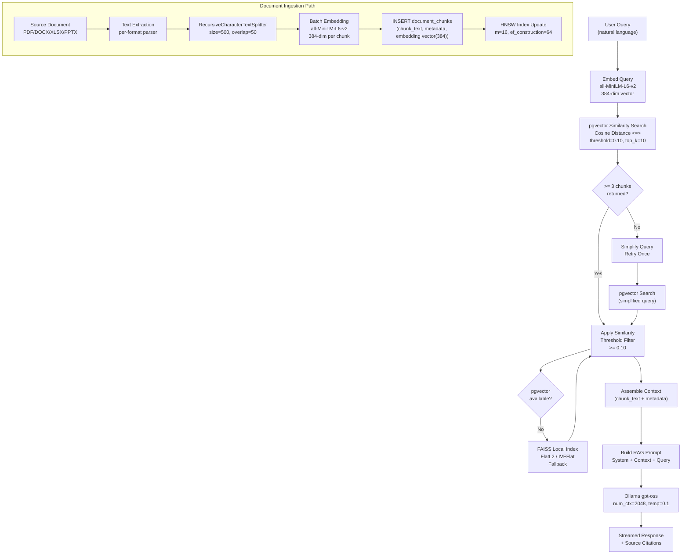

# Vector and Embedding Standards — AA-Hackathon Enterprise AI Platform

**Organization:** Aligned Automation  
**Project:** AA-Hackathon Enterprise AI Platform  
**Version:** 1.0  
**Last Updated:** 2026-06-07  
**Owner:** Platform Engineering  

---

## 1. Purpose

This document defines standards for embedding generation, vector storage, similarity search, and retrieval-augmented generation (RAG) retrieval for the AA-Hackathon Enterprise AI Platform. These standards ensure consistent, high-quality retrieval of relevant document chunks for AI-generated answers.

---

## 2. Vector Pipeline Overview



---

## 3. Embedding Model

### 3.1 Primary Model

**Model:** `sentence-transformers/all-MiniLM-L6-v2`  
**Dimension:** 384  
**Normalization:** L2-normalized (unit vector)  
**Max Tokens:** 256 tokens per input (sequences truncated)  
**Library:** `sentence-transformers` Python package  
**Inference:** Local CPU/GPU (no external API call)

```python
from sentence_transformers import SentenceTransformer

embedder = SentenceTransformer("all-MiniLM-L6-v2")

def embed_text(text: str) -> list[float]:
    embedding = embedder.encode(text, normalize_embeddings=True)
    return embedding.tolist()

def embed_batch(texts: list[str]) -> list[list[float]]:
    embeddings = embedder.encode(
        texts,
        normalize_embeddings=True,
        batch_size=32,
        show_progress_bar=False,
    )
    return embeddings.tolist()
```

### 3.2 Alternative Model: nomic-embed-text

**Model:** `nomic-embed-text`  
**Dimension:** 384 (same as primary)  
**Source:** Ollama at `ml01.alignedautomation.com:11434`  
**Use Case:** On-premise alternative; selected via `EMBEDDING_MODEL=nomic-embed-text` env var  

Switching embedding models requires re-embedding all documents in the vector store, as embeddings from different models are not comparable. The `EMBEDDING_MODEL` env var must match the model used during ingestion.

### 3.3 Dimension Rationale

| Model | Dim | Notes |
|-------|-----|-------|
| all-MiniLM-L6-v2 | 384 | Selected: fast inference, good quality, small storage |
| all-mpnet-base-v2 | 768 | Better quality, 2x storage and slower inference |
| text-embedding-ada-002 | 1536 | OpenAI, external API, not on-premise |
| nomic-embed-text | 384 | On-prem alternative via Ollama, same quality range |

384 dimensions is the optimal trade-off for this platform: inference is fast enough to embed in real time, storage overhead in pgvector is manageable at scale, and retrieval quality meets the use case requirements for HR/IT/Policy document retrieval.

---

## 4. Vector Storage

### 4.1 Primary: pgvector in PostgreSQL

Embeddings are stored in the `document_chunks` table as `vector(384)` type. This co-locates vector data with metadata and enables filtering by document properties in a single query.

```sql
-- Column definition
embedding vector(384) NOT NULL

-- Similarity search (cosine distance)
SELECT
    dc.id,
    dc.chunk_text,
    dc.metadata,
    d.document_name,
    d.tags->>'source_url' AS source_url,
    1 - (dc.embedding <=> %s::vector) AS similarity
FROM document_chunks dc
JOIN documents d ON d.id = dc.document_id
WHERE d.is_deleted = false
  AND dc.is_deleted = false
ORDER BY dc.embedding <=> %s::vector
LIMIT %s;
```

### 4.2 Fallback: FAISS Local Index

If pgvector is unavailable (database connection failure, extension not loaded), the system falls back to a FAISS index built from the same embeddings and loaded into memory at startup.

Location: `apps/api-gateway/app/rag/knowledge_base.py`

```python
import faiss
import numpy as np

class FAISSKnowledgeBase:
    def __init__(self, dimension: int = 384):
        self.dimension = dimension
        self.index = faiss.IndexFlatL2(dimension)  # or IndexIVFFlat for larger corpora
        self.chunk_store: list[dict] = []          # parallel array of chunk metadata

    def add_chunks(self, embeddings: np.ndarray, chunks: list[dict]) -> None:
        faiss.normalize_L2(embeddings)             # normalize for cosine similarity via L2
        self.index.add(embeddings)
        self.chunk_store.extend(chunks)

    def search(self, query_embedding: np.ndarray, top_k: int = 10) -> list[dict]:
        faiss.normalize_L2(query_embedding.reshape(1, -1))
        distances, indices = self.index.search(query_embedding.reshape(1, -1), top_k)
        results = []
        for dist, idx in zip(distances[0], indices[0]):
            if idx == -1:
                continue
            similarity = 1 - (dist / 2)  # convert L2 to cosine similarity approximation
            if similarity >= SIMILARITY_THRESHOLD:
                results.append({**self.chunk_store[idx], "similarity": float(similarity)})
        return results
```

---

## 5. Similarity Search Parameters

### 5.1 Cosine Distance Operator

pgvector uses the `<=>` operator for cosine distance. Cosine distance ranges from 0 (identical) to 2 (opposite). Cosine similarity = `1 - cosine_distance`.

```sql
-- Cosine distance (lower = more similar)
dc.embedding <=> query_vec::vector

-- Similarity score (higher = more similar)
1 - (dc.embedding <=> query_vec::vector) AS similarity
```

### 5.2 Search Parameters

| Parameter | Value | Rationale |
|-----------|-------|-----------|
| `similarity_threshold` | 0.10 | Low threshold keeps weak matches — HR policy questions may use indirect terminology. Minimum 3 chunks enforced via adaptive retry. |
| `top_k` | 10 | Top 10 chunks provide sufficient context without exceeding `num_ctx=2048` of Ollama |
| `min_chunks` | 3 | Adaptive retry triggered if fewer than 3 chunks returned |

### 5.3 Adaptive Retry Logic

When the initial similarity search returns fewer than the minimum threshold of 3 chunks, the system retries with a simplified query to avoid leaving the LLM without context:

```python
async def retrieve_chunks(query: str, top_k: int = 10) -> list[dict]:
    query_embedding = embed_text(query)
    chunks = await pgvector_search(query_embedding, top_k=top_k)

    if len(chunks) < MIN_CHUNKS_THRESHOLD:
        # Simplify query: take first sentence or key noun phrase
        simplified_query = extract_core_query(query)
        simplified_embedding = embed_text(simplified_query)
        chunks = await pgvector_search(simplified_embedding, top_k=top_k)

    return chunks
```

---

## 6. pgvector Index Configuration

### 6.1 HNSW Index (Production)

Hierarchical Navigable Small World graph index. Preferred for production: faster query time at the cost of slower build time and more memory.

```sql
CREATE INDEX idx_document_chunks_embedding_hnsw
ON document_chunks
USING hnsw (embedding vector_cosine_ops)
WITH (m = 16, ef_construction = 64);
```

| Parameter | Value | Effect |
|-----------|-------|--------|
| `m` | 16 | Connections per graph node. Higher = better accuracy, more memory (16 is default recommended) |
| `ef_construction` | 64 | Build-time candidate list size. Higher = better graph quality, slower build |

Query-time tuning:
```sql
SET hnsw.ef_search = 100;  -- Larger candidate list during search = better recall
```

### 6.2 IVFFlat Index (Development / Small Datasets)

Inverted File Index with flat storage. Faster to build, suitable for development or datasets under 100K vectors.

```sql
CREATE INDEX idx_document_chunks_embedding_ivfflat
ON document_chunks
USING ivfflat (embedding vector_cosine_ops)
WITH (lists = 100);
```

Query-time tuning:
```sql
SET ivfflat.probes = 10;  -- Number of lists to search (higher = better recall, slower)
```

`lists` should be approximately `sqrt(number_of_vectors)`.

### 6.3 Index Type Comparison

| Aspect | HNSW | IVFFlat |
|--------|------|---------|
| Build speed | Slow | Fast |
| Query speed | Fast | Medium |
| Memory usage | High | Low |
| Recall accuracy | Very high | High (with enough probes) |
| Best for | Production (>10K vectors) | Dev / small datasets |
| Supports incremental inserts | Yes | Yes (but degrades; rebuild recommended) |

---

## 7. Embedding Pipeline — Ingestion

### 7.1 Batch Processing

Embeddings are generated in batches during document ingestion to maximize throughput:

```python
EMBEDDING_BATCH_SIZE = 32

async def embed_and_store_chunks(
    document_id: str,
    chunks: list[str],
    metadatas: list[dict],
) -> int:
    stored_count = 0
    for i in range(0, len(chunks), EMBEDDING_BATCH_SIZE):
        batch_texts = chunks[i:i + EMBEDDING_BATCH_SIZE]
        batch_meta = metadatas[i:i + EMBEDDING_BATCH_SIZE]
        try:
            embeddings = embed_batch(batch_texts)
            await bulk_insert_chunks(document_id, batch_texts, batch_meta, embeddings)
            stored_count += len(batch_texts)
        except Exception as e:
            logger.error(f"Embedding batch {i//EMBEDDING_BATCH_SIZE} failed", exc_info=True)
            # Continue with next batch — partial ingestion is acceptable
            continue
    return stored_count
```

### 7.2 Re-embedding on Document Change

When a document changes (detected by SHA-256 hash comparison during SharePoint ingestion):

1. Soft-delete all existing `document_chunks` for the document
2. Update `documents` record with new hash and `updated_at`
3. Re-extract, re-chunk, and re-embed the new document version
4. Insert new chunks with fresh embeddings
5. New HNSW index automatically includes new vectors on next query

```sql
-- Step 1: Soft-delete old chunks
UPDATE document_chunks
SET is_deleted = true
WHERE document_id = %s;

-- Step 2: Update document record
UPDATE documents
SET hash = %s, updated_at = NOW()
WHERE id = %s;
```

---

## 8. Quality Metrics

### 8.1 Retrieval Quality Targets

| Metric | Target | Measurement Method |
|--------|--------|-------------------|
| Precision@10 | > 0.70 | Manual evaluation on 50-query benchmark set |
| Recall@10 | > 0.80 | Benchmark: does the relevant chunk appear in top 10? |
| Mean similarity score | > 0.40 | Average similarity of returned chunks |
| Empty retrieval rate | < 5% | Percentage of queries returning 0 chunks |
| Adaptive retry rate | < 15% | Percentage of queries triggering retry |

### 8.2 Monitoring Retrieval Quality

Log chunk count and average similarity for every retrieval operation:

```python
logger.info(
    "RAG retrieval completed",
    extra={
        "query_length": len(query),
        "chunks_retrieved": len(chunks),
        "avg_similarity": sum(c["similarity"] for c in chunks) / len(chunks) if chunks else 0,
        "retry_triggered": retry_triggered,
    }
)
```

---

## 9. Vector Operators Reference

| Operator | Distance Type | Formula | Use Case |
|----------|--------------|---------|----------|
| `<=>` | Cosine distance | `1 - dot(a,b)` (for normalized) | Default for text embeddings |
| `<->` | Euclidean (L2) distance | `sqrt(sum((a-b)^2))` | Alternative, less common |
| `<#>` | Negative inner product | `-dot(a,b)` | Maximum inner product search |

This platform uses `<=>` (cosine) exclusively. All embeddings are L2-normalized before storage, making cosine and inner product searches equivalent.

---

## 10. Future Improvements

| Improvement | Benefit | Effort | Target |
|------------|---------|--------|--------|
| Upgrade to nomic-embed-text-v1.5 (768-dim) | Better retrieval quality for long documents | High (requires full re-embed) | Q4 2026 |
| Hybrid BM25 + vector search | Better handling of exact keyword matches | Medium | Q3 2026 |
| Cross-encoder reranking | Improve precision of top-k results | Medium | Q3 2026 |
| Semantic chunking | Smarter chunk boundaries | Medium | Q3 2026 |
| Parent-child chunk retrieval | Return smaller precise chunks, embed in larger parent context | High | Q4 2026 |
| HNSW auto-tuning | Automatic `ef_search` tuning per query | Low | Q2 2026 |
