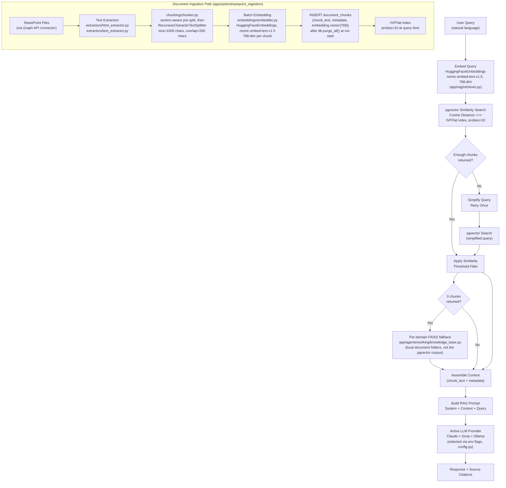

# Vector and Embedding Standards — AA-Hackathon Enterprise AI Platform

**Organization:** Aligned Automation  
**Project:** AA-Hackathon Enterprise AI Platform  
**Version:** 1.0  
**Last Updated:** 2026-06-07  
**Owner:** Platform Engineering  

---

## 1. Purpose

This document defines standards for embedding generation, vector storage, similarity search, and retrieval-augmented generation (RAG) retrieval for the AA-Hackathon Enterprise AI Platform. These standards ensure consistent, high-quality retrieval of relevant document chunks for AI-generated answers.

---

## 2. Vector Pipeline Overview



---

## 3. Embedding Model

### 3.1 Model — Used Identically at Query Time and Ingestion Time

**Model:** `nomic-ai/nomic-embed-text-v1.5`  
**Dimension:** 768  
**Library:** `langchain_huggingface.HuggingFaceEmbeddings` (from the `langchain-huggingface` package; `sentence-transformers` is present as a dependency it relies on, but the application code calls it through the LangChain wrapper, not the raw `SentenceTransformer` API)  
**Load option:** `model_kwargs={"trust_remote_code": True}` (required for this model family)  
**Used in:** `apps/api-gateway/app/rag/retriever.py` (query time) and `apps/jobs/sharepoint_ingestion/embeddings/embedder.py` (ingestion time) — the same model, loaded the same way, in both places, so query embeddings and stored embeddings are directly comparable.  
**Inference:** Local CPU/GPU (no external embedding API call)

```python
from langchain_huggingface import HuggingFaceEmbeddings

embedder = HuggingFaceEmbeddings(
    model_name="nomic-ai/nomic-embed-text-v1.5",
    model_kwargs={"trust_remote_code": True},
)

def embed_text(text: str) -> list[float]:
    return embedder.embed_query(text)

def embed_batch(texts: list[str]) -> list[list[float]]:
    return embedder.embed_documents(texts)
```

There is **no** separate Ollama-hosted embedding model in this platform — embedding generation always goes through the HuggingFace/`nomic-embed-text-v1.5` path above, regardless of which LLM provider (Claude, Groq, or Ollama) is generating the final answer text.

### 3.2 Dimension Rationale

| Model | Dim | Notes |
|-------|-----|-------|
| nomic-embed-text-v1.5 | 768 | The model actually used, at both query time and ingestion time |
| all-mpnet-base-v2 | 768 | Comparable dimension, not used by this platform |
| text-embedding-ada-002 | 1536 | OpenAI, external API — not used by this platform |

768 dimensions is a reasonable trade-off for this platform: inference is fast enough to embed in real time, storage overhead in pgvector is manageable at scale, and retrieval quality meets the use case requirements for HR/IT/Policy document retrieval. This is **not** `all-MiniLM-L6-v2` / 384 dimensions, which appeared in earlier, incorrect drafts of this documentation set.

---

## 4. Vector Storage

### 4.1 Primary: pgvector in PostgreSQL

Embeddings are stored in the `document_chunks` table as `vector(768)` type. This co-locates vector data with metadata and enables filtering by document properties in a single query.

```sql
-- Column definition
embedding vector(768) NOT NULL

-- Similarity search (cosine distance)
SELECT
    dc.id,
    dc.chunk_text,
    dc.metadata,
    d.document_name,
    d.tags->>'source_url' AS source_url,
    1 - (dc.embedding <=> %s::vector) AS similarity
FROM document_chunks dc
JOIN documents d ON d.id = dc.document_id
WHERE d.is_deleted = false
  AND dc.is_deleted = false
ORDER BY dc.embedding <=> %s::vector
LIMIT %s;
```

### 4.2 Fallback: Per-Domain FAISS Local Knowledge Base

`faiss-cpu` is a real dependency, but its role is narrower and different in kind from a database-outage fallback:

- **Location:** `apps/api-gateway/app/agents/working/knowledge_base.py` (not `app/rag/knowledge_base.py`)
- **Built from:** local document folders, one knowledge base **per domain agent** (HR, IT, Admin, Finance, PMO) — it is not built from the same embeddings stored in pgvector, and is not a mirror of the pgvector corpus
- **Trigger condition:** consulted only when a pgvector similarity search **returns zero results** for a query — not when pgvector itself is unavailable/unreachable
- **Not used in ingestion:** there is no FAISS usage anywhere under `apps/jobs`; it plays no role in the SharePoint ingestion pipeline

```python
import faiss
import numpy as np

class DomainFAISSKnowledgeBase:
    """One instance per domain agent (HR, IT, Admin, Finance, PMO),
    built from that domain's local document folder — not from pgvector data."""

    def __init__(self, dimension: int = 768):
        self.dimension = dimension
        self.index = faiss.IndexFlatL2(dimension)
        self.chunk_store: list[dict] = []

    def add_chunks(self, embeddings: np.ndarray, chunks: list[dict]) -> None:
        faiss.normalize_L2(embeddings)
        self.index.add(embeddings)
        self.chunk_store.extend(chunks)

    def search(self, query_embedding: np.ndarray, top_k: int = 10) -> list[dict]:
        faiss.normalize_L2(query_embedding.reshape(1, -1))
        distances, indices = self.index.search(query_embedding.reshape(1, -1), top_k)
        results = []
        for dist, idx in zip(distances[0], indices[0]):
            if idx == -1:
                continue
            similarity = 1 - (dist / 2)
            results.append({**self.chunk_store[idx], "similarity": float(similarity)})
        return results
```

Usage in `BaseDeepAgent` (`app/agents/working/base_deep_agent.py`) is a conditional fallback, not a parallel `asyncio.gather` across sources:

```python
chunks = pgvector_search(query_embedding, top_k=10)
if not chunks:
    chunks = domain_knowledge_base.search(query_embedding, top_k=10)
```

---

## 5. Similarity Search Parameters

### 5.1 Cosine Distance Operator

pgvector uses the `<=>` operator for cosine distance. Cosine distance ranges from 0 (identical) to 2 (opposite). Cosine similarity = `1 - cosine_distance`.

```sql
-- Cosine distance (lower = more similar)
dc.embedding <=> query_vec::vector

-- Similarity score (higher = more similar)
1 - (dc.embedding <=> query_vec::vector) AS similarity
```

### 5.2 Search Parameters

| Parameter | Value | Rationale |
|-----------|-------|-----------|
| `similarity_threshold` | 0.10 | Low threshold keeps weak matches — HR policy questions may use indirect terminology. Minimum 3 chunks enforced via adaptive retry. |
| `top_k` | 10 | Top 10 chunks provide sufficient context for the active LLM provider (Claude, Groq, or Ollama — the platform is multi-provider, not tuned solely against one provider's context window) |
| `min_chunks` | 3 | Adaptive retry triggered if fewer than 3 chunks returned |

### 5.3 Adaptive Retry Logic

When the initial similarity search returns fewer than the minimum threshold of 3 chunks, the system retries with a simplified query to avoid leaving the LLM without context:

```python
async def retrieve_chunks(query: str, top_k: int = 10) -> list[dict]:
    query_embedding = embed_text(query)
    chunks = await pgvector_search(query_embedding, top_k=top_k)

    if len(chunks) < MIN_CHUNKS_THRESHOLD:
        # Simplify query: take first sentence or key noun phrase
        simplified_query = extract_core_query(query)
        simplified_embedding = embed_text(simplified_query)
        chunks = await pgvector_search(simplified_embedding, top_k=top_k)

    return chunks
```

---

## 6. pgvector Index Configuration

### 6.1 IVFFlat Index (Current)

The platform's documented retrieval configuration uses an **IVFFlat** index with `probes = 10` — this is the real, current index type.

```sql
CREATE INDEX idx_document_chunks_embedding_ivfflat
ON document_chunks
USING ivfflat (embedding vector_cosine_ops)
WITH (lists = 100);
```

Query-time tuning:
```sql
SET ivfflat.probes = 10;  -- The platform's documented default. Higher = better recall, slower.
```

`lists` should be approximately `sqrt(number_of_vectors)`.

### 6.2 HNSW Index (Future Alternative, Not Confirmed Current)

Hierarchical Navigable Small World graph index. Can offer faster queries at the cost of slower, more memory-intensive builds. This is a plausible future upgrade, but it is **not confirmed as the index type currently deployed** — treat any mention of HNSW as production elsewhere in older drafts as superseded by this correction.

```sql
-- Illustrative future option only
CREATE INDEX idx_document_chunks_embedding_hnsw
ON document_chunks
USING hnsw (embedding vector_cosine_ops)
WITH (m = 16, ef_construction = 64);

SET hnsw.ef_search = 100;
```

### 6.3 Index Type Comparison

| Aspect | IVFFlat | HNSW |
|--------|---------|------|
| Build speed | Fast | Slow |
| Query speed | Fast (with tuned `probes`) | Very fast |
| Memory usage | Low | High |
| Recall accuracy | High (with enough probes) | Very high |
| **Current platform use** | **Yes — `probes = 10`** | **Not confirmed — future candidate** |
| Supports incremental inserts | Yes (but degrades; rebuild recommended) | Yes |

---

## 7. Embedding Pipeline — Ingestion

### 7.1 Batch Processing

Embeddings are generated in batches during document ingestion to maximize throughput:

```python
EMBEDDING_BATCH_SIZE = 32

async def embed_and_store_chunks(
    document_id: str,
    chunks: list[str],
    metadatas: list[dict],
) -> int:
    stored_count = 0
    for i in range(0, len(chunks), EMBEDDING_BATCH_SIZE):
        batch_texts = chunks[i:i + EMBEDDING_BATCH_SIZE]
        batch_meta = metadatas[i:i + EMBEDDING_BATCH_SIZE]
        try:
            embeddings = embed_batch(batch_texts)
            await bulk_insert_chunks(document_id, batch_texts, batch_meta, embeddings)
            stored_count += len(batch_texts)
        except Exception as e:
            logger.error(f"Embedding batch {i//EMBEDDING_BATCH_SIZE} failed", exc_info=True)
            # Continue with next batch — partial ingestion is acceptable
            continue
    return stored_count
```

### 7.2 Re-embedding on Document Change

When a document changes (detected by SHA-256 hash comparison during SharePoint ingestion):

1. Soft-delete all existing `document_chunks` for the document
2. Update `documents` record with new hash and `updated_at`
3. Re-extract, re-chunk, and re-embed the new document version
4. Insert new chunks with fresh embeddings
5. New HNSW index automatically includes new vectors on next query

```sql
-- Step 1: Soft-delete old chunks
UPDATE document_chunks
SET is_deleted = true
WHERE document_id = %s;

-- Step 2: Update document record
UPDATE documents
SET hash = %s, updated_at = NOW()
WHERE id = %s;
```

---

## 8. Quality Metrics

### 8.1 Retrieval Quality Targets

| Metric | Target | Measurement Method |
|--------|--------|-------------------|
| Precision@10 | > 0.70 | Manual evaluation on 50-query benchmark set |
| Recall@10 | > 0.80 | Benchmark: does the relevant chunk appear in top 10? |
| Mean similarity score | > 0.40 | Average similarity of returned chunks |
| Empty retrieval rate | < 5% | Percentage of queries returning 0 chunks |
| Adaptive retry rate | < 15% | Percentage of queries triggering retry |

### 8.2 Monitoring Retrieval Quality

Log chunk count and average similarity for every retrieval operation:

```python
logger.info(
    "RAG retrieval completed",
    extra={
        "query_length": len(query),
        "chunks_retrieved": len(chunks),
        "avg_similarity": sum(c["similarity"] for c in chunks) / len(chunks) if chunks else 0,
        "retry_triggered": retry_triggered,
    }
)
```

---

## 9. Vector Operators Reference

| Operator | Distance Type | Formula | Use Case |
|----------|--------------|---------|----------|
| `<=>` | Cosine distance | `1 - dot(a,b)` (for normalized) | Default for text embeddings |
| `<->` | Euclidean (L2) distance | `sqrt(sum((a-b)^2))` | Alternative, less common |
| `<#>` | Negative inner product | `-dot(a,b)` | Maximum inner product search |

This platform uses `<=>` (cosine) exclusively. All embeddings are L2-normalized before storage, making cosine and inner product searches equivalent.

---

## 10. Future Improvements

| Improvement | Benefit | Effort | Target |
|------------|---------|--------|--------|
| Evaluate HNSW as an upgrade from the current IVFFlat index | Potentially faster queries / higher recall | Medium (re-index, not re-embed) | Q3 2026 |
| Hybrid BM25 + vector search | Better handling of exact keyword matches | Medium | Q3 2026 |
| Cross-encoder reranking | Improve precision of top-k results | Medium | Q3 2026 |
| Semantic chunking | Smarter chunk boundaries | Medium | Q3 2026 |
| Parent-child chunk retrieval | Return smaller precise chunks, embed in larger parent context | High | Q4 2026 |
| IVFFlat `lists`/`probes` auto-tuning | Automatic tuning per query load | Low | Q2 2026 |
