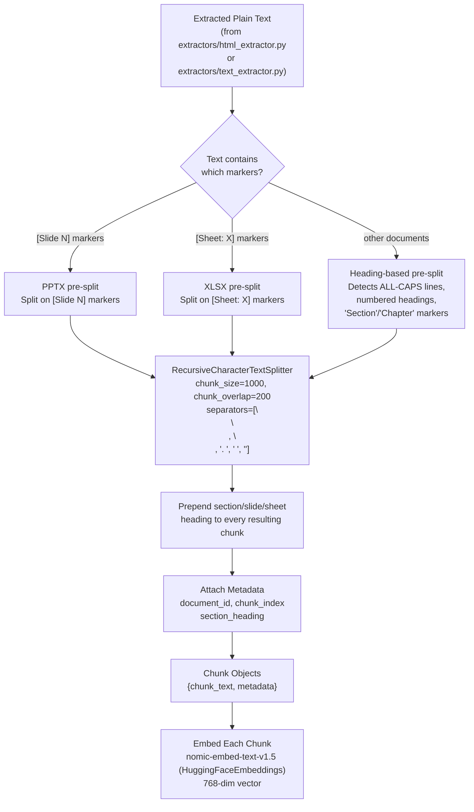

# Chunking Strategy — AA-Hackathon Enterprise AI Platform

**Organization:** Aligned Automation  
**Project:** AA-Hackathon Enterprise AI Platform  
**Version:** 1.0  
**Last Updated:** 2026-06-07  
**Owner:** Platform Engineering / Data Engineering  

---

## 1. Purpose

This document specifies the text chunking strategy for the AA-Hackathon Enterprise AI Platform. Chunking is the process of splitting extracted document text into fixed-size overlapping segments before embedding and vector storage. Chunk quality directly determines retrieval quality, which in turn determines the accuracy of AI-generated answers.

---

## 2. Chunking Pipeline Overview

The chunker (`apps/jobs/sharepoint_ingestion/chunking/chunker.py`) operates on **already-extracted plain text** produced by the extractors under `extractors/` (see [`sharepoint-ingestion.md`](sharepoint-ingestion.md)) — it does not itself parse PDF/DOCX/XLSX/PPTX file bytes. It is **file-type-aware** at the pre-split stage, then falls back to a single shared splitter:



---

## 3. Core Chunking Parameters

### 3.1 RecursiveCharacterTextSplitter Configuration

Configured in `apps/jobs/sharepoint_ingestion/config/settings.py`:

```python
from langchain.text_splitter import RecursiveCharacterTextSplitter

CHUNK_SIZE = 1000       # Maximum characters per chunk (character-based, not token-based)
CHUNK_OVERLAP = 200     # Characters shared between adjacent chunks

splitter = RecursiveCharacterTextSplitter(
    chunk_size=CHUNK_SIZE,
    chunk_overlap=CHUNK_OVERLAP,
    length_function=len,
    separators=[
        "\n\n",   # Paragraph break (highest priority split point)
        "\n",     # Line break
        ". ",     # Sentence boundary
        " ",      # Word boundary
        "",       # Character boundary (last resort)
    ],
)
```

This splitter is applied **within each pre-split section**, not directly to the whole document — see Section 4 for the pre-split logic that runs first.

### 3.2 Parameter Rationale

| Parameter | Value | Rationale |
|-----------|-------|-----------|
| `chunk_size` | 1000 characters | Character-based sizing keeps chunks a manageable, self-contained size for embedding and for assembling multi-chunk context at query time, independent of which LLM provider (Claude, Groq, or Ollama) ultimately consumes the retrieved context |
| `chunk_overlap` | 200 characters | Roughly 30–40 words of shared context between adjacent chunks. Prevents answers that span chunk boundaries from losing context at the seam |
| Separator priority | `\n\n` first | Prefer splitting at paragraph boundaries to preserve semantic coherence |
| Pre-split unit | Section / slide / sheet | The text is first divided by structural markers (heading, `[Slide N]`, `[Sheet: X]`) before the character splitter ever runs, so a chunk boundary from the splitter never crosses a section/slide/sheet boundary |

### 3.3 Note on LLM Context Budgets

Because the platform is multi-provider (Claude, Groq, or Ollama, selected by env flags — see [`technical-standards.md`](../07-technical/technical-standards.md)), retrieved-chunk sizing is not tuned against a single fixed context window (e.g. an assumed Ollama `num_ctx`). `CHUNK_SIZE=1000` and the RAG pipeline's `top_k` retrieval count (see [`vector-standards.md`](../07-technical/vector-standards.md)) are chosen so that the assembled context is reasonable for whichever provider is active, rather than being derived from one provider's specific token budget.

---

## 4. File-Type-Aware Pre-Split Strategies

The real chunker (`apps/jobs/sharepoint_ingestion/chunking/chunker.py`) does **not** parse PDF/DOCX/XLSX/PPTX file bytes directly — that already happened upstream in the extractors (`extractors/html_extractor.py`, `extractors/text_extractor.py`), which hand the chunker plain text. What the chunker does is look at that plain text and decide how to pre-split it into sections *before* running `RecursiveCharacterTextSplitter`. There are three pre-split paths:

### 4.1 PPTX text — split on `[Slide N]` markers

If the extracted text contains `[Slide N]`-style markers (indicating the source was a presentation), the chunker splits on those markers first, so no chunk boundary ever crosses a slide boundary. Each slide's text is then run through `RecursiveCharacterTextSplitter` independently, and the `[Slide N]` marker is prepended to every chunk produced from that slide.

```python
def presplit_pptx_text(text: str) -> list[dict]:
    """Splits already-extracted text on '[Slide N]' markers."""
    sections = re.split(r"(\[Slide \d+\])", text)
    slides = []
    current_marker = None
    for part in sections:
        if re.match(r"\[Slide \d+\]", part):
            current_marker = part
        elif part.strip() and current_marker:
            slides.append({"heading": current_marker, "body": part.strip()})
    return slides
```

### 4.2 XLSX text — split on `[Sheet: X]` markers

Similarly, extracted spreadsheet text carries `[Sheet: X]` markers per worksheet. The chunker splits on these first, then applies `RecursiveCharacterTextSplitter` within each sheet's text, prepending the `[Sheet: X]` marker to every resulting chunk.

```python
def presplit_xlsx_text(text: str) -> list[dict]:
    """Splits already-extracted text on '[Sheet: X]' markers."""
    sections = re.split(r"(\[Sheet: [^\]]+\])", text)
    sheets = []
    current_marker = None
    for part in sections:
        if re.match(r"\[Sheet: [^\]]+\]", part):
            current_marker = part
        elif part.strip() and current_marker:
            sheets.append({"heading": current_marker, "body": part.strip()})
    return sheets
```

### 4.3 Everything else — split on detected section headings

For all other document types (including PDFs, DOCX, and plain text), the chunker scans the extracted text for heading-like lines using generic, format-agnostic heuristics — **not** a rich-format API like python-docx paragraph styles, since chunking runs on plain text, not the original file:

- ALL-CAPS lines (e.g. `LEAVE POLICY`)
- Numbered headings (e.g. `1. Introduction`, `2.3 Eligibility`)
- Lines containing `Section` or `Chapter` markers

Text between two detected headings becomes one section. Each section is then run through `RecursiveCharacterTextSplitter`, with the detected heading prepended to every chunk produced from that section.

```python
HEADING_PATTERNS = [
    re.compile(r"^[A-Z][A-Z\s]{4,}$"),          # ALL-CAPS line
    re.compile(r"^\d+(\.\d+)*\.?\s+\S"),         # numbered heading, e.g. "1." or "2.3"
    re.compile(r"^(Section|Chapter)\s+\S", re.IGNORECASE),
]

def presplit_by_heading(text: str) -> list[dict]:
    lines = text.splitlines()
    sections = []
    current_heading = ""
    current_body: list[str] = []

    for line in lines:
        if any(p.match(line.strip()) for p in HEADING_PATTERNS):
            if current_body:
                sections.append({"heading": current_heading, "body": "\n".join(current_body)})
                current_body = []
            current_heading = line.strip()
        else:
            current_body.append(line)

    if current_body:
        sections.append({"heading": current_heading, "body": "\n".join(current_body)})

    return sections
```

### 4.4 Shared splitting step

Regardless of which pre-split path produced the sections, the same final step applies to all of them:

```python
def chunk_sections(sections: list[dict], base_metadata: dict) -> list[dict]:
    all_chunks = []
    for section in sections:
        full_text = f"{section['heading']}\n\n{section['body']}" if section["heading"] else section["body"]
        for chunk_text in splitter.split_text(full_text):
            all_chunks.append({
                "chunk_text": chunk_text,
                "metadata": {
                    **base_metadata,
                    "chunk_index": len(all_chunks),
                    "section_heading": section["heading"],
                }
            })
    return all_chunks
```

---

## 5. Required Chunk Metadata

Every chunk object stored in `document_chunks.metadata` (JSONB) should carry, at minimum:

| Field | Type | Source | Required |
|-------|------|--------|----------|
| `chunk_index` | int | Position within the document's chunk sequence | Always |
| `section_heading` | str | The heading / `[Slide N]` / `[Sheet: X]` marker prepended to this chunk, if any | When a heading/marker was detected |
| `source_file` | str | Original filename | When available |

Earlier drafts of this document asserted a richer, format-specific metadata set (`page_number`, `slide_number`, `sheet_name`, `section_title`, `word_count` as separate always-present fields). Only treat those as accurate if you have independently confirmed them against `apps/jobs/sharepoint_ingestion/chunking/chunker.py` and `create_schema.py` — the verified metadata contract is the smaller set above.

---

## 6. Special Content Handling

**Caveat:** the sub-rules below (table/list/code-block handling) describe desirable behavior for a `RecursiveCharacterTextSplitter`-based pipeline and are illustrative guidance, not line-by-line confirmed against `chunker.py`. Treat the numeric thresholds as relative to `CHUNK_SIZE` (1000 characters), not as independently verified constants.

### 6.1 Tables

Tables should not be split across chunks in a way that separates headers from data rows where avoidable:

- If the full table fits within `CHUNK_SIZE` (1000 characters), it can remain a single chunk
- If larger, prefer splitting at row boundaries, including the header row at the top of each resulting chunk
- `|` delimiters between cells aid readability in the extracted text

### 6.2 Numbered Lists and Bullet Points

List items should stay together when possible. If a list exceeds `CHUNK_SIZE`, prefer splitting at list item boundaries (at `\n` before a bullet or number), not mid-item — this falls out naturally from the splitter's separator priority (`\n\n`, then `\n`, before falling back to word/character boundaries).

### 6.3 Code Blocks

Code blocks, where present in source documents, should ideally not be split mid-statement. If a code block exceeds `CHUNK_SIZE`, prefer splitting only at blank lines within the code.

### 6.4 Minimum Chunk Size

Very short fragments (a handful of characters — typically orphaned headings, page numbers, or formatting artifacts) add no semantic value and are candidates for discarding before embedding. The exact minimum-length cutoff used by `chunker.py` was not independently confirmed in the last audit; do not assert a specific number without checking the source.

---

## 7. Quality Metrics and Monitoring

The metrics below are suggested monitoring targets for the ingestion pipeline, not confirmed values pulled from a live dashboard. Use them as a starting point for instrumentation rather than as already-measured facts:

| Metric | Suggested Target | How to Measure |
|--------|--------|-------------|
| Average chunk length | Well under `CHUNK_SIZE` (1000 chars) on average, given section pre-splitting | Compute per ingestion run |
| Empty chunk rate | 0% | Validate before insert |
| Retrieval hit rate | Most queries return ≥ 3 chunks | Log per query at runtime, see [`vector-standards.md`](../07-technical/vector-standards.md) for the retrieval retry logic |

---

## 8. Future Chunking Improvements

### 8.1 Semantic Chunking

Split at points where semantic similarity between adjacent sentences drops below a threshold. This produces chunks that are more semantically coherent than fixed-size splits.

**Tool:** LangChain `SemanticChunker` or custom sentence-boundary detection  
**Trade-off:** Variable chunk sizes, more complex pipeline, slower ingestion  
**Target:** Q3 2026

### 8.2 Parent-Child Chunk Retrieval

Store both small chunks (for precise embedding similarity) and larger parent chunks (for richer context). At retrieval time, embed small child chunks but return the parent chunk text to the LLM.

**Configuration:**
- Child chunk: 200 chars, overlap=20
- Parent chunk: 1000 chars, overlap=100
- Retrieved: top-10 child chunks → look up corresponding parent → deduplicated parent text sent to LLM

**Target:** Q4 2026

### 8.3 Hierarchical Chunking

For structured documents (policies, procedures), use the document's own heading hierarchy to create a tree of chunks. Retrieval traverses the tree from specific (leaf) to general (root).
