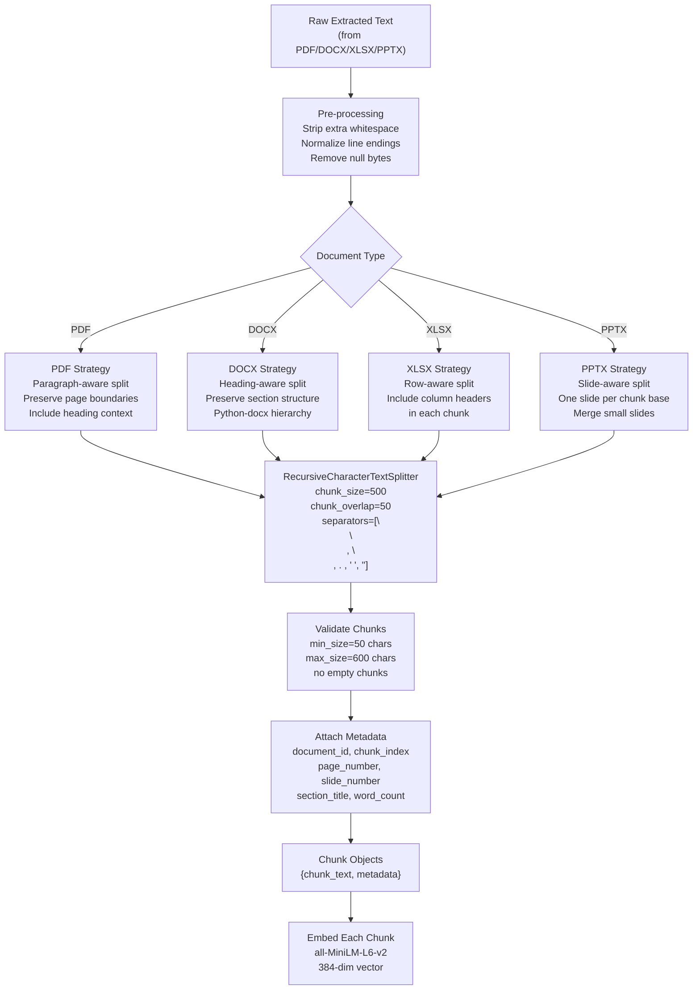

# Chunking Strategy — AA-Hackathon Enterprise AI Platform

**Organization:** Aligned Automation  
**Project:** AA-Hackathon Enterprise AI Platform  
**Version:** 1.0  
**Last Updated:** 2026-06-07  
**Owner:** Platform Engineering / Data Engineering  

---

## 1. Purpose

This document specifies the text chunking strategy for the AA-Hackathon Enterprise AI Platform. Chunking is the process of splitting extracted document text into fixed-size overlapping segments before embedding and vector storage. Chunk quality directly determines retrieval quality, which in turn determines the accuracy of AI-generated answers.

---

## 2. Chunking Pipeline Overview



---

## 3. Core Chunking Parameters

### 3.1 RecursiveCharacterTextSplitter Configuration

```python
from langchain.text_splitter import RecursiveCharacterTextSplitter

CHUNK_SIZE = 500       # Maximum characters per chunk
CHUNK_OVERLAP = 50     # Characters shared between adjacent chunks

splitter = RecursiveCharacterTextSplitter(
    chunk_size=CHUNK_SIZE,
    chunk_overlap=CHUNK_OVERLAP,
    length_function=len,
    separators=[
        "\n\n",   # Paragraph break (highest priority split point)
        "\n",     # Line break
        ". ",     # Sentence boundary
        " ",      # Word boundary
        "",       # Character boundary (last resort)
    ],
    keep_separator=False,
    add_start_index=True,
)
```

### 3.2 Parameter Rationale

| Parameter | Value | Rationale |
|-----------|-------|-----------|
| `chunk_size` | 500 characters | Fits within Ollama context window (`num_ctx=2048`) with room for system prompt, user query, and multiple retrieved chunks |
| `chunk_overlap` | 50 characters | Approximately 10 words. Prevents answers that span chunk boundaries from losing context at the seam |
| Separator priority | `\n\n` first | Prefer splitting at paragraph boundaries to preserve semantic coherence |
| Min chunk size | 50 characters | Chunks smaller than 50 chars are too short to embed meaningfully |

### 3.3 Context Window Budget

With Ollama `num_ctx=2048` tokens:

| Component | Token Budget | Notes |
|-----------|-------------|-------|
| System prompt | ~200 tokens | Instructions, persona, safety rules |
| User query | ~100 tokens | Typical user question |
| Retrieved chunks (top 10) | ~1500 tokens | 10 × 150 avg tokens per 500-char chunk |
| Response buffer | ~248 tokens | Maps to `num_predict=800` (separate output context) |

This budget analysis validates that `chunk_size=500` and `top_k=10` fit within the model's context window while leaving room for the system prompt and query.

---

## 4. Document-Type Specific Strategies

### 4.1 PDF Documents

PDFs are processed page by page. Text is extracted per page, then chunked within page boundaries where possible to preserve page number metadata accurately.

**Strategy:**
- Extract text page by page using `pdfplumber`
- Detect headings via font size metadata where available
- Prepend heading context to chunks that begin mid-section
- Preserve page number in every chunk's metadata
- Handle multi-column layouts by concatenating columns left-to-right

**Special handling:**
- Scanned PDFs (image-only) → OCR required (future: Azure Document Intelligence)
- Tables in PDFs → extracted as structured text with `|` delimiters
- Footnotes → appended to the page text block they appear on
- Headers/footers → stripped if repetitive across pages (detected by identical text pattern)

```python
def chunk_pdf(pages: list[dict]) -> list[dict]:
    """
    pages: [{'text': str, 'page_number': int}]
    Returns: [{'chunk_text': str, 'metadata': dict}]
    """
    all_chunks = []
    for page in pages:
        page_chunks = splitter.split_text(page["text"])
        for idx, chunk_text in enumerate(page_chunks):
            all_chunks.append({
                "chunk_text": chunk_text,
                "metadata": {
                    "chunk_index": len(all_chunks),
                    "page_number": page["page_number"],
                    "word_count": len(chunk_text.split()),
                }
            })
    return all_chunks
```

### 4.2 DOCX Documents

Word documents have explicit heading hierarchy (Heading 1, Heading 2, etc.) via python-docx. This structure is used to prepend section context to each chunk.

**Strategy:**
- Parse document paragraph by paragraph
- Track current section heading (most recent Heading 1 and Heading 2)
- Prepend section title to chunks so retrieval context includes the section name
- Keep tables together (don't split a table across chunks if < 500 chars)
- Lists (bullet points, numbered) kept together where possible

```python
def chunk_docx(doc_path_or_bytes) -> list[dict]:
    from docx import Document
    doc = Document(doc_path_or_bytes)

    sections = []
    current_heading = ""
    current_text = []

    for para in doc.paragraphs:
        if "Heading" in para.style.name and para.text.strip():
            if current_text:
                sections.append({"heading": current_heading, "text": "\n".join(current_text)})
                current_text = []
            current_heading = para.text.strip()
        elif para.text.strip():
            current_text.append(para.text.strip())

    if current_text:
        sections.append({"heading": current_heading, "text": "\n".join(current_text)})

    all_chunks = []
    for section in sections:
        # Prepend heading so every chunk carries section context
        full_text = f"{section['heading']}\n\n{section['text']}" if section['heading'] else section['text']
        sub_chunks = splitter.split_text(full_text)
        for chunk_text in sub_chunks:
            all_chunks.append({
                "chunk_text": chunk_text,
                "metadata": {
                    "chunk_index": len(all_chunks),
                    "section_title": section["heading"],
                    "word_count": len(chunk_text.split()),
                }
            })
    return all_chunks
```

### 4.3 XLSX Spreadsheets

Spreadsheets are tabular. Each row is treated as a unit of information. Column headers are included in every row-chunk so the chunk is self-contained and meaningful without surrounding context.

**Strategy:**
- Process sheet by sheet, include sheet name in metadata
- Treat each row as a text string: `Column1: Value1 | Column2: Value2 | ...`
- Skip rows where all cells are empty
- For large sheets, group rows into chunks of up to 10 rows (within 500-char limit)
- Include header row reference in every chunk

```python
def chunk_xlsx(file_bytes: bytes) -> list[dict]:
    from openpyxl import load_workbook
    wb = load_workbook(io.BytesIO(file_bytes), read_only=True, data_only=True)
    all_chunks = []

    for sheet in wb.worksheets:
        rows = list(sheet.iter_rows(values_only=True))
        if not rows:
            continue

        headers = [str(h or "").strip() for h in rows[0]]
        row_texts = []

        for row in rows[1:]:
            row_parts = [
                f"{headers[i]}: {str(val).strip()}"
                for i, val in enumerate(row)
                if val is not None and str(val).strip()
            ]
            if row_parts:
                row_texts.append(" | ".join(row_parts))

        # Group rows into chunks
        batch_text = "\n".join(row_texts)
        sub_chunks = splitter.split_text(batch_text)
        for chunk_text in sub_chunks:
            all_chunks.append({
                "chunk_text": chunk_text,
                "metadata": {
                    "chunk_index": len(all_chunks),
                    "sheet_name": sheet.title,
                    "word_count": len(chunk_text.split()),
                }
            })
    return all_chunks
```

### 4.4 PPTX Presentations

PowerPoint slides are treated as natural chunk boundaries. Each slide is a self-contained unit of information.

**Strategy:**
- One slide per chunk (base unit)
- Merge consecutive very short slides (< 50 chars) with the following slide
- Include slide number in metadata
- Extract text from all shapes (text frames, tables, SmartArt text)
- Split slides that exceed 500 characters using the standard splitter

```python
def chunk_pptx(file_bytes: bytes) -> list[dict]:
    from pptx import Presentation
    prs = Presentation(io.BytesIO(file_bytes))
    all_chunks = []
    carry_text = ""

    for slide_num, slide in enumerate(prs.slides, start=1):
        slide_texts = []
        for shape in slide.shapes:
            if shape.has_text_frame:
                slide_texts.append(shape.text_frame.text.strip())
        slide_text = carry_text + "\n".join(t for t in slide_texts if t)
        carry_text = ""

        if len(slide_text) < 50:
            carry_text = slide_text + " "  # merge with next slide
            continue

        if len(slide_text) <= CHUNK_SIZE:
            all_chunks.append({
                "chunk_text": slide_text,
                "metadata": {"chunk_index": len(all_chunks), "slide_number": slide_num, "word_count": len(slide_text.split())}
            })
        else:
            sub_chunks = splitter.split_text(slide_text)
            for chunk_text in sub_chunks:
                all_chunks.append({
                    "chunk_text": chunk_text,
                    "metadata": {"chunk_index": len(all_chunks), "slide_number": slide_num, "word_count": len(chunk_text.split())}
                })
    return all_chunks
```

---

## 5. Required Chunk Metadata

Every chunk object stored in `document_chunks.metadata` (JSONB) must include:

| Field | Type | Source | Required |
|-------|------|--------|----------|
| `chunk_index` | int | Position in document | Always |
| `word_count` | int | `len(chunk_text.split())` | Always |
| `page_number` | int | PDF page number | PDF only |
| `slide_number` | int | PPTX slide index | PPTX only |
| `sheet_name` | str | XLSX worksheet name | XLSX only |
| `section_title` | str | DOCX heading | DOCX only |
| `source_file` | str | Original filename | When available |

---

## 6. Special Content Handling

### 6.1 Tables

Tables must not be split across chunks in a way that separates headers from data rows. Rules:

- If the full table is ≤ 500 chars, store as a single chunk
- If > 500 chars, split at row boundaries, including the header row at the top of each chunk
- Use `|` delimiters between cells for clear structure

### 6.2 Numbered Lists and Bullet Points

List items should stay together when possible. If a list exceeds 500 chars, split at list item boundaries (at `\n` before a bullet or number), not mid-item.

### 6.3 Code Blocks

Code blocks (found in technical DOCX documents) must never be split mid-statement. If a code block exceeds 500 chars, split only at blank lines within the code. Prefix with a comment indicating it is a code snippet:

```
[Code snippet from: section_title]
<code content here>
```

### 6.4 Minimum Chunk Size

Chunks shorter than 50 characters are discarded. They are typically orphaned headings, page numbers, or formatting artifacts that add no semantic value. Log a warning when a chunk is discarded.

---

## 7. Quality Metrics and Monitoring

| Metric | Target | How Measured |
|--------|--------|-------------|
| Average chunk length | 300–450 chars | Computed per ingestion run, logged in summary |
| Empty chunk rate | 0% | Validated before insert |
| Sub-50-char discard rate | < 5% | Logged per ingestion run |
| Overlap effectiveness | > 80% answer completeness | Evaluated on benchmark question set |
| Retrieval hit rate | > 90% queries return ≥ 3 chunks | Logged per query at runtime |

---

## 8. Future Chunking Improvements

### 8.1 Semantic Chunking

Split at points where semantic similarity between adjacent sentences drops below a threshold. This produces chunks that are more semantically coherent than fixed-size splits.

**Tool:** LangChain `SemanticChunker` or custom sentence-boundary detection  
**Trade-off:** Variable chunk sizes, more complex pipeline, slower ingestion  
**Target:** Q3 2026

### 8.2 Parent-Child Chunk Retrieval

Store both small chunks (for precise embedding similarity) and larger parent chunks (for richer context). At retrieval time, embed small child chunks but return the parent chunk text to the LLM.

**Configuration:**
- Child chunk: 200 chars, overlap=20
- Parent chunk: 1000 chars, overlap=100
- Retrieved: top-10 child chunks → look up corresponding parent → deduplicated parent text sent to LLM

**Target:** Q4 2026

### 8.3 Hierarchical Chunking

For structured documents (policies, procedures), use the document's own heading hierarchy to create a tree of chunks. Retrieval traverses the tree from specific (leaf) to general (root).
