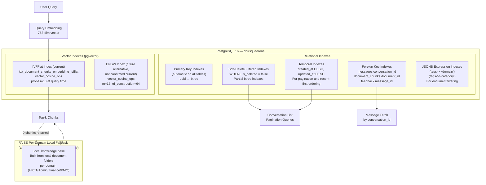

# Indexing Strategy — AA-Hackathon Enterprise AI Platform

**Organization:** Aligned Automation  
**Project:** AA-Hackathon Enterprise AI Platform  
**Version:** 1.0  
**Last Updated:** 2026-06-07  
**Owner:** Platform Engineering / Data Engineering  

---

## 1. Purpose

This document defines the indexing strategy for both PostgreSQL relational indexes and pgvector approximate nearest neighbor (ANN) indexes in the AA-Hackathon Enterprise AI Platform. Good indexing is critical for query performance at scale, especially for the vector similarity search that underpins the RAG pipeline.

---

## 2. Indexing Architecture Overview



**Note:** the FAISS path is consulted only when pgvector's own search returns **zero results** for a query — not when pgvector is "unavailable" (connection failure). It is a per-domain local knowledge base built from local document folders, not a mirror of the pgvector corpus, and it plays no role in the SharePoint ingestion pipeline (no FAISS usage exists anywhere under `apps/jobs`).

---

## 3. PostgreSQL Relational Indexes

### 3.1 Primary Key Indexes (Automatic)

PostgreSQL automatically creates B-tree indexes on all primary key columns. These are inherited and do not need explicit creation.

| Table | PK Column | Index Type |
|-------|-----------|-----------|
| `conversations` | `id` | B-tree (auto) |
| `messages` | `id` | B-tree (auto) |
| `feedback` | `id` | B-tree (auto) |
| `escalation_records` | `id` | B-tree (auto) |
| `audit_logs` | `id` | B-tree (auto) |
| `documents` | `id` | B-tree (auto) |
| `document_chunks` | `id` | B-tree (auto) |
| `pii_redaction_rules` | `id` | B-tree (auto) |
| `pii_redaction_logs` | `id` | B-tree (auto) |

### 3.2 Foreign Key Indexes

PostgreSQL does NOT automatically index foreign key columns. These must be created explicitly. Missing FK indexes cause full-table scans on joined queries.

```sql
-- messages → conversations
CREATE INDEX IF NOT EXISTS idx_messages_conversation_id
    ON messages (conversation_id)
    WHERE is_deleted = false;

-- feedback → messages
CREATE INDEX IF NOT EXISTS idx_feedback_message_id
    ON feedback (message_id)
    WHERE is_deleted = false;

-- document_chunks → documents
CREATE INDEX IF NOT EXISTS idx_document_chunks_document_id
    ON document_chunks (document_id)
    WHERE is_deleted = false;

-- pii_redaction_logs → messages
CREATE INDEX IF NOT EXISTS idx_pii_redaction_logs_message_id
    ON pii_redaction_logs (message_id);
```

### 3.3 Soft-Delete Filtered Indexes

Most queries add `WHERE is_deleted = false`. Partial indexes covering only non-deleted rows are smaller and faster than full indexes.

```sql
-- Conversations by user (primary access pattern for sidebar)
CREATE INDEX IF NOT EXISTS idx_conversations_user_active
    ON conversations (user_id, updated_at DESC)
    WHERE is_deleted = false;

-- Messages in a conversation (most common query)
CREATE INDEX IF NOT EXISTS idx_messages_conversation_active
    ON messages (conversation_id, created_at ASC)
    WHERE is_deleted = false;

-- Active documents (for ingestion hash lookup)
CREATE INDEX IF NOT EXISTS idx_documents_source_path_active
    ON documents (source_path)
    WHERE is_deleted = false;

-- Active document chunks (for JOIN in similarity search)
CREATE INDEX IF NOT EXISTS idx_document_chunks_active
    ON document_chunks (document_id, created_at DESC)
    WHERE is_deleted = false;

-- Escalation records by user and status
CREATE INDEX IF NOT EXISTS idx_escalation_records_user_active
    ON escalation_records (user_id, status, updated_at DESC)
    WHERE is_deleted = false;
```

### 3.4 Temporal Indexes

Used for recent-first ordering and date-range queries in analytics.

```sql
-- Conversations: most recent first (for list view)
CREATE INDEX IF NOT EXISTS idx_conversations_updated_at
    ON conversations (updated_at DESC)
    WHERE is_deleted = false;

-- Messages: chronological order within conversation (already covered by FK index above)

-- Audit logs: time-ordered queries (no is_deleted on audit_logs)
CREATE INDEX IF NOT EXISTS idx_audit_logs_created_at
    ON audit_logs (created_at DESC);

-- Audit logs: by user and time
CREATE INDEX IF NOT EXISTS idx_audit_logs_user_created_at
    ON audit_logs (user_id, created_at DESC);

-- PII redaction logs: retention enforcement queries
CREATE INDEX IF NOT EXISTS idx_pii_redaction_logs_created_at
    ON pii_redaction_logs (created_at);
```

### 3.5 JSONB Expression Indexes

Enable efficient filtering on specific JSONB fields without full-table scans.

```sql
-- Filter documents by domain (most common filter in RAG retrieval)
CREATE INDEX IF NOT EXISTS idx_documents_tags_domain
    ON documents ((tags->>'domain'))
    WHERE is_deleted = false;

-- Filter documents by category
CREATE INDEX IF NOT EXISTS idx_documents_tags_category
    ON documents ((tags->>'category'))
    WHERE is_deleted = false;

-- Lookup document by SharePoint item ID (for incremental updates)
CREATE INDEX IF NOT EXISTS idx_documents_tags_sharepoint_id
    ON documents ((tags->>'sharepoint_item_id'))
    WHERE is_deleted = false;

-- Chunk metadata: lookup by page number (for citation display)
CREATE INDEX IF NOT EXISTS idx_chunks_metadata_page
    ON document_chunks ((metadata->>'page_number'))
    WHERE is_deleted = false;
```

### 3.6 Unique Constraints (Implicit Unique Indexes)

```sql
-- documents.hash must be unique (change detection)
ALTER TABLE documents ADD CONSTRAINT uq_documents_hash UNIQUE (hash);
-- Equivalent: CREATE UNIQUE INDEX uq_documents_hash ON documents (hash);
```

---

## 4. pgvector Indexes

### 4.1 IVFFlat Index — Current Platform Index

The platform's documented retrieval configuration uses an **IVFFlat** index with `probes = 10` at query time — this is the current, real index type used by `document_chunks`, not HNSW.

```sql
-- Build AFTER inserting initial data (IVFFlat trains on existing rows)
CREATE INDEX IF NOT EXISTS idx_document_chunks_embedding_ivfflat
    ON document_chunks
    USING ivfflat (embedding vector_cosine_ops)
    WITH (lists = 100);
```

#### Parameter Explanation

| Parameter | Value | Description |
|-----------|-------|-------------|
| `lists` | 100 (approx.) | Number of inverted lists (clusters). Recommended rule of thumb: `sqrt(row_count)`. |

#### Query-Time Parameter

```sql
SET ivfflat.probes = 10;   -- The platform's documented default
-- Higher values search more lists → better recall, slower query. Typical range: 1–100.
```

#### IVFFlat Limitations

- Must be built on existing data (cannot be built on an empty table)
- Recall degrades as new data is inserted (clusters become stale)
- `REINDEX` recommended after adding a large fraction of the original row count — e.g. after the SharePoint ingestion job's full purge-and-rebuild run (see [`sharepoint-ingestion.md`](sharepoint-ingestion.md))

### 4.2 HNSW Index — Future Alternative, Not Confirmed Current

Hierarchical Navigable Small World (HNSW) builds a multi-layer graph structure that can offer faster queries and higher recall than IVFFlat, at the cost of slower, more memory-intensive index builds. It is a reasonable future upgrade path, but **it is not confirmed as the index type currently in use** on this platform — the README and the platform's documented retrieval configuration both point to IVFFlat as the real, current index.

```sql
-- Illustrative only — treat as a future option, not the current state
CREATE INDEX IF NOT EXISTS idx_document_chunks_embedding_hnsw
    ON document_chunks
    USING hnsw (embedding vector_cosine_ops)
    WITH (m = 16, ef_construction = 64);

SET hnsw.ef_search = 100;
```

### 4.3 Choosing HNSW vs IVFFlat

| Criterion | HNSW | IVFFlat |
|-----------|------|---------|
| Build speed | Slow (minutes for 100K rows) | Fast (seconds) |
| Query speed | Very fast | Fast |
| Recall at same speed | Higher | Lower |
| Memory during build | High (entire graph in memory) | Lower |
| Incremental insert support | Yes (degrades gracefully) | Yes (degrades, REINDEX recommended) |
| **Current platform use** | **Not confirmed — future candidate** | **Current (`probes = 10`)** |

---

## 5. FAISS Local Index — Per-Domain Fallback (Not an Ingestion-Pipeline Component)

`faiss-cpu` is a real dependency in `apps/api-gateway/requirements.txt`, but its role is narrower than earlier drafts of this document suggested:

- It is built by `app/agents/working/knowledge_base.py` from **local document folders**, one knowledge base per domain agent (HR, IT, Admin, Finance, PMO) — it is not built from the pgvector corpus and is not a mirror of it.
- It is consulted only when a pgvector similarity search for a query returns **zero results** — not when pgvector is unreachable/unavailable due to a connection failure.
- It plays **no role in the SharePoint ingestion pipeline**: there is no FAISS usage anywhere under `apps/jobs`, so it is not "persisted after each ingestion run" as earlier drafts claimed. It is populated from static local folders that are separate from the SharePoint-sourced corpus in `document_chunks`.

### 5.1 Indicative Usage Pattern

```python
import faiss
import numpy as np

DIMENSION = 768

# Per-domain local knowledge base, built from a local document folder
index = faiss.IndexFlatL2(DIMENSION)   # exact search over a comparatively small local corpus
```

Because each domain's local knowledge base is expected to be small (a curated local folder per domain, not the full organizational corpus), exact search (`IndexFlatL2`) is a reasonable choice; there is no confirmed use of `IndexIVFFlat` for this fallback path.

### 5.2 When It Is Consulted

```python
# Illustrative — see app/agents/working/base_deep_agent.py for the real pipeline
chunks = pgvector_search(query_embedding, top_k=10)
if not chunks:
    chunks = domain_faiss_knowledge_base.search(query_embedding, top_k=10)
```

---

## 6. Index Maintenance

### 6.1 After Bulk Ingestion

After adding a large batch of new documents (> 10% of total), rebuild the HNSW index concurrently to restore optimal graph structure:

```sql
-- Rebuild without locking reads (takes longer but non-blocking)
REINDEX INDEX CONCURRENTLY idx_document_chunks_embedding_hnsw;

-- Update statistics
ANALYZE document_chunks;
```

### 6.2 Routine Maintenance Schedule

| Operation | Frequency | Command |
|-----------|-----------|---------|
| `VACUUM ANALYZE documents` | Weekly | Reclaim dead tuples, update statistics |
| `VACUUM ANALYZE document_chunks` | Weekly | Critical for query planner accuracy |
| `ANALYZE audit_logs` | Weekly | Large append-only table |
| `REINDEX CONCURRENTLY` vector index | Monthly or after large ingestion | Restore HNSW graph quality |
| Check index bloat | Monthly | `pg_stat_user_indexes` |

### 6.3 Index Health Monitoring

```sql
-- Index usage statistics — confirm indexes are being used
SELECT
    schemaname,
    tablename,
    indexname,
    idx_scan         AS scans,
    idx_tup_read     AS tuples_read,
    idx_tup_fetch    AS tuples_fetched,
    pg_size_pretty(pg_relation_size(indexrelid)) AS index_size
FROM pg_stat_user_indexes
WHERE tablename IN ('documents', 'document_chunks', 'conversations', 'messages')
ORDER BY idx_scan DESC;

-- Unused indexes (candidates for removal)
SELECT indexname, tablename
FROM pg_stat_user_indexes
WHERE idx_scan = 0
  AND schemaname = 'public';

-- Index bloat estimation
SELECT
    tablename,
    indexname,
    pg_size_pretty(pg_relation_size(indexrelid)) AS index_size
FROM pg_stat_user_indexes
ORDER BY pg_relation_size(indexrelid) DESC;
```

---

## 7. Query Optimization Patterns

### 7.1 Verify Index Usage

```sql
-- Should show "Index Scan" not "Seq Scan"
EXPLAIN ANALYZE
SELECT id, title, created_at
FROM conversations
WHERE user_id = 'some-oid' AND is_deleted = false
ORDER BY updated_at DESC
LIMIT 20;
```

### 7.2 Vector Query Performance

```sql
-- Monitor vector query time
EXPLAIN (ANALYZE, BUFFERS)
SELECT dc.chunk_text, 1 - (dc.embedding <=> '[0.1,0.2,...]'::vector) AS similarity
FROM document_chunks dc
JOIN documents d ON d.id = dc.document_id
WHERE d.is_deleted = false AND dc.is_deleted = false
ORDER BY dc.embedding <=> '[0.1,0.2,...]'::vector
LIMIT 10;
```

Expected: `Index Scan using idx_document_chunks_embedding_ivfflat`. Actual execution time on this platform's dataset was not independently benchmarked in the last audit — treat any specific millisecond figure as illustrative, not measured.

### 7.3 Connection Pool Interaction

The API uses `psycopg2.pool.ThreadedConnectionPool` for its PostgreSQL connections (see [`database-standards.md`](../07-technical/database-standards.md) for the confirmed pool configuration). Exact pool size and per-query memory figures should be read from that document rather than assumed here.

---

## 8. Future Indexing Improvements

| Improvement | Description | Target |
|------------|-------------|--------|
| Evaluate HNSW as an upgrade from the current IVFFlat index | Potentially faster queries / higher recall at the cost of slower index builds — see Section 4.2 | Q3 2026 |
| Separate read replica for vector search | Offload vector queries from write connection pool | Q4 2026 |
| Domain-partitioned indexes | Separate vector index per domain (HR, IT, etc.) for faster domain-filtered search | Q4 2026 |
| pgBouncer | Connection pooler to reduce connection overhead | Q3 2026 |
| Hybrid BM25 + vector index | PostgreSQL full-text index (GIN) combined with vector index for hybrid search | Q4 2026 |
