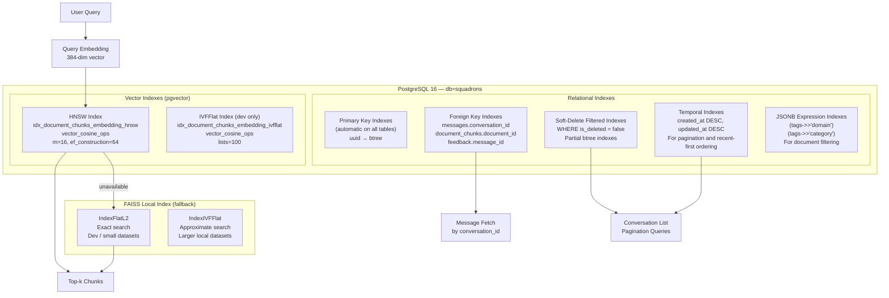

# Indexing Strategy — AA-Hackathon Enterprise AI Platform

**Organization:** Aligned Automation  
**Project:** AA-Hackathon Enterprise AI Platform  
**Version:** 1.0  
**Last Updated:** 2026-06-07  
**Owner:** Platform Engineering / Data Engineering  

---

## 1. Purpose

This document defines the indexing strategy for both PostgreSQL relational indexes and pgvector approximate nearest neighbor (ANN) indexes in the AA-Hackathon Enterprise AI Platform. Good indexing is critical for query performance at scale, especially for the vector similarity search that underpins the RAG pipeline.

---

## 2. Indexing Architecture Overview



---

## 3. PostgreSQL Relational Indexes

### 3.1 Primary Key Indexes (Automatic)

PostgreSQL automatically creates B-tree indexes on all primary key columns. These are inherited and do not need explicit creation.

| Table | PK Column | Index Type |
|-------|-----------|-----------|
| `conversations` | `id` | B-tree (auto) |
| `messages` | `id` | B-tree (auto) |
| `feedback` | `id` | B-tree (auto) |
| `escalations` | `id` | B-tree (auto) |
| `audit_logs` | `id` | B-tree (auto) |
| `documents` | `id` | B-tree (auto) |
| `document_chunks` | `id` | B-tree (auto) |
| `pii_redactions` | `id` | B-tree (auto) |
| `pii_events` | `id` | B-tree (auto) |

### 3.2 Foreign Key Indexes

PostgreSQL does NOT automatically index foreign key columns. These must be created explicitly. Missing FK indexes cause full-table scans on joined queries.

```sql
-- messages → conversations
CREATE INDEX IF NOT EXISTS idx_messages_conversation_id
    ON messages (conversation_id)
    WHERE is_deleted = false;

-- feedback → messages
CREATE INDEX IF NOT EXISTS idx_feedback_message_id
    ON feedback (message_id)
    WHERE is_deleted = false;

-- document_chunks → documents
CREATE INDEX IF NOT EXISTS idx_document_chunks_document_id
    ON document_chunks (document_id)
    WHERE is_deleted = false;

-- pii_redactions → messages
CREATE INDEX IF NOT EXISTS idx_pii_redactions_message_id
    ON pii_redactions (message_id);
```

### 3.3 Soft-Delete Filtered Indexes

Most queries add `WHERE is_deleted = false`. Partial indexes covering only non-deleted rows are smaller and faster than full indexes.

```sql
-- Conversations by user (primary access pattern for sidebar)
CREATE INDEX IF NOT EXISTS idx_conversations_user_active
    ON conversations (user_id, updated_at DESC)
    WHERE is_deleted = false;

-- Messages in a conversation (most common query)
CREATE INDEX IF NOT EXISTS idx_messages_conversation_active
    ON messages (conversation_id, created_at ASC)
    WHERE is_deleted = false;

-- Active documents (for ingestion hash lookup)
CREATE INDEX IF NOT EXISTS idx_documents_source_path_active
    ON documents (source_path)
    WHERE is_deleted = false;

-- Active document chunks (for JOIN in similarity search)
CREATE INDEX IF NOT EXISTS idx_document_chunks_active
    ON document_chunks (document_id, created_at DESC)
    WHERE is_deleted = false;

-- Escalations by user and status
CREATE INDEX IF NOT EXISTS idx_escalations_user_active
    ON escalations (user_id, status, updated_at DESC)
    WHERE is_deleted = false;
```

### 3.4 Temporal Indexes

Used for recent-first ordering and date-range queries in analytics.

```sql
-- Conversations: most recent first (for list view)
CREATE INDEX IF NOT EXISTS idx_conversations_updated_at
    ON conversations (updated_at DESC)
    WHERE is_deleted = false;

-- Messages: chronological order within conversation (already covered by FK index above)

-- Audit logs: time-ordered queries (no is_deleted on audit_logs)
CREATE INDEX IF NOT EXISTS idx_audit_logs_created_at
    ON audit_logs (created_at DESC);

-- Audit logs: by user and time
CREATE INDEX IF NOT EXISTS idx_audit_logs_user_created_at
    ON audit_logs (user_id, created_at DESC);

-- PII events: retention enforcement queries
CREATE INDEX IF NOT EXISTS idx_pii_events_created_at
    ON pii_events (created_at);
```

### 3.5 JSONB Expression Indexes

Enable efficient filtering on specific JSONB fields without full-table scans.

```sql
-- Filter documents by domain (most common filter in RAG retrieval)
CREATE INDEX IF NOT EXISTS idx_documents_tags_domain
    ON documents ((tags->>'domain'))
    WHERE is_deleted = false;

-- Filter documents by category
CREATE INDEX IF NOT EXISTS idx_documents_tags_category
    ON documents ((tags->>'category'))
    WHERE is_deleted = false;

-- Lookup document by SharePoint item ID (for incremental updates)
CREATE INDEX IF NOT EXISTS idx_documents_tags_sharepoint_id
    ON documents ((tags->>'sharepoint_item_id'))
    WHERE is_deleted = false;

-- Chunk metadata: lookup by page number (for citation display)
CREATE INDEX IF NOT EXISTS idx_chunks_metadata_page
    ON document_chunks ((metadata->>'page_number'))
    WHERE is_deleted = false;
```

### 3.6 Unique Constraints (Implicit Unique Indexes)

```sql
-- documents.hash must be unique (change detection)
ALTER TABLE documents ADD CONSTRAINT uq_documents_hash UNIQUE (hash);
-- Equivalent: CREATE UNIQUE INDEX uq_documents_hash ON documents (hash);
```

---

## 4. pgvector Indexes

### 4.1 HNSW Index — Production Standard

Hierarchical Navigable Small World (HNSW) is the recommended index type for production use. It builds a multi-layer graph structure that enables extremely fast approximate nearest neighbor search.

```sql
CREATE INDEX IF NOT EXISTS idx_document_chunks_embedding_hnsw
    ON document_chunks
    USING hnsw (embedding vector_cosine_ops)
    WITH (m = 16, ef_construction = 64);
```

#### Parameter Explanation

| Parameter | Value | Description | Trade-off |
|-----------|-------|-------------|-----------|
| `m` | 16 | Maximum number of bidirectional links per node in each layer | Higher → better accuracy, more memory and build time. Range: 4–64. 16 is pgvector default. |
| `ef_construction` | 64 | Size of the candidate list during index construction | Higher → better graph quality, slower build. Range: 16–256. 64 is a good balance. |

#### Query-Time Parameter

```sql
-- Set at connection level or per session
SET hnsw.ef_search = 100;
-- Default: 40. Higher → better recall, slower query. Range: ef_construction to 1000.
```

Recommended values by use case:

| Use Case | `ef_search` | Rationale |
|----------|-------------|-----------|
| Real-time chat (< 100ms) | 64 | Fast response |
| Standard retrieval | 100 | Good balance (production default) |
| Analytics / offline reranking | 200 | High recall priority |
| Benchmarking / evaluation | 400 | Maximum recall |

#### Memory Estimation

HNSW memory per vector = approximately `m * 2 * 8 bytes` = 256 bytes overhead per vector (at m=16).

For 100,000 chunks: `100,000 × (384 × 4 + 256)` = ~178 MB total (vectors + graph structure).

### 4.2 IVFFlat Index — Development Only

Inverted File (IVF) index with flat storage. Suitable for development environments and small datasets (< 10,000 vectors) where fast build time matters more than query speed.

```sql
-- Build AFTER inserting initial data (IVFFlat trains on existing rows)
CREATE INDEX IF NOT EXISTS idx_document_chunks_embedding_ivfflat
    ON document_chunks
    USING ivfflat (embedding vector_cosine_ops)
    WITH (lists = 100);
```

#### Parameter Explanation

| Parameter | Value | Description |
|-----------|-------|-------------|
| `lists` | 100 | Number of inverted lists (clusters). Recommended: `sqrt(row_count)`. At 10,000 rows → 100 lists. |

#### Query-Time Parameter

```sql
SET ivfflat.probes = 10;
-- Default: 1 (very fast, lower recall). 10 searches 10% of lists. Typical range: 1–100.
```

#### IVFFlat Limitations

- Must be built on existing data (cannot be built on empty table)
- Recall degrades as new data is inserted (clusters become stale)
- REINDEX recommended after adding > 20% of original row count

### 4.3 Choosing HNSW vs IVFFlat

| Criterion | HNSW | IVFFlat |
|-----------|------|---------|
| Build speed | Slow (minutes for 100K rows) | Fast (seconds) |
| Query speed | Very fast | Fast |
| Recall at same speed | Higher | Lower |
| Memory during build | High (entire graph in memory) | Lower |
| Incremental insert support | Yes (degrades gracefully) | Yes (degrades, REINDEX recommended) |
| Recommended for | Production, > 5,000 rows | Development, < 10,000 rows |
| Current platform use | Production (default) | Development fallback |

---

## 5. FAISS Local Index

The FAISS index is the fallback when pgvector is unavailable. It is built in-memory from embeddings loaded from the database (or from a persisted file).

### 5.1 Index Types

```python
import faiss
import numpy as np

DIMENSION = 384

# Development / small datasets (< 10,000 vectors)
# Exact search — perfect recall, linear time O(n)
index = faiss.IndexFlatL2(DIMENSION)

# Production fallback (> 10,000 vectors)
# Approximate search with IVF clustering
quantizer = faiss.IndexFlatL2(DIMENSION)
index = faiss.IndexIVFFlat(quantizer, DIMENSION, nlist=100)
index.train(training_vectors)  # requires training data
index.nprobe = 10              # probes at query time
```

### 5.2 Persistence

The FAISS index is persisted to disk after each ingestion run and loaded on startup:

```python
FAISS_INDEX_PATH = os.path.join(FAISS_DATA_DIR, "knowledge_base.index")
FAISS_META_PATH  = os.path.join(FAISS_DATA_DIR, "knowledge_base_meta.pkl")

# Save after ingestion
faiss.write_index(index, FAISS_INDEX_PATH)
with open(FAISS_META_PATH, "wb") as f:
    pickle.dump(chunk_metadata_list, f)

# Load on startup
if os.path.exists(FAISS_INDEX_PATH):
    index = faiss.read_index(FAISS_INDEX_PATH)
    with open(FAISS_META_PATH, "rb") as f:
        chunk_metadata_list = pickle.load(f)
```

### 5.3 FAISS Index Size

| Vectors | IndexFlatL2 Size | IndexIVFFlat Size |
|---------|-----------------|------------------|
| 10,000 | 15 MB | 16 MB |
| 50,000 | 75 MB | 77 MB |
| 100,000 | 150 MB | 155 MB |

---

## 6. Index Maintenance

### 6.1 After Bulk Ingestion

After adding a large batch of new documents (> 10% of total), rebuild the HNSW index concurrently to restore optimal graph structure:

```sql
-- Rebuild without locking reads (takes longer but non-blocking)
REINDEX INDEX CONCURRENTLY idx_document_chunks_embedding_hnsw;

-- Update statistics
ANALYZE document_chunks;
```

### 6.2 Routine Maintenance Schedule

| Operation | Frequency | Command |
|-----------|-----------|---------|
| `VACUUM ANALYZE documents` | Weekly | Reclaim dead tuples, update statistics |
| `VACUUM ANALYZE document_chunks` | Weekly | Critical for query planner accuracy |
| `ANALYZE audit_logs` | Weekly | Large append-only table |
| `REINDEX CONCURRENTLY` vector index | Monthly or after large ingestion | Restore HNSW graph quality |
| Check index bloat | Monthly | `pg_stat_user_indexes` |

### 6.3 Index Health Monitoring

```sql
-- Index usage statistics — confirm indexes are being used
SELECT
    schemaname,
    tablename,
    indexname,
    idx_scan         AS scans,
    idx_tup_read     AS tuples_read,
    idx_tup_fetch    AS tuples_fetched,
    pg_size_pretty(pg_relation_size(indexrelid)) AS index_size
FROM pg_stat_user_indexes
WHERE tablename IN ('documents', 'document_chunks', 'conversations', 'messages')
ORDER BY idx_scan DESC;

-- Unused indexes (candidates for removal)
SELECT indexname, tablename
FROM pg_stat_user_indexes
WHERE idx_scan = 0
  AND schemaname = 'public';

-- Index bloat estimation
SELECT
    tablename,
    indexname,
    pg_size_pretty(pg_relation_size(indexrelid)) AS index_size
FROM pg_stat_user_indexes
ORDER BY pg_relation_size(indexrelid) DESC;
```

---

## 7. Query Optimization Patterns

### 7.1 Verify Index Usage

```sql
-- Should show "Index Scan" not "Seq Scan"
EXPLAIN ANALYZE
SELECT id, title, created_at
FROM conversations
WHERE user_id = 'some-oid' AND is_deleted = false
ORDER BY updated_at DESC
LIMIT 20;
```

### 7.2 Vector Query Performance

```sql
-- Monitor vector query time
EXPLAIN (ANALYZE, BUFFERS)
SELECT dc.chunk_text, 1 - (dc.embedding <=> '[0.1,0.2,...]'::vector) AS similarity
FROM document_chunks dc
JOIN documents d ON d.id = dc.document_id
WHERE d.is_deleted = false AND dc.is_deleted = false
ORDER BY dc.embedding <=> '[0.1,0.2,...]'::vector
LIMIT 10;
```

Expected: `Index Scan using idx_document_chunks_embedding_hnsw`. Typical execution time: 5–50ms for 50,000 vectors.

### 7.3 Connection Pool Interaction

With `ThreadedConnectionPool(min=1, max=8)`, a maximum of 8 concurrent connections can run vector queries simultaneously. Each vector query with `hnsw.ef_search=100` uses approximately 50MB of working memory. Total working memory estimate: `8 × 50MB = 400MB` — within acceptable bounds for the platform host.

---

## 8. Future Indexing Improvements

| Improvement | Description | Target |
|------------|-------------|--------|
| Separate read replica for vector search | Offload vector queries from write connection pool | Q4 2026 |
| HNSW auto-tuning | Dynamic `ef_search` based on query latency SLA | Q3 2026 |
| Domain-partitioned indexes | Separate HNSW index per domain (HR, IT, etc.) for faster domain-filtered search | Q4 2026 |
| pgBouncer | Connection pooler to reduce connection overhead | Q3 2026 |
| Hybrid BM25 + vector index | PostgreSQL full-text index (GIN) combined with vector index for hybrid search | Q4 2026 |
