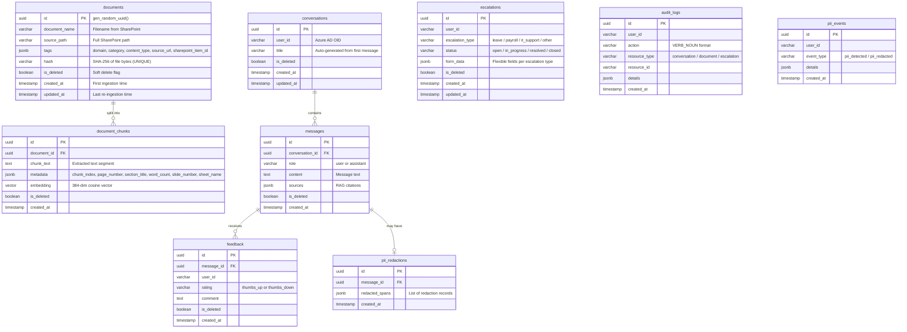

# Metadata Model — AA-Hackathon Enterprise AI Platform

**Organization:** Aligned Automation  
**Project:** AA-Hackathon Enterprise AI Platform  
**Version:** 1.0  
**Last Updated:** 2026-06-07  
**Owner:** Platform Engineering / Data Engineering  

---

## 1. Purpose

This document defines the complete metadata model for all entities in the AA-Hackathon Enterprise AI Platform. It covers document metadata, chunk metadata, conversation and message metadata, user context metadata, and the document taxonomy used for tagging and discovery. This model governs what data is stored, in what format, and how it is used.

---

## 2. Entity Relationship Overview



---

## 3. Document-Level Metadata

### 3.1 `documents` Table Schema

```sql
CREATE TABLE documents (
    id            UUID         PRIMARY KEY DEFAULT gen_random_uuid(),
    document_name VARCHAR(512) NOT NULL,
    source_path   VARCHAR(2048) NOT NULL,
    tags          JSONB        NOT NULL DEFAULT '{}',
    hash          VARCHAR(64)  NOT NULL UNIQUE,  -- SHA-256 hex (64 chars)
    is_deleted    BOOLEAN      NOT NULL DEFAULT FALSE,
    created_at    TIMESTAMPTZ  NOT NULL DEFAULT NOW(),
    updated_at    TIMESTAMPTZ  NOT NULL DEFAULT NOW()
);
```

### 3.2 `tags` JSONB Schema

The `tags` column stores document classification and origin metadata. All fields are optional but populated where known.

```json
{
  "source_url": "https://alignedautomation.sharepoint.com/sites/HR/Shared%20Documents/Leave%20Policy%202026.pdf",
  "sharepoint_item_id": "01ABCDEF1234567890",
  "domain": "HR",
  "category": "Policy",
  "content_type": "PDF",
  "department": "Human Resources",
  "effective_date": "2026-01-01",
  "version": "2026-v1"
}
```

| Field | Type | Description |
|-------|------|-------------|
| `source_url` | string | Direct SharePoint URL to the file |
| `sharepoint_item_id` | string | SharePoint Graph API item ID for incremental updates |
| `domain` | string | Taxonomy domain (see Section 8) |
| `category` | string | Content category (see Section 8) |
| `content_type` | string | File format: PDF / DOCX / XLSX / PPTX |
| `department` | string | Owning department if known |
| `effective_date` | string (ISO 8601 date) | Document effective date if found in metadata |
| `version` | string | Document version if present |

---

## 4. Chunk-Level Metadata

### 4.1 `document_chunks` Table Schema

```sql
CREATE TABLE document_chunks (
    id          UUID    PRIMARY KEY DEFAULT gen_random_uuid(),
    document_id UUID    NOT NULL REFERENCES documents(id),
    chunk_text  TEXT    NOT NULL,
    metadata    JSONB   NOT NULL DEFAULT '{}',
    embedding   vector(384) NOT NULL,
    is_deleted  BOOLEAN NOT NULL DEFAULT FALSE,
    created_at  TIMESTAMPTZ NOT NULL DEFAULT NOW()
);
```

### 4.2 `metadata` JSONB Schema

```json
{
  "chunk_index": 7,
  "page_number": 3,
  "slide_number": null,
  "sheet_name": null,
  "section_title": "Annual Leave Entitlement",
  "word_count": 89,
  "char_count": 487
}
```

| Field | Type | Applicable To |
|-------|------|--------------|
| `chunk_index` | int | All documents — position within document |
| `page_number` | int | PDF only |
| `slide_number` | int | PPTX only |
| `sheet_name` | string | XLSX only |
| `section_title` | string | DOCX — heading of containing section |
| `word_count` | int | All — word count of this chunk |
| `char_count` | int | All — character count of this chunk |

---

## 5. Conversation Metadata

### 5.1 `conversations` Table Schema

```sql
CREATE TABLE conversations (
    id         UUID         PRIMARY KEY DEFAULT gen_random_uuid(),
    user_id    VARCHAR(128) NOT NULL,  -- Azure AD OID
    title      VARCHAR(512),           -- Auto-generated from first message (first 60 chars)
    is_deleted BOOLEAN      NOT NULL DEFAULT FALSE,
    created_at TIMESTAMPTZ NOT NULL DEFAULT NOW(),
    updated_at TIMESTAMPTZ NOT NULL DEFAULT NOW()
);
```

`title` is auto-generated server-side from the first message of the conversation (truncated to 60 characters). It can be updated by the user via the API.

### 5.2 `messages` Table Schema

```sql
CREATE TABLE messages (
    id              UUID        PRIMARY KEY DEFAULT gen_random_uuid(),
    conversation_id UUID        NOT NULL REFERENCES conversations(id),
    role            VARCHAR(16) NOT NULL CHECK (role IN ('user', 'assistant')),
    content         TEXT        NOT NULL,
    sources         JSONB       NOT NULL DEFAULT '[]',
    is_deleted      BOOLEAN     NOT NULL DEFAULT FALSE,
    created_at      TIMESTAMPTZ NOT NULL DEFAULT NOW()
);
```

### 5.3 `sources` JSONB Schema (Messages)

The `sources` field on assistant messages contains the RAG citations that supported the response:

```json
[
  {
    "document_name": "Leave Policy 2026.pdf",
    "source_url": "https://alignedautomation.sharepoint.com/sites/HR/Shared%20Documents/Leave%20Policy%202026.pdf",
    "similarity": 0.87,
    "chunk_text_preview": "Annual leave entitlement for permanent employees is 21 working days per calendar year...",
    "page_number": 3,
    "section_title": "Annual Leave Entitlement"
  },
  {
    "document_name": "Employee Handbook 2026.docx",
    "source_url": "https://alignedautomation.sharepoint.com/...",
    "similarity": 0.72,
    "chunk_text_preview": "New joiners are entitled to pro-rated leave in their first year...",
    "page_number": null,
    "section_title": "Leave and Attendance"
  }
]
```

| Field | Type | Description |
|-------|------|-------------|
| `document_name` | string | Display name of the source document |
| `source_url` | string | Direct link to the SharePoint document |
| `similarity` | float | Cosine similarity score (0.0–1.0) |
| `chunk_text_preview` | string | First 200 chars of the matched chunk (for tooltip display) |
| `page_number` | int or null | Page number (PDF) or null |
| `section_title` | string or null | Section heading (DOCX) or null |

---

## 6. Escalation Metadata

### 6.1 `escalations` Table Schema

```sql
CREATE TABLE escalations (
    id               UUID        PRIMARY KEY DEFAULT gen_random_uuid(),
    user_id          VARCHAR(128) NOT NULL,
    escalation_type  VARCHAR(64) NOT NULL,
    status           VARCHAR(32) NOT NULL DEFAULT 'open'
                     CHECK (status IN ('open', 'in_progress', 'resolved', 'closed')),
    form_data        JSONB       NOT NULL DEFAULT '{}',
    is_deleted       BOOLEAN     NOT NULL DEFAULT FALSE,
    created_at       TIMESTAMPTZ NOT NULL DEFAULT NOW(),
    updated_at       TIMESTAMPTZ NOT NULL DEFAULT NOW()
);
```

### 6.2 `form_data` JSONB Schemas by Type

**Leave Request:**
```json
{
  "escalation_type": "leave_request",
  "leave_type": "Annual",
  "start_date": "2026-07-01",
  "end_date": "2026-07-05",
  "days_requested": 5,
  "reason": "Family vacation",
  "approver_email": "manager@alignedautomation.com"
}
```

**IT Support:**
```json
{
  "escalation_type": "it_support",
  "issue_category": "Software",
  "issue_description": "Cannot access the shared drive on new laptop",
  "priority": "medium",
  "asset_tag": "LT-2024-0892"
}
```

**Payroll Query:**
```json
{
  "escalation_type": "payroll_query",
  "query_type": "Missing reimbursement",
  "month": "2026-05",
  "amount_expected": 2500.00,
  "description": "Travel reimbursement from Apr not reflected in May payslip"
}
```

---

## 7. User Context Metadata

User metadata is not stored in a separate table — it is assembled at request time from two sources:

### 7.1 Azure AD JWT Claims

| Claim | Field | Example |
|-------|-------|---------|
| `oid` | Object ID / user_id | `"a1b2c3d4-e5f6-7890-abcd-ef1234567890"` |
| `preferred_username` | Email | `"john.doe@alignedautomation.com"` |
| `name` | Display name | `"John Doe"` |

### 7.2 Zoho People Enrichment (Read-only DB)

Looked up by email from the `preferred_username` claim:

| Field | Source | Example |
|-------|--------|---------|
| `department` | Zoho | `"Human Resources"` |
| `designation` | Zoho | `"HR Business Partner"` |
| `manager_email` | Zoho | `"jane.smith@alignedautomation.com"` |
| `employee_id` | Zoho | `"EMP-0042"` |
| `joining_date` | Zoho | `"2023-03-15"` |

The combined user context object is assembled in `get_current_user` and used to personalize AI responses (e.g., applying correct leave policy based on department, providing manager-specific escalation routing).

---

## 8. Document Taxonomy

All documents in the knowledge base are tagged with a controlled vocabulary for domain and category.

### 8.1 Domain Tags

| Domain | Description | Example Documents |
|--------|-------------|-------------------|
| `HR` | Human resources policies and processes | Leave policy, onboarding guide, code of conduct |
| `IT` | Technology policies and support guides | IT security policy, VPN setup guide, software list |
| `Admin` | Administrative procedures and forms | Procurement process, vendor onboarding, travel policy |
| `Org` | Organizational information | Org chart, office locations, team structures |
| `Finance` | Finance policies and procedures | Expense claims, budget process, reimbursement policy |
| `PMO` | Project management standards | Project templates, governance, reporting standards |
| `Legal` | Legal and compliance documents | Contract templates, NDA, data protection policy |

### 8.2 Category Tags

| Category | Description |
|----------|-------------|
| `Policy` | Formal policy document with rules and guidelines |
| `Procedure` | Step-by-step process instructions |
| `Form` | Fillable form or template |
| `Announcement` | One-time communication or news |
| `Guide` | How-to guide or reference material |
| `FAQ` | Frequently asked questions document |
| `Report` | Analytical report or dashboard data |
| `Contract` | Legal agreement template |

### 8.3 Auto-Tagging from SharePoint Path

The domain tag is automatically derived from the SharePoint folder path during ingestion:

```python
FOLDER_TO_DOMAIN = {
    "/HR/": "HR",
    "/Human Resources/": "HR",
    "/IT/": "IT",
    "/Information Technology/": "IT",
    "/Finance/": "Finance",
    "/Administration/": "Admin",
    "/PMO/": "PMO",
    "/Legal/": "Legal",
}

def derive_domain_from_path(source_path: str) -> str:
    for folder_pattern, domain in FOLDER_TO_DOMAIN.items():
        if folder_pattern.lower() in source_path.lower():
            return domain
    return "Org"  # default if no match
```

### 8.4 Security Classification

| Level | Description | Access |
|-------|-------------|--------|
| `Public` | General company information | All employees |
| `Internal` | Internal processes and policies | All employees |
| `Confidential` | Sensitive HR, legal, financial data | Role-restricted (future) |

Current platform does not enforce document-level access control — all authenticated users can retrieve all documents. Row-level security by domain/classification is a planned future feature.

---

## 9. Audit Log Metadata

### 9.1 `audit_logs` Table Schema

```sql
CREATE TABLE audit_logs (
    id            UUID        PRIMARY KEY DEFAULT gen_random_uuid(),
    user_id       VARCHAR(128) NOT NULL,
    action        VARCHAR(128) NOT NULL,  -- VERB_NOUN: CREATE_CONVERSATION, SEND_MESSAGE, etc.
    resource_type VARCHAR(64),
    resource_id   VARCHAR(128),
    details       JSONB        NOT NULL DEFAULT '{}',
    created_at    TIMESTAMPTZ NOT NULL DEFAULT NOW()
);
```

Note: `audit_logs` does not have `is_deleted` — audit records are immutable. They are never soft-deleted.

### 9.2 Standard Action Codes

| Action | Trigger |
|--------|---------|
| `CREATE_CONVERSATION` | User starts new chat |
| `SEND_MESSAGE` | User sends a message |
| `RECEIVE_RESPONSE` | AI response generated |
| `SUBMIT_FEEDBACK` | User submits thumbs up/down |
| `SUBMIT_ESCALATION` | User submits escalation form |
| `DELETE_CONVERSATION` | User soft-deletes conversation |
| `TRIGGER_INGESTION` | Admin triggers SharePoint ingestion |
| `EXPORT_ANALYTICS` | Admin exports analytics data |
| `PII_DETECTED` | PII found in user input |

### 9.3 `details` JSONB Schema

```json
{
  "ip_address": "10.0.0.45",
  "user_agent": "Mozilla/5.0...",
  "request_id": "uuid",
  "conversation_id": "uuid",
  "message_length": 142,
  "chunks_retrieved": 8,
  "model_used": "gpt-oss"
}
```

---

## 10. PII Metadata

### 10.1 `pii_redactions` Table Schema

```sql
CREATE TABLE pii_redactions (
    id             UUID PRIMARY KEY DEFAULT gen_random_uuid(),
    message_id     UUID NOT NULL REFERENCES messages(id),
    redacted_spans JSONB NOT NULL DEFAULT '[]',
    created_at     TIMESTAMPTZ NOT NULL DEFAULT NOW()
);
```

### 10.2 `redacted_spans` JSONB Schema

```json
[
  {
    "start": 45,
    "end": 57,
    "entity_type": "EMAIL",
    "replacement": "[EMAIL]",
    "original_text_hash": "sha256-of-original"
  },
  {
    "start": 102,
    "end": 113,
    "entity_type": "PHONE_NUMBER",
    "replacement": "[PHONE]",
    "original_text_hash": "sha256-of-original"
  }
]
```

The original PII text is never stored — only its SHA-256 hash for audit purposes. The replacement text (`[EMAIL]`, `[PHONE]`, etc.) is what is stored in the message content.
