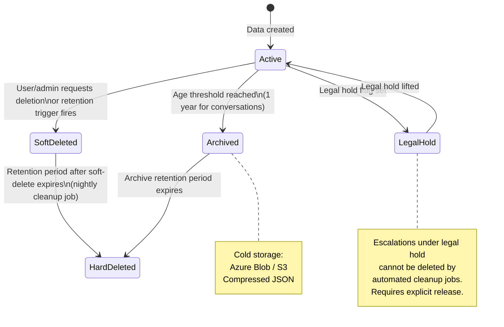

# Data Retention Policy — AA-Hackathon Enterprise AI Platform

**Organization:** Aligned Automation  
**Project:** AA-Hackathon Enterprise AI Platform  
**Version:** 1.0  
**Last Updated:** 2026-06-07  
**Owner:** Platform Engineering / Legal / Compliance  

---

## 1. Purpose and Scope

This document defines the data retention policy for all data stored by the AA-Hackathon Enterprise AI Platform. The policy covers retention periods, archival procedures, deletion mechanisms, GDPR compliance, and legal hold procedures.

All data stored in the `squadrons` PostgreSQL database is subject to this policy. The policy applies to: conversations, messages, feedback, escalations, audit logs, documents, document chunks, PII redactions, and PII events.

---

## 2. Data Lifecycle Overview



---

## 3. Retention Schedule by Data Type

### 3.1 Conversation Data

| Stage | Duration | Action | Trigger |
|-------|----------|--------|---------|
| Active | Indefinite | Normal operations | User creates conversation |
| Soft-deleted | 90 days | `is_deleted = true`, not visible to user | User deletes conversation or user GDPR erasure request |
| Hard-deleted | After 90 days of soft-delete | Physical row deletion via cleanup job | Nightly job: `DELETE WHERE is_deleted = true AND updated_at < NOW() - INTERVAL '90 days'` |
| Archived | After 1 year from creation | Export to cold storage, hard-delete from primary DB | Nightly archival job |

```sql
-- Conversations eligible for hard deletion (90 days post soft-delete)
SELECT id FROM conversations
WHERE is_deleted = true
  AND updated_at < NOW() - INTERVAL '90 days';

-- Conversations eligible for archival (1 year, still active)
SELECT id FROM conversations
WHERE is_deleted = false
  AND created_at < NOW() - INTERVAL '1 year';
```

### 3.2 Message Data

| Stage | Duration | Action |
|-------|----------|--------|
| Active | Linked to conversation lifetime | Available for retrieval |
| Soft-deleted | Inherits from parent conversation | When conversation is soft-deleted |
| Archived | 1 year from creation | Exported to cold storage alongside conversation |
| Hard-deleted | With parent conversation | Physical deletion when conversation is hard-deleted |

Messages are never independently deleted — they follow their parent conversation's lifecycle.

### 3.3 Feedback Data

| Stage | Duration | Action | Rationale |
|-------|----------|--------|-----------|
| Active | Indefinite | Retained permanently | Feedback is essential for AI model improvement and quality monitoring. Deleting feedback removes the signal for calibrating model responses. |

Exception: if a GDPR erasure request is made, feedback records for that user are anonymized (user_id replaced with anonymized hash) but not deleted.

### 3.4 Escalation Data

| Stage | Duration | Action |
|-------|----------|--------|
| Active | Until resolved, then 2 years minimum | Normal |
| Legal hold | Until hold is lifted | Cannot be deleted by automated jobs |
| Archival | After 2 years | Export to cold storage |
| Hard-deleted | After 2 years in archive | Physical deletion |

Minimum 2-year retention is required for:
- Employment law compliance (documentation of HR decisions)
- Finance-related escalations (payroll disputes, reimbursements)
- IT security incidents

Status history (each transition from `open` → `in_progress` → `resolved` → `closed`) is preserved in `audit_logs` even after escalation is archived.

### 3.5 Audit Logs

| Stage | Duration | Action |
|-------|----------|--------|
| Active | 2 years minimum | Retained in primary database |
| Archived | After 2 years | Exported to cold storage |
| Hard-deleted | Never (or after 7+ years per jurisdiction) | Audit logs are legally protected records |

Audit logs are immutable. They have no `is_deleted` column. They are never soft-deleted. Physical deletion only via approved compliance process.

### 3.6 PII Events

| Stage | Duration | Action | Legal Basis |
|-------|----------|--------|-------------|
| Active | 7 years | Retained in primary database | GDPR Article 17(3)(b): legal obligation |
| Archived | After 7 years | Export to cold storage | |
| Hard-deleted | After 7 years in archive | Physical deletion | |

7-year retention for PII events aligns with tax law requirements in India and GDPR's exemption for legal obligations. This is the longest retention period in the platform.

### 3.7 PII Redactions

| Stage | Duration | Action |
|-------|----------|--------|
| Active | 1 year | Retained for audit trail |
| Hard-deleted | After 1 year | Physical deletion via cleanup job |

Note: PII redactions do not store the original PII text — only the character positions and entity type. The original text's SHA-256 hash is retained for audit purposes but the plaintext is never stored.

### 3.8 Document Data

| Stage | Duration | Action |
|-------|----------|--------|
| Active | While document exists in SharePoint | Normal |
| Soft-deleted | Immediate (on DELETED detection or manual delete) | `is_deleted = true` |
| Hard-deleted (chunks) | 30 days after soft-delete | Physical deletion by cleanup job |
| Hard-deleted (document) | 30 days after soft-delete | Physical deletion by cleanup job |

Document data is replaced (not extended) when a document changes. Old chunks are soft-deleted immediately and hard-deleted after 30 days. The 30-day window allows rollback if the ingestion had errors.

---

## 4. Retention Summary Table

| Data Type | Active Retention | Soft-Delete Window | Archive After | Hard Delete |
|-----------|-----------------|-------------------|---------------|-------------|
| Conversations | Indefinite | 90 days | 1 year | 90 days post soft-delete |
| Messages | With conversation | With conversation | 1 year | With conversation |
| Feedback | Permanent (anonymized on GDPR) | — | — | Never |
| Escalations | Until resolved + 2 years | — | 2 years | 2 years post-archive |
| Audit Logs | 2 years active | Never (immutable) | 2 years | 7+ years |
| PII Events | 7 years | Never | After 7 years | After 7 years |
| PII Redactions | 1 year | — | — | 1 year |
| Documents | While in SharePoint | 30 days | — | 30 days post soft-delete |
| Document Chunks | With document | 30 days | — | 30 days post soft-delete |

---

## 5. Backup Retention

| Backup Type | Frequency | Retention Period | Storage |
|-------------|-----------|-----------------|---------|
| Daily backup | Every day at 00:00 UTC | 7 days rolling | Secure offsite storage |
| Weekly backup | Every Sunday at 01:00 UTC | 4 weeks rolling | Secure offsite storage |
| Monthly backup | First of month at 02:00 UTC | 12 months | Cold storage (Azure Blob) |
| Annual backup | January 1st | 7 years | Cold storage (encrypted) |

Backup command:
```bash
pg_dump -h hackathon.alignedautomation.com -U admin -d squadrons -Fc \
    > backup_squadrons_$(date +%Y%m%d_%H%M).dump
```

Backup verification: Monthly restoration test to isolated test instance. Verify row counts match production.

---

## 6. Archival Process

### 6.1 Archival Target

Cold storage: Azure Blob Storage (or S3-compatible) under the path:
```
aa-platform/archive/{year}/{month}/{data_type}_{YYYYMMDD}.json.gz
```

### 6.2 Archival Data Format

Conversations are exported as NDJSON (newline-delimited JSON), one record per line, including all associated messages:

```json
{"id": "uuid", "user_id": "oid", "title": "...", "created_at": "...", "messages": [...]}
{"id": "uuid", "user_id": "oid", "title": "...", "created_at": "...", "messages": [...]}
```

Files are gzip-compressed before upload. Encryption at rest is handled by the storage service (Azure Blob SSE or S3 SSE-S3).

### 6.3 Archival Job

Location: `apps/jobs/retention_archival/main.py`
Schedule: First day of each month at 03:00 UTC

The job:
1. Queries records eligible for archival (age > threshold, not under legal hold)
2. Exports to NDJSON, gzip-compresses
3. Uploads to cold storage
4. Verifies upload checksum
5. Hard-deletes from primary database
6. Logs archival summary to `audit_logs`

---

## 7. GDPR Right to Erasure (Right to Be Forgotten)

When an employee submits a GDPR data erasure request, the following procedure applies:

### 7.1 Data Subject Identification

Identify all records associated with the user's Azure AD OID (`oid` claim). The `oid` is stored in:
- `conversations.user_id`
- `messages` (indirectly via conversation)
- `feedback.user_id`
- `escalations.user_id`
- `audit_logs.user_id`
- `pii_events.user_id`

### 7.2 Erasure Actions by Table

```sql
BEGIN;

-- 1. Soft-delete all user conversations (cascades to messages via cleanup job)
UPDATE conversations
SET is_deleted = true, updated_at = NOW()
WHERE user_id = %s;

-- 2. Soft-delete all user escalations (subject to legal hold check first)
UPDATE escalations
SET is_deleted = true, updated_at = NOW()
WHERE user_id = %s
  AND id NOT IN (SELECT escalation_id FROM legal_holds WHERE active = true);

-- 3. Anonymize feedback (do not delete — preserves signal integrity)
UPDATE feedback
SET user_id = encode(sha256(%s::bytea), 'hex')  -- pseudonymized hash
WHERE user_id = %s;

-- 4. Anonymize audit_logs (do not delete — legally required records)
UPDATE audit_logs
SET user_id = encode(sha256(%s::bytea), 'hex')
WHERE user_id = %s;

-- 5. Delete PII events for user
DELETE FROM pii_events
WHERE user_id = %s;

COMMIT;
```

### 7.3 Erasure Exceptions

The following data is NOT erased under Right to Erasure (GDPR Article 17(3) exceptions):

| Exception | Data | Reason |
|-----------|------|--------|
| Legal obligation | Audit logs older than 2 years | Required by compliance and employment law |
| Legal claim defense | Escalations under active legal hold | Company legitimate interest |
| Tax law | Financial escalation records within 7 years | Statutory requirement |

### 7.4 Erasure Response Timeline

GDPR requires response within 30 days. Target: complete erasure within 5 business days of verified request. Confirmation sent to data subject with list of actions taken.

---

## 8. Legal Hold

### 8.1 Legal Hold Definition

A legal hold (litigation hold) prevents automated deletion of escalation records that may be relevant to a legal dispute, regulatory investigation, or disciplinary proceeding.

### 8.2 Legal Hold Procedure

1. HR or Legal notifies the platform administrator via formal request
2. Administrator sets `legal_hold = true` on the relevant `escalations` record
3. The cleanup job skips all records where `legal_hold = true`
4. Legal hold is documented in `audit_logs` with action `LEGAL_HOLD_APPLIED`
5. When litigation concludes, Legal notifies administrator to release the hold
6. Release documented in `audit_logs` with action `LEGAL_HOLD_RELEASED`
7. Normal retention schedule resumes from the release date

```sql
-- Apply legal hold (admin operation)
ALTER TABLE escalations ADD COLUMN IF NOT EXISTS legal_hold BOOLEAN NOT NULL DEFAULT FALSE;

UPDATE escalations
SET legal_hold = true
WHERE id = %s;

INSERT INTO audit_logs (user_id, action, resource_type, resource_id, details)
VALUES (%s, 'LEGAL_HOLD_APPLIED', 'escalation', %s, %s);
```

---

## 9. Enforcement Mechanisms

### 9.1 Nightly Cleanup Job

Location: `apps/jobs/retention_cleanup/main.py`
Schedule: 03:00 AM nightly

The cleanup job executes in this order:
1. Hard-delete conversations soft-deleted > 90 days ago
2. Hard-delete document chunks soft-deleted > 30 days ago
3. Hard-delete documents soft-deleted > 30 days ago
4. Hard-delete PII redactions created > 1 year ago
5. Anonymize audit_logs where user requests have been fulfilled and > 2 years old
6. Log cleanup summary to `audit_logs` with action `RETENTION_CLEANUP`

```python
RETENTION_RULES = [
    {
        "name": "conversations_hard_delete",
        "table": "conversations",
        "condition": "is_deleted = true AND updated_at < NOW() - INTERVAL '90 days'",
        "action": "DELETE",
    },
    {
        "name": "document_chunks_hard_delete",
        "table": "document_chunks",
        "condition": "is_deleted = true AND created_at < NOW() - INTERVAL '30 days'",
        "action": "DELETE",
    },
    {
        "name": "pii_redactions_hard_delete",
        "table": "pii_redactions",
        "condition": "created_at < NOW() - INTERVAL '1 year'",
        "action": "DELETE",
    },
]
```

### 9.2 Cleanup Job Monitoring

The cleanup job emits a structured summary after each run:

```json
{
  "run_id": "uuid",
  "started_at": "2026-06-07T03:00:00Z",
  "completed_at": "2026-06-07T03:00:45Z",
  "results": {
    "conversations_hard_deleted": 12,
    "messages_hard_deleted": 347,
    "document_chunks_hard_deleted": 0,
    "pii_redactions_hard_deleted": 3,
    "errors": []
  }
}
```

Alerts are fired if the cleanup job fails or if any error list is non-empty. Alert destination: platform operations email.

---

## 10. Compliance References

| Regulation | Relevant Requirement | Implementation |
|-----------|---------------------|----------------|
| GDPR Article 17 | Right to erasure | Erasure procedure in Section 7 |
| GDPR Article 17(3) | Exceptions to erasure | Legal hold and audit log retention in Sections 8 and 3.5 |
| GDPR Article 30 | Records of processing activities | Audit logs, PII events |
| Indian IT Act 2000 / DPDP Act 2023 | Data protection and breach notification | PII detection, audit trails |
| Employment law (India) | HR record retention | 2-year minimum for escalations |
| Income Tax Act | Financial record retention | 7-year minimum for financial records |
