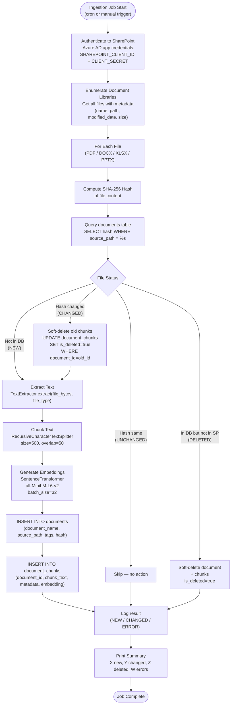

# SharePoint Ingestion Pipeline — AA-Hackathon Enterprise AI Platform

**Organization:** Aligned Automation  
**Project:** AA-Hackathon Enterprise AI Platform  
**Version:** 1.0  
**Last Updated:** 2026-06-07  
**Owner:** Platform Engineering / Data Engineering  

---

## 1. Purpose

This document specifies the SharePoint document ingestion pipeline for the AA-Hackathon Enterprise AI Platform. The pipeline extracts documents from SharePoint document libraries, converts them to text, chunks and embeds the text, and stores the resulting vectors in pgvector for retrieval-augmented generation (RAG).

---

## 2. Ingestion Pipeline Overview



---

## 3. Component Locations

| Component | Path | Description |
|-----------|------|-------------|
| Job entry point | `apps/jobs/sharepoint_ingestion/main.py` | Orchestrates the full ingestion run |
| SharePoint client | `integrations/sharepoint/client.py` | Connects to SharePoint, lists and downloads files |
| Text extractor | `apps/jobs/sharepoint_ingestion/extractor.py` | Extracts plain text from PDF/DOCX/XLSX/PPTX |
| Text chunker | `apps/jobs/sharepoint_ingestion/chunker.py` | RecursiveCharacterTextSplitter wrapper |
| Embedder | `apps/api-gateway/app/rag/embedder.py` | Shared with API — all-MiniLM-L6-v2 |
| Document service | `apps/api-gateway/app/services/document_service.py` | DB insert/update/soft-delete operations |
| Config | `apps/jobs/sharepoint_ingestion/config.py` | Reads env vars, validates config on startup |

---

## 4. SharePoint Client

### 4.1 Authentication

The SharePoint client authenticates using an Azure AD app registration with `Sites.Read.All` permission (app-level, not delegated).

```python
# integrations/sharepoint/client.py
import msal
import requests

class SharePointClient:
    def __init__(self, tenant_id: str, client_id: str, client_secret: str, site_url: str):
        self.site_url = site_url
        self.graph_base = "https://graph.microsoft.com/v1.0"
        self._token = self._acquire_token(tenant_id, client_id, client_secret)

    def _acquire_token(self, tenant_id: str, client_id: str, client_secret: str) -> str:
        authority = f"https://login.microsoftonline.com/{tenant_id}"
        app = msal.ConfidentialClientApplication(
            client_id=client_id,
            client_credential=client_secret,
            authority=authority,
        )
        result = app.acquire_token_for_client(
            scopes=["https://graph.microsoft.com/.default"]
        )
        if "access_token" not in result:
            raise RuntimeError(f"Token acquisition failed: {result.get('error_description')}")
        return result["access_token"]

    def list_documents(self, library_name: str) -> list[dict]:
        """List all files in a SharePoint document library via Microsoft Graph."""
        ...

    def download_file(self, item_id: str) -> bytes:
        """Download file bytes for a SharePoint item."""
        ...
```

### 4.2 Supported File Types

| Extension | Library | Notes |
|-----------|---------|-------|
| `.pdf` | `pypdf2` or `pdfplumber` | Extracts text per page, preserves page numbers |
| `.docx` | `python-docx` | Extracts paragraphs and tables, preserves heading structure |
| `.xlsx` | `openpyxl` | Extracts sheet by sheet, includes column headers in each row |
| `.pptx` | `python-pptx` | Extracts slide-by-slide, includes slide number in metadata |

---

## 5. Hash-Based Change Detection

The ingestion pipeline avoids reprocessing unchanged documents using SHA-256 content hashing.

```python
import hashlib

def compute_file_hash(file_bytes: bytes) -> str:
    return hashlib.sha256(file_bytes).hexdigest()

def determine_file_status(
    source_path: str,
    new_hash: str,
    db_pool: ThreadedConnectionPool,
) -> tuple[str, str | None]:
    """
    Returns (status, existing_document_id)
    status: 'NEW' | 'CHANGED' | 'UNCHANGED'
    """
    conn = db_pool.getconn()
    try:
        cursor = conn.cursor(cursor_factory=RealDictCursor)
        cursor.execute(
            "SELECT id, hash FROM documents WHERE source_path = %s AND is_deleted = false",
            (source_path,)
        )
        row = cursor.fetchone()
        if row is None:
            return "NEW", None
        if row["hash"] == new_hash:
            return "UNCHANGED", row["id"]
        return "CHANGED", row["id"]
    finally:
        db_pool.putconn(conn)
```

---

## 6. Text Extraction

Each file type has a dedicated extractor that returns plain text with structural metadata preserved.

### 6.1 PDF Extraction

```python
import pdfplumber

def extract_pdf(file_bytes: bytes) -> list[dict]:
    """Returns list of {text, page_number} dicts."""
    pages = []
    with pdfplumber.open(io.BytesIO(file_bytes)) as pdf:
        for page_num, page in enumerate(pdf.pages, start=1):
            text = page.extract_text() or ""
            if text.strip():
                pages.append({"text": text, "page_number": page_num})
    return pages
```

### 6.2 DOCX Extraction

```python
from docx import Document

def extract_docx(file_bytes: bytes) -> str:
    """Extracts full text preserving paragraph structure."""
    doc = Document(io.BytesIO(file_bytes))
    paragraphs = []
    for para in doc.paragraphs:
        if para.text.strip():
            prefix = f"[{para.style.name}] " if "Heading" in para.style.name else ""
            paragraphs.append(prefix + para.text)
    return "\n\n".join(paragraphs)
```

### 6.3 XLSX Extraction

```python
from openpyxl import load_workbook

def extract_xlsx(file_bytes: bytes) -> str:
    """Extracts each row as text with column headers prepended."""
    wb = load_workbook(io.BytesIO(file_bytes), read_only=True, data_only=True)
    all_text = []
    for sheet in wb.worksheets:
        rows = list(sheet.iter_rows(values_only=True))
        if not rows:
            continue
        headers = [str(h or "") for h in rows[0]]
        for row in rows[1:]:
            row_text = " | ".join(
                f"{headers[i]}: {str(val or '').strip()}"
                for i, val in enumerate(row)
                if val is not None
            )
            if row_text.strip():
                all_text.append(row_text)
    return "\n".join(all_text)
```

### 6.4 PPTX Extraction

```python
from pptx import Presentation

def extract_pptx(file_bytes: bytes) -> list[dict]:
    """Returns list of {text, slide_number} dicts."""
    prs = Presentation(io.BytesIO(file_bytes))
    slides = []
    for slide_num, slide in enumerate(prs.slides, start=1):
        texts = []
        for shape in slide.shapes:
            if shape.has_text_frame:
                texts.append(shape.text_frame.text)
        full_text = "\n".join(t for t in texts if t.strip())
        if full_text:
            slides.append({"text": full_text, "slide_number": slide_num})
    return slides
```

---

## 7. Chunking

After extraction, text is chunked using LangChain's `RecursiveCharacterTextSplitter`.

```python
from langchain.text_splitter import RecursiveCharacterTextSplitter

CHUNK_SIZE = 500
CHUNK_OVERLAP = 50

splitter = RecursiveCharacterTextSplitter(
    chunk_size=CHUNK_SIZE,
    chunk_overlap=CHUNK_OVERLAP,
    length_function=len,
    separators=["\n\n", "\n", ". ", " ", ""],
)

def chunk_text(text: str, base_metadata: dict) -> list[dict]:
    chunks = splitter.split_text(text)
    return [
        {
            "chunk_text": chunk,
            "metadata": {
                **base_metadata,
                "chunk_index": i,
                "word_count": len(chunk.split()),
            }
        }
        for i, chunk in enumerate(chunks)
    ]
```

---

## 8. Database Insert Pattern

```python
def insert_document_and_chunks(
    document_name: str,
    source_path: str,
    tags: dict,
    file_hash: str,
    chunks: list[dict],
    embeddings: list[list[float]],
    db_pool: ThreadedConnectionPool,
) -> str:
    conn = db_pool.getconn()
    try:
        cursor = conn.cursor(cursor_factory=RealDictCursor)

        # Insert document record
        cursor.execute(
            """
            INSERT INTO documents (document_name, source_path, tags, hash)
            VALUES (%s, %s, %s, %s)
            RETURNING id
            """,
            (document_name, source_path, json.dumps(tags), file_hash)
        )
        document_id = cursor.fetchone()["id"]

        # Batch insert chunks
        chunk_data = [
            (document_id, c["chunk_text"], json.dumps(c["metadata"]), e)
            for c, e in zip(chunks, embeddings)
        ]
        cursor.executemany(
            """
            INSERT INTO document_chunks (document_id, chunk_text, metadata, embedding)
            VALUES (%s, %s, %s, %s::vector)
            """,
            chunk_data
        )
        conn.commit()
        return document_id
    except Exception:
        conn.rollback()
        raise
    finally:
        db_pool.putconn(conn)
```

---

## 9. Error Handling

- Each file is processed in an independent try/except block — one file failure does not stop the job
- Failed files are logged with full exception details and counted in the error summary
- Retry: each file is attempted 3 times with exponential backoff (1s, 2s, 4s) before marking as error
- Partial document ingestion (some chunks succeed, some fail) is acceptable — the document is still inserted but chunk count may be lower than expected
- Network errors to SharePoint: retry up to 3 times, then skip the file

---

## 10. Job Run Summary

At the end of every run, the job logs a structured summary:

```json
{
  "run_id": "uuid",
  "started_at": "2026-06-07T02:00:00Z",
  "completed_at": "2026-06-07T02:15:32Z",
  "duration_seconds": 932,
  "files_enumerated": 248,
  "files_new": 12,
  "files_changed": 3,
  "files_deleted": 1,
  "files_unchanged": 232,
  "files_error": 0,
  "chunks_created": 487,
  "chunks_deleted": 89
}
```

---

## 11. Phase 2: Web Scraping (Optional)

If enabled via environment variables, the ingestion job also scrapes internal web pages and SharePoint lists.

| Variable | Default | Description |
|----------|---------|-------------|
| `SCRAPE_PAGES_ENABLED` | `false` | Enable scraping of SharePoint site pages |
| `SCRAPE_LISTS_ENABLED` | `false` | Enable extraction of SharePoint list data |

Scraping uses `requests-html` or `playwright` for JS-rendered pages. Scraped content follows the same chunking and embedding pipeline as file-based documents.

---

## 12. Future State: Event-Driven Ingestion

Current state is a batch job (cron/manual). The target future architecture is event-driven incremental processing:

1. **SharePoint Webhook** → registers change notification
2. **Azure Function** → triggered by webhook event, downloads only changed files
3. **Queue-based processing** → Azure Service Bus or RabbitMQ for reliable processing
4. **Incremental updates** → only new/changed files processed, near-real-time knowledge base updates

This eliminates the 24-hour knowledge lag of daily batch ingestion.

---

## 13. Scheduling Reference

### 13.1 Linux Cron Examples

```cron
# Daily at 2:00 AM
0 2 * * * /usr/bin/python3 /app/jobs/sharepoint_ingestion/main.py

# Every 6 hours
0 */6 * * * /usr/bin/python3 /app/jobs/sharepoint_ingestion/main.py

# Weekdays only at 1:00 AM
0 1 * * 1-5 /usr/bin/python3 /app/jobs/sharepoint_ingestion/main.py
```

### 13.2 Manual Trigger via API

```http
POST /api/ingestion/trigger
Authorization: Bearer {admin_token}
```

Returns `202 Accepted` immediately; ingestion runs as background task. Status available at `GET /api/ingestion/status`.
