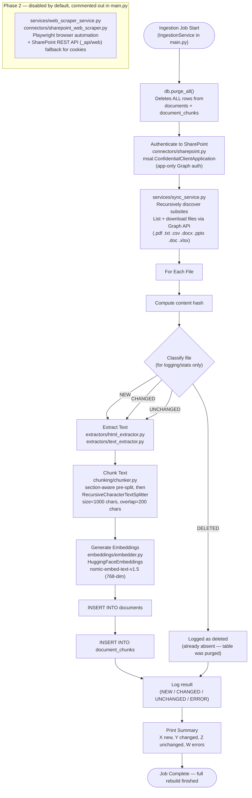

# SharePoint Ingestion Pipeline — AA-Hackathon Enterprise AI Platform

**Organization:** Aligned Automation  
**Project:** AA-Hackathon Enterprise AI Platform  
**Version:** 1.0  
**Last Updated:** 2026-06-07  
**Owner:** Platform Engineering / Data Engineering  

---

## 1. Purpose

This document specifies the SharePoint document ingestion pipeline for the AA-Hackathon Enterprise AI Platform. The pipeline extracts documents from SharePoint document libraries, converts them to text, chunks and embeds the text, and stores the resulting vectors in pgvector for retrieval-augmented generation (RAG).

---

## 2. Ingestion Pipeline Overview

**This is a full purge-and-rebuild pipeline, not an incremental-only process.** At the start of every run, `main.py` calls `db.purge_all()`, which deletes all existing `documents`/`document_chunks` rows, then does a complete re-ingest of everything currently discoverable in SharePoint. The pipeline still computes a per-file NEW/CHANGED/UNCHANGED/DELETED classification during the run (for logging and summary stats), but that classification does **not** cause unchanged files to be skipped at the database level — because the database was just wiped, every file is re-extracted, re-chunked, and re-embedded on every run.



---

## 3. Component Locations

| Component | Path | Description |
|-----------|------|-------------|
| Job entry point | `apps/jobs/sharepoint_ingestion/main.py` | Orchestrates the full run: purges all documents/chunks, then re-ingests everything found via the primary connector |
| Primary SharePoint connector | `apps/jobs/sharepoint_ingestion/connectors/sharepoint.py` | Microsoft Graph API + `msal.ConfidentialClientApplication` (app-only auth). Recursively discovers subsites, lists/downloads files. This is the connector actually invoked in the live pipeline, via `services/sync_service.py` |
| Sync orchestration | `apps/jobs/sharepoint_ingestion/services/sync_service.py` | Primary/live pipeline logic invoked by `IngestionService` in `main.py` |
| Secondary connector (disabled by default) | `apps/jobs/sharepoint_ingestion/connectors/sharepoint_web_scraper.py` | Playwright-based browser automation with a SharePoint REST API (`_api/web`) fallback for cookies. Used by `services/web_scraper_service.py` for "Phase 2" (site pages + list scraping). Gated by `SCRAPE_PAGES_ENABLED` / `SCRAPE_LISTS_ENABLED` (both default `false`) and commented out in `main.py` |
| Text extractors | `apps/jobs/sharepoint_ingestion/extractors/html_extractor.py`, `extractors/text_extractor.py` | Type-specific extractors that convert downloaded file bytes to plain text. (Note: the exact set of third-party parsing libraries behind these extractors — e.g. for PDF/DOCX/XLSX/PPTX — was not independently confirmed in the last code audit; do not assume specific libraries without checking the ingestion job's own `requirements.txt`.) |
| Text chunker | `apps/jobs/sharepoint_ingestion/chunking/chunker.py` | File-type-aware section pre-split + `RecursiveCharacterTextSplitter` — see [`chunking-strategy.md`](chunking-strategy.md) for the full algorithm |
| Embedder | `apps/jobs/sharepoint_ingestion/embeddings/embedder.py` | `HuggingFaceEmbeddings` wrapping `nomic-embed-text-v1.5` (`model_kwargs={"trust_remote_code": True}`) — the same model and library used at query time in `apps/api-gateway/app/rag/retriever.py` |
| Schema creation | `apps/jobs/sharepoint_ingestion/create_schema.py` | Standalone DDL script — creates ~28 tables including `documents`, `document_chunks`. No ORM, no migration framework; raw SQL only |
| Config | `apps/jobs/sharepoint_ingestion/config/settings.py` | Reads env vars, defines `CHUNK_SIZE`, `CHUNK_OVERLAP`, and other ingestion parameters |

---

## 4. SharePoint Connectors

There are **two** SharePoint connectors in the codebase, serving different purposes. Do not conflate them, and note that `integrations/sharepoint/client.py` at the repository root is a separate, older/shared connector that is distinct from either of the ingestion job's own connectors under `apps/jobs/sharepoint_ingestion/connectors/`.

### 4.1 Primary connector — Microsoft Graph API (`connectors/sharepoint.py`)

This is the connector that actually runs in the live pipeline today. It authenticates via an Azure AD app registration using app-only (not delegated) auth, through Python's `msal.ConfidentialClientApplication`. It is invoked by `services/sync_service.py`, which is the primary pipeline logic driven by `IngestionService` in `main.py`. It recursively discovers subsites and lists/downloads files with these extensions: `.pdf .txt .csv .docx .pptx .doc .xlsx`.

```python
# apps/jobs/sharepoint_ingestion/connectors/sharepoint.py (illustrative)
import msal

class SharePointGraphConnector:
    def __init__(self, tenant_id: str, client_id: str, client_secret: str, site_url: str):
        self.site_url = site_url
        self.graph_base = "https://graph.microsoft.com/v1.0"
        self._token = self._acquire_token(tenant_id, client_id, client_secret)

    def _acquire_token(self, tenant_id: str, client_id: str, client_secret: str) -> str:
        authority = f"https://login.microsoftonline.com/{tenant_id}"
        app = msal.ConfidentialClientApplication(
            client_id=client_id,
            client_credential=client_secret,
            authority=authority,
        )
        result = app.acquire_token_for_client(
            scopes=["https://graph.microsoft.com/.default"]
        )
        if "access_token" not in result:
            raise RuntimeError(f"Token acquisition failed: {result.get('error_description')}")
        return result["access_token"]

    # Recursively discovers subsites, then lists/downloads files via Graph
    def discover_and_download(self) -> list[dict]:
        ...
```

### 4.2 Secondary connector — Playwright web scraper (`connectors/sharepoint_web_scraper.py`), disabled by default

This connector is used only for the optional "Phase 2" scope (site pages + SharePoint list scraping), via `services/web_scraper_service.py`. It uses Playwright-driven browser automation, with a fallback to the SharePoint REST API (`_api/web`) for obtaining cookies. It is gated by `SCRAPE_PAGES_ENABLED` and `SCRAPE_LISTS_ENABLED`, both of which **default to `false`**, and its invocation is commented out in `main.py`. In the live pipeline today, only the Graph API connector (4.1) actually runs.

### 4.3 Supported File Types (primary connector)

`.pdf .txt .csv .docx .pptx .doc .xlsx` are downloaded by the primary connector. Extraction to plain text is handled downstream by the type-specific extractors under `apps/jobs/sharepoint_ingestion/extractors/` (see Section 6) — do not assume a specific third-party parsing library per format without checking the ingestion job's own `requirements.txt`.

---

## 5. Change Classification — Not a Skip-Unchanged Mechanism

The pipeline still computes a per-file hash/status classification (`NEW` / `CHANGED` / `UNCHANGED` / `DELETED`) while walking SharePoint, and this classification is written to the run summary/log for observability. **However, this does not translate into "skip reprocessing of unchanged files" at the database level.** `main.py` calls `db.purge_all()` at the very start of every run, deleting all rows from `documents` and `document_chunks`. Every file discovered in the run is therefore re-extracted, re-chunked, and re-embedded regardless of whether its hash changed since the last run. Treat the classification as a stats/logging feature, not an incremental-processing optimization.

```python
# Illustrative — status is computed for logging, not to gate reprocessing
def classify_file(source_path: str, new_hash: str, previously_seen: dict) -> str:
    """
    Returns 'NEW' | 'CHANGED' | 'UNCHANGED' | 'DELETED'
    Used for the run summary only — every discovered file is still
    extracted, chunked, and embedded this run because the tables
    were purged at job start.
    """
    prior_hash = previously_seen.get(source_path)
    if prior_hash is None:
        return "NEW"
    if prior_hash == new_hash:
        return "UNCHANGED"
    return "CHANGED"
```

---

## 6. Text Extraction

Text extraction lives under `apps/jobs/sharepoint_ingestion/extractors/`, which contains two extractor modules: `html_extractor.py` and `text_extractor.py`. These convert downloaded file bytes into plain text for the chunker (Section 7).

The exact third-party libraries used inside these extractors for each file format (PDF, DOCX, XLSX, PPTX) were **not independently confirmed** in the most recent code audit — a prior version of this document asserted specific libraries (`pdfplumber`, `python-docx`, `openpyxl`, `python-pptx`) with confidence that turned out to be unverifiable, since the ingestion job maintains its own `requirements.txt` separate from `apps/api-gateway/requirements.txt`. Until that file is checked directly, describe extraction by function rather than by implementation library:

- Each supported file type has a dedicated extraction path that returns plain text.
- Structural cues that survive into the extracted text are used by the chunker to detect section boundaries — e.g. `[Slide N]` markers for presentations and `[Sheet: X]` markers for spreadsheets (see [`chunking-strategy.md`](chunking-strategy.md)).
- Where a heading structure exists in the source document, it is expected to be detectable in the extracted plain text (e.g. ALL-CAPS lines, numbered headings, "Section"/"Chapter" markers) rather than carried as separate rich metadata.

---

## 7. Chunking

Chunking happens in `apps/jobs/sharepoint_ingestion/chunking/chunker.py`, configured by `CHUNK_SIZE = 1000` (characters) and `CHUNK_OVERLAP = 200` (characters) in `config/settings.py`. This is character-based, not token-based, and is **file-type-aware**: the chunker first pre-splits the extracted text into sections, then applies LangChain's `RecursiveCharacterTextSplitter` within each section:

1. **PPTX text** is pre-split on `[Slide N]` markers.
2. **XLSX text** is pre-split on `[Sheet: X]` markers.
3. **Everything else** is pre-split on detected section headings (ALL-CAPS lines, numbered headings, "Section"/"Chapter" markers).
4. Within each resulting section, `RecursiveCharacterTextSplitter` further splits long sections into ≤1000-character chunks with 200-character overlap.
5. The section heading (or slide/sheet marker) is **prepended to every chunk** produced from that section, so each chunk carries its own context even after splitting.

See [`chunking-strategy.md`](chunking-strategy.md) for the full algorithm and code-level detail. Full chunking configuration:

```python
from langchain.text_splitter import RecursiveCharacterTextSplitter

CHUNK_SIZE = 1000       # characters, not tokens
CHUNK_OVERLAP = 200     # characters

splitter = RecursiveCharacterTextSplitter(
    chunk_size=CHUNK_SIZE,
    chunk_overlap=CHUNK_OVERLAP,
    length_function=len,
    separators=["\n\n", "\n", ". ", " ", ""],
)

def chunk_extracted_text(text: str, base_metadata: dict) -> list[dict]:
    """
    text is already-extracted plain text (from extractors/html_extractor.py
    or extractors/text_extractor.py), which may contain [Slide N] / [Sheet: X]
    markers or heading-like lines depending on source file type.
    """
    sections = split_into_sections(text)  # by slide/sheet markers, or detected headings
    all_chunks = []
    for section in sections:
        full_text = f"{section['heading']}\n\n{section['body']}" if section["heading"] else section["body"]
        for chunk in splitter.split_text(full_text):
            all_chunks.append({
                "chunk_text": chunk,
                "metadata": {
                    **base_metadata,
                    "chunk_index": len(all_chunks),
                    "section_heading": section["heading"],
                }
            })
    return all_chunks
```

---

## 8. Database Insert Pattern

```python
def insert_document_and_chunks(
    document_name: str,
    source_path: str,
    tags: dict,
    file_hash: str,
    chunks: list[dict],
    embeddings: list[list[float]],
    db_pool: ThreadedConnectionPool,
) -> str:
    conn = db_pool.getconn()
    try:
        cursor = conn.cursor(cursor_factory=RealDictCursor)

        # Insert document record
        cursor.execute(
            """
            INSERT INTO documents (document_name, source_path, tags, hash)
            VALUES (%s, %s, %s, %s)
            RETURNING id
            """,
            (document_name, source_path, json.dumps(tags), file_hash)
        )
        document_id = cursor.fetchone()["id"]

        # Batch insert chunks
        chunk_data = [
            (document_id, c["chunk_text"], json.dumps(c["metadata"]), e)
            for c, e in zip(chunks, embeddings)
        ]
        cursor.executemany(
            """
            INSERT INTO document_chunks (document_id, chunk_text, metadata, embedding)
            VALUES (%s, %s, %s, %s::vector)
            """,
            chunk_data
        )
        conn.commit()
        return document_id
    except Exception:
        conn.rollback()
        raise
    finally:
        db_pool.putconn(conn)
```

---

## 9. Error Handling

- Each file is processed in an independent try/except block — one file failure does not stop the job
- Failed files are logged with full exception details and counted in the error summary
- Retry: each file is attempted 3 times with exponential backoff (1s, 2s, 4s) before marking as error
- Partial document ingestion (some chunks succeed, some fail) is acceptable — the document is still inserted but chunk count may be lower than expected
- Network errors to SharePoint: retry up to 3 times, then skip the file

---

## 10. Job Run Summary

At the end of every run, the job logs a structured summary. Because `main.py` purges all documents/chunks at job start, `chunks_created` reflects the **entire rebuilt corpus** for the run, not just chunks from new/changed files — the `files_new` / `files_changed` / `files_unchanged` breakdown is retained purely as a classification stat for observability (e.g. to spot how much of SharePoint actually changed since the last run), not as an indicator of what was skipped:

```json
{
  "run_id": "uuid",
  "started_at": "2026-06-07T02:00:00Z",
  "completed_at": "2026-06-07T02:15:32Z",
  "duration_seconds": 932,
  "files_enumerated": 248,
  "files_new": 12,
  "files_changed": 3,
  "files_unchanged": 233,
  "files_error": 0,
  "chunks_created": 5140,
  "note": "chunks_created reflects the full rebuilt corpus (all 248 files were re-processed after purge_all()), not only new/changed files"
}
```

---

## 11. Phase 2: Web Scraping (disabled by default)

The ingestion job includes a second, optional connector — `connectors/sharepoint_web_scraper.py`, invoked via `services/web_scraper_service.py` — that can scrape internal SharePoint site pages and SharePoint list data. **It is disabled by default and its invocation is commented out in `main.py`**, so it does not run as part of the live pipeline unless both explicitly re-enabled in code and turned on via environment variables.

| Variable | Default | Description |
|----------|---------|-------------|
| `SCRAPE_PAGES_ENABLED` | `false` | Enable scraping of SharePoint site pages |
| `SCRAPE_LISTS_ENABLED` | `false` | Enable extraction of SharePoint list data |

This connector uses Playwright for browser automation, with a fallback to the SharePoint REST API (`_api/web`) to obtain cookies. When enabled, scraped content is intended to follow the same chunking and embedding pipeline as file-based documents. In the current default configuration, only the Microsoft Graph API connector (Section 4.1) contributes documents to the knowledge base.

---

## 12. Future State: Event-Driven Ingestion

Current state is a batch job (cron/manual). The target future architecture is event-driven incremental processing:

1. **SharePoint Webhook** → registers change notification
2. **Azure Function** → triggered by webhook event, downloads only changed files
3. **Queue-based processing** → Azure Service Bus or RabbitMQ for reliable processing
4. **Incremental updates** → only new/changed files processed, near-real-time knowledge base updates

This eliminates the 24-hour knowledge lag of daily batch ingestion.

---

## 13. Scheduling Reference

### 13.1 Linux Cron Examples

```cron
# Daily at 2:00 AM
0 2 * * * /usr/bin/python3 /app/jobs/sharepoint_ingestion/main.py

# Every 6 hours
0 */6 * * * /usr/bin/python3 /app/jobs/sharepoint_ingestion/main.py

# Weekdays only at 1:00 AM
0 1 * * 1-5 /usr/bin/python3 /app/jobs/sharepoint_ingestion/main.py
```

### 13.2 Manual Trigger via API

```http
POST /api/ingestion/trigger
Authorization: Bearer {admin_token}
```

Returns `202 Accepted` immediately; ingestion runs as background task. Status available at `GET /api/ingestion/status`.
