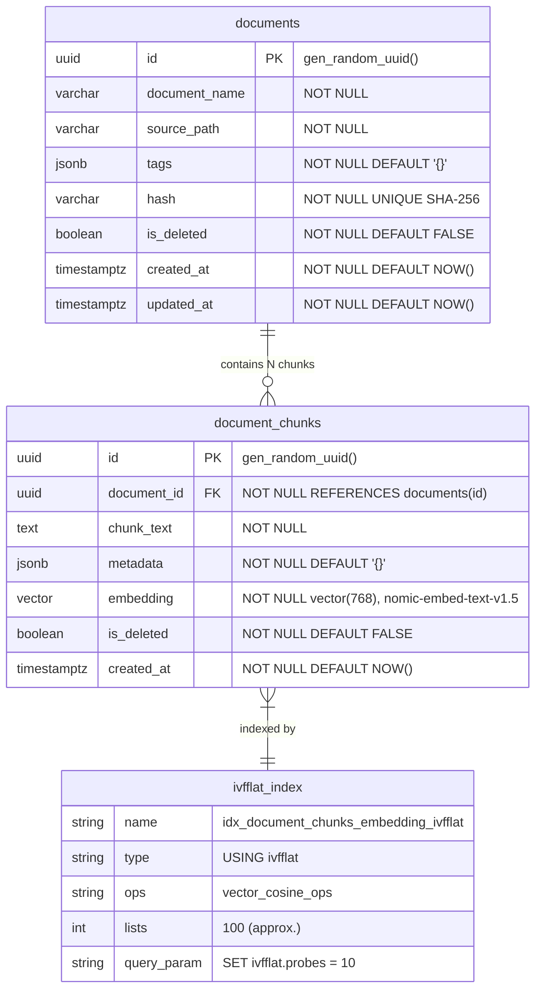

# Vector Schema — AA-Hackathon Enterprise AI Platform

**Organization:** Aligned Automation  
**Project:** AA-Hackathon Enterprise AI Platform  
**Version:** 1.0  
**Last Updated:** 2026-06-07  
**Owner:** Platform Engineering / Data Engineering  

---

## 1. Purpose

This document provides the complete DDL specification for the pgvector schema used in the AA-Hackathon Enterprise AI Platform. It covers extension setup, table definitions, index creation, all query patterns used in the RAG pipeline, and performance tuning parameters.

---

## 2. Schema Architecture Diagram



---

## 3. Extension Setup

pgvector must be enabled before any vector operations. This is applied once during initial database setup.

```sql
-- Enable pgvector extension
CREATE EXTENSION IF NOT EXISTS vector;

-- Verify installation
SELECT extname, extversion FROM pg_extension WHERE extname = 'vector';

-- Verify vector type is available
SELECT typname FROM pg_type WHERE typname = 'vector';
```

The `pgvector/pgvector:pg16` Docker image ships with the extension pre-installed. On an existing PostgreSQL 16 instance, install via:

```bash
apt-get install postgresql-16-pgvector   # Debian/Ubuntu
# or
yum install pgvector_16                   # RHEL/CentOS
```

---

## 4. Documents Table DDL

```sql
CREATE TABLE IF NOT EXISTS documents (
    id            UUID         PRIMARY KEY DEFAULT gen_random_uuid(),
    document_name VARCHAR(512) NOT NULL,
    source_path   VARCHAR(2048) NOT NULL,
    tags          JSONB        NOT NULL DEFAULT '{}',
    hash          VARCHAR(64)  NOT NULL,
    is_deleted    BOOLEAN      NOT NULL DEFAULT FALSE,
    created_at    TIMESTAMPTZ  NOT NULL DEFAULT NOW(),
    updated_at    TIMESTAMPTZ  NOT NULL DEFAULT NOW(),

    CONSTRAINT uq_documents_hash UNIQUE (hash)
);

COMMENT ON TABLE documents IS 'Source documents ingested from SharePoint. One record per file version.';
COMMENT ON COLUMN documents.hash IS 'SHA-256 hex digest of file bytes. Used for change detection.';
COMMENT ON COLUMN documents.tags IS 'JSONB: {source_url, domain, category, content_type, sharepoint_item_id, department, effective_date}';
COMMENT ON COLUMN documents.source_path IS 'Full SharePoint path: /sites/HR/Shared Documents/Leave Policy 2026.pdf';

-- Indexes
CREATE INDEX IF NOT EXISTS idx_documents_source_path
    ON documents (source_path)
    WHERE is_deleted = false;

CREATE INDEX IF NOT EXISTS idx_documents_hash
    ON documents (hash)
    WHERE is_deleted = false;

CREATE INDEX IF NOT EXISTS idx_documents_domain
    ON documents ((tags->>'domain'))
    WHERE is_deleted = false;

CREATE INDEX IF NOT EXISTS idx_documents_created_at
    ON documents (created_at DESC)
    WHERE is_deleted = false;
```

---

## 5. Document Chunks Table DDL

```sql
CREATE TABLE IF NOT EXISTS document_chunks (
    id          UUID    PRIMARY KEY DEFAULT gen_random_uuid(),
    document_id UUID    NOT NULL,
    chunk_text  TEXT    NOT NULL,
    metadata    JSONB   NOT NULL DEFAULT '{}',
    embedding   vector(768) NOT NULL,
    is_deleted  BOOLEAN NOT NULL DEFAULT FALSE,
    created_at  TIMESTAMPTZ NOT NULL DEFAULT NOW(),

    CONSTRAINT fk_document_chunks_document
        FOREIGN KEY (document_id)
        REFERENCES documents(id)
        ON DELETE RESTRICT
);

COMMENT ON TABLE document_chunks IS 'Text chunks from documents with 768-dim cosine embeddings for vector similarity search.';
COMMENT ON COLUMN document_chunks.embedding IS '768-dimensional L2-normalized vector from nomic-embed-text-v1.5. Cosine similarity via <=> operator.';
COMMENT ON COLUMN document_chunks.metadata IS 'JSONB: {chunk_index, page_number, slide_number, sheet_name, section_title, word_count, char_count}';

-- Foreign key index
CREATE INDEX IF NOT EXISTS idx_document_chunks_document_id
    ON document_chunks (document_id)
    WHERE is_deleted = false;

-- Soft-delete filtered index
CREATE INDEX IF NOT EXISTS idx_document_chunks_active
    ON document_chunks (document_id, created_at DESC)
    WHERE is_deleted = false;
```

---

## 6. IVFFlat Vector Index DDL (current)

The platform's retrieval query pattern (`app/rag/retriever.py`) is documented as running against an **IVFFlat** index with `probes = 10` — this is the current, real index type, not HNSW.

```sql
-- IVFFlat index (current production index type)
-- Must be built AFTER inserting initial data — IVFFlat trains its clusters on existing rows
CREATE INDEX IF NOT EXISTS idx_document_chunks_embedding_ivfflat
    ON document_chunks
    USING ivfflat (embedding vector_cosine_ops)
    WITH (lists = 100);

-- Query-time parameter
SET ivfflat.probes = 10;

COMMENT ON INDEX idx_document_chunks_embedding_ivfflat IS
    'IVFFlat index for approximate nearest neighbor search. '
    'lists=100: number of inverted-list clusters (approx. sqrt(row_count)). '
    'ivfflat.probes=10 set at query time controls the recall/speed trade-off.';
```

### 6.1 Future Alternative: HNSW

HNSW (Hierarchical Navigable Small World) is a pgvector index type that generally offers faster queries and higher recall than IVFFlat at the cost of slower, more memory-intensive builds. It is a plausible **future** upgrade path for this platform but is not confirmed as the index type currently in use — do not describe it as the production index without re-verifying against the live database.

```sql
-- Illustrative future alternative — not confirmed as currently deployed
CREATE INDEX IF NOT EXISTS idx_document_chunks_embedding_hnsw
    ON document_chunks
    USING hnsw (embedding vector_cosine_ops)
    WITH (m = 16, ef_construction = 64);

-- Query-time parameter
SET hnsw.ef_search = 100;
```

---

## 7. Similarity Search Query

This is the exact query pattern from `apps/api-gateway/app/rag/retriever.py`:

```sql
-- Primary similarity search (cosine distance via <=>)
-- %s placeholders for psycopg2 parameterization
-- First %s: query embedding as vector literal
-- Second %s: query embedding again (ORDER BY uses it separately in pgvector)
-- Third %s: top_k limit (typically 10)

SELECT
    dc.id                                         AS chunk_id,
    dc.chunk_text,
    dc.metadata,
    d.document_name,
    d.tags->>'source_url'                         AS source_url,
    d.tags->>'domain'                             AS domain,
    1 - (dc.embedding <=> %s::vector)             AS similarity
FROM document_chunks dc
INNER JOIN documents d ON d.id = dc.document_id
WHERE d.is_deleted  = false
  AND dc.is_deleted = false
ORDER BY dc.embedding <=> %s::vector   -- ascending distance = descending similarity
LIMIT %s;
```

Python execution pattern:

```python
async def search_similar_chunks(
    query_embedding: list[float],
    top_k: int = 10,
    domain_filter: str | None = None,
) -> list[dict]:
    conn = None
    try:
        conn = db_pool.getconn()
        cursor = conn.cursor(cursor_factory=RealDictCursor)

        # Set query-time HNSW parameter for better recall
        cursor.execute("SET hnsw.ef_search = 100")

        embedding_str = f"[{','.join(str(x) for x in query_embedding)}]"

        if domain_filter:
            cursor.execute(
                """
                SELECT dc.id, dc.chunk_text, dc.metadata,
                       d.document_name, d.tags->>'source_url' AS source_url,
                       1 - (dc.embedding <=> %s::vector) AS similarity
                FROM document_chunks dc
                JOIN documents d ON d.id = dc.document_id
                WHERE d.is_deleted = false AND dc.is_deleted = false
                  AND d.tags->>'domain' = %s
                ORDER BY dc.embedding <=> %s::vector
                LIMIT %s
                """,
                (embedding_str, domain_filter, embedding_str, top_k)
            )
        else:
            cursor.execute(
                """
                SELECT dc.id, dc.chunk_text, dc.metadata,
                       d.document_name, d.tags->>'source_url' AS source_url,
                       1 - (dc.embedding <=> %s::vector) AS similarity
                FROM document_chunks dc
                JOIN documents d ON d.id = dc.document_id
                WHERE d.is_deleted = false AND dc.is_deleted = false
                ORDER BY dc.embedding <=> %s::vector
                LIMIT %s
                """,
                (embedding_str, embedding_str, top_k)
            )

        rows = cursor.fetchall()
        # Apply similarity threshold filter
        return [r for r in rows if r["similarity"] >= SIMILARITY_THRESHOLD]

    finally:
        if conn:
            db_pool.putconn(conn)
```

---

## 8. Batch Insert Pattern

Used during document ingestion to insert chunks efficiently:

```sql
-- Single chunk insert
INSERT INTO document_chunks (document_id, chunk_text, metadata, embedding)
VALUES (%s, %s, %s, %s::vector)
RETURNING id;
```

Python batch insert with `executemany`:

```python
def batch_insert_chunks(
    document_id: str,
    chunks: list[dict],
    embeddings: list[list[float]],
    conn,
) -> int:
    cursor = conn.cursor()
    rows = []
    for chunk, embedding in zip(chunks, embeddings):
        embedding_str = f"[{','.join(str(x) for x in embedding)}]"
        rows.append((
            document_id,
            chunk["chunk_text"],
            json.dumps(chunk["metadata"]),
            embedding_str,
        ))

    cursor.executemany(
        """
        INSERT INTO document_chunks (document_id, chunk_text, metadata, embedding)
        VALUES (%s, %s, %s, %s::vector)
        """,
        rows
    )
    return len(rows)
```

For very large batches (> 1000 chunks), use `psycopg2.extras.execute_values` for better performance:

```python
from psycopg2.extras import execute_values

execute_values(
    cursor,
    "INSERT INTO document_chunks (document_id, chunk_text, metadata, embedding) VALUES %s",
    rows,
    template="(%s, %s, %s, %s::vector)",
    page_size=100,
)
```

---

## 9. Update Pattern (Document Re-ingestion)

When a document's hash changes (CHANGED status), the old chunks are soft-deleted and new chunks inserted:

```sql
-- Step 1: Soft-delete old chunks
UPDATE document_chunks
SET is_deleted = true
WHERE document_id = %s
  AND is_deleted = false;

-- Step 2: Update document hash and timestamp
UPDATE documents
SET hash       = %s,
    updated_at = NOW()
WHERE id = %s;

-- Step 3: Insert new chunks (same pattern as batch insert above)
```

This pattern is wrapped in a transaction to ensure atomicity:

```python
conn = db_pool.getconn()
try:
    cursor = conn.cursor()
    cursor.execute(
        "UPDATE document_chunks SET is_deleted = true WHERE document_id = %s",
        (document_id,)
    )
    cursor.execute(
        "UPDATE documents SET hash = %s, updated_at = NOW() WHERE id = %s",
        (new_hash, document_id)
    )
    batch_insert_chunks(document_id, chunks, embeddings, conn)
    conn.commit()
except Exception:
    conn.rollback()
    raise
finally:
    db_pool.putconn(conn)
```

---

## 10. Delete Pattern (Soft-Delete Document + Chunks)

```sql
BEGIN;

-- Soft-delete all chunks for the document
UPDATE document_chunks
SET is_deleted = true
WHERE document_id = %s;

-- Soft-delete the document
UPDATE documents
SET is_deleted = true,
    updated_at = NOW()
WHERE id = %s;

COMMIT;
```

---

## 11. pgvector Distance Operators Reference

| Operator | Distance Type | Query Pattern | Use Case |
|----------|--------------|--------------|----------|
| `<=>` | Cosine distance | `ORDER BY embedding <=> query_vec` | Text similarity (default) |
| `<->` | Euclidean (L2) distance | `ORDER BY embedding <-> query_vec` | Alternative metric |
| `<#>` | Negative inner product | `ORDER BY embedding <#> query_vec` | Maximum inner product search |

This platform uses `<=>` (cosine distance) exclusively. Embeddings from `nomic-embed-text-v1.5` are L2-normalized, so cosine similarity and inner product search produce equivalent results.

**Similarity score from cosine distance:**

```sql
-- Cosine similarity = 1 - cosine distance
-- cosine distance: 0.0 = identical, 1.0 = orthogonal, 2.0 = opposite
-- cosine similarity: 1.0 = identical, 0.0 = orthogonal, -1.0 = opposite
1 - (embedding <=> query_vec::vector) AS similarity
```

---

## 12. Dimension Selection Rationale

The embedding dimension of 768 was selected after evaluation:

| Dimension | Model Example | Storage per Chunk | Query Speed | Quality |
|-----------|-------------|-------------------|-------------|---------|
| 768 | nomic-embed-text-v1.5 | 1.5 KB | Fast | Good |
| 768 | all-mpnet-base-v2 | 3.1 KB | Medium | Better |
| 1536 | text-embedding-ada-002 | 6.1 KB | Slow | Best |

Storage calculation for 10,000 chunks at 768 dimensions: `10,000 × 768 × 4 bytes = 15 MB` — negligible.

768 dimensions provides sufficient quality for HR/IT/Policy document retrieval at the scale of a single organization's knowledge base (estimated 50,000–100,000 chunks maximum).

---

## 13. Performance Tuning

### 13.1 IVFFlat Query Parameters (current)

```sql
-- Number of inverted lists to probe (higher = better recall, slower)
SET ivfflat.probes = 10;   -- The platform's documented default
SET ivfflat.probes = 20;   -- Better recall, slower
```

### 13.2 HNSW Query Parameters (future alternative, not confirmed current)

```sql
-- Illustrative only — see Section 6.1
SET hnsw.ef_search = 100;
```

### 13.3 Index Maintenance

```sql
-- Reindex after large bulk ingestion (> 10% of total rows added)
REINDEX INDEX CONCURRENTLY idx_document_chunks_embedding_ivfflat;

-- Update statistics for query planner
ANALYZE document_chunks;

-- Reclaim space and update visibility map
VACUUM ANALYZE document_chunks;

-- Monitor index size
SELECT
    indexname,
    pg_size_pretty(pg_relation_size(indexname::regclass)) AS index_size
FROM pg_indexes
WHERE tablename = 'document_chunks';
```

### 13.4 EXPLAIN ANALYZE for Vector Queries

```sql
EXPLAIN (ANALYZE, BUFFERS, FORMAT TEXT)
SELECT dc.chunk_text, 1 - (dc.embedding <=> '[0.1,0.2,...]'::vector) AS similarity
FROM document_chunks dc
WHERE dc.is_deleted = false
ORDER BY dc.embedding <=> '[0.1,0.2,...]'::vector
LIMIT 10;
```

Expected execution plan: Index Scan using `idx_document_chunks_embedding_ivfflat`. If a Sequential Scan appears, check that the index exists and `ivfflat.probes` is set appropriately.
