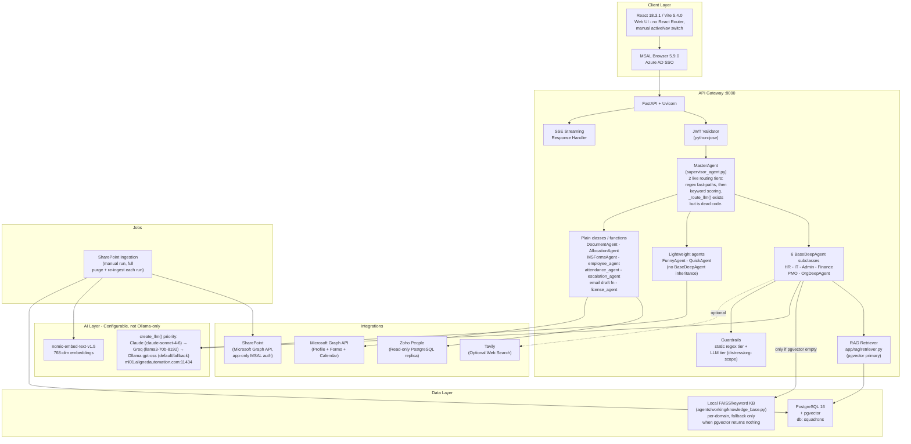

# Current State Assessment — AURA (AA-Hackathon Enterprise Assistant)

**Organization:** Aligned Automation
**Platform:** AURA — AA-Hackathon Enterprise Assistant
**Assessment Date:** 2026-07-02 (revised — corrected against live codebase)
**Version:** 2.0
**Author:** Platform Engineering

> **Accuracy note:** The 2026-06-07 version of this document described a fixed "13 domain agents"
> roster, a "3-tier" router with a working LLM classification step, and an Ollama-only LLM layer.
> None of that matches the code. This revision is checked against
> `apps/api-gateway/app/agents/supervisor_agent.py`, `agents/working/base_deep_agent.py`, and
> `agents/working/config.py`. See `README.md` and `10-reference/folder-structure.md` for the
> platform-wide corrected facts this document builds on.

---

## Executive Summary

AURA is a fully operational internal AI assistant deployed at Aligned Automation. It provides a
multi-agent architecture — a mix of retrieval-based agents, lightweight direct-LLM agents, and plain
functional handlers, not a uniform fixed count — a pgvector-based RAG pipeline with a local fallback
knowledge base, Azure AD SSO authentication, and a rich React-based frontend. The system handles
natural-language queries across HR, IT, Finance, PMO, Org, Admin, Employee, and Attendance domains,
plus larger feature areas (parking, org communications, skills analytics, a no-code form/workflow
builder, and more) documented in `README.md`. This document captures the current state of every
implemented feature, architectural strengths and weaknesses, and the areas prioritized for
improvement.

---

## Current Architecture Overview

Note: Redis appears in `docker-compose.yml` but is not shown as connected to any application code
above — it is defined infrastructure with zero application-level usage today (no Redis client library,
no imports). See `09-roadmap/technical-debt.md`.

---

## Feature Implementation Status

### Core Platform Features

| Feature | Component | Status | Notes |
|---|---|---|---|
| Natural-language chat | MasterAgent + handlers | Implemented | SSE streaming |
| Azure AD SSO | MSAL (frontend) + python-jose JWT validation (backend) | Implemented | MSAL is not used on the backend, only the frontend |
| Conversation history | conversations + messages tables | Implemented | Paginated |
| Message regeneration | messages_controller | Implemented | Per-message |
| SSE streaming responses | chat_controller + SSE handler | Implemented | Chunked tokens |
| Message citation | citation support in message model | Implemented | Source attribution |
| Feedback collection | feedback_controller | Implemented | Per-message thumbs up/down, backend-persisted |
| Regex fast-path + keyword-score routing | MasterAgent | Implemented | 2 live tiers — see Architecture Overview |
| LLM-based routing classification | `_route_llm()` in supervisor_agent.py | **Not live** | Method exists in source but is never called — dead code |

### Handler Roster (Not a Fixed "13")

The previous roster table implied every handler was a uniform `BaseAgent` subclass. That is not
accurate — see `04-agents/agent-framework.md` Section 2 for the full breakdown. Summary:

| Handler | Type | Status | Key Capabilities |
|---|---|---|---|
| HRAgent | `BaseDeepAgent` subclass | Implemented | Policy Q&A, benefits, leave policy guidance |
| ITAgent | `BaseDeepAgent` subclass | Implemented | Helpdesk, asset queries, access requests |
| AdminAgent | `BaseDeepAgent` subclass (+ static parking-rate context) | Implemented | Facilities, travel, parking |
| FinanceAgent | `BaseDeepAgent` subclass | Implemented | TDS, Form 16, reimbursements, payslip info |
| PMOAgent | `BaseDeepAgent` subclass | Implemented | Project status, timelines, resource queries |
| OrgDeepAgent | `BaseDeepAgent` subclass, no local data folders | Implemented | Org chart, directory, reporting lines |
| QuickAgent | Lightweight, direct LLM call, **not** `BaseDeepAgent` | Implemented | Fast conversational fallback; default when routing finds no domain match |
| FunnyAgent | Lightweight, direct LLM call, **not** `BaseDeepAgent` | Implemented | Humor mode, office jokes |
| DocumentAgent | Plain class, in-memory multi-turn session state | Implemented | 12 document types + free-text custom, 30-minute session timeout, not persisted to DB |
| AllocationAgent | Plain class + `ask_aura()` LLM Q&A | Implemented | PMO allocation board data |
| MSFormsAgent | Plain class, pure REST client, **no LLM** | Implemented | Microsoft Forms creation |
| employee_agent | Plain function, adapter-wrapped | Implemented | Profile, employee-directory lookup |
| attendance_agent | Plain function, adapter-wrapped | Implemented | Attendance records, reportee attendance |
| escalation_agent | Plain function, adapter-wrapped | Implemented | Create, track escalations |
| email draft function | Plain function, adapter-wrapped | Implemented (partial) | Draft only — no send from backend |
| license_agent | Plain function, adapter-wrapped | Implemented | AI tool license/seat lookup |

There is no `GeneralAgent` class — the catch-all role is filled by `QuickAgent`.

### RAG Pipeline Features

| Feature | Status | Notes |
|---|---|---|
| SharePoint document ingestion | Implemented | Manual run; each run purges and fully re-ingests all documents (per-file NEW/CHANGED/UNCHANGED/DELETED classification still occurs during the run) |
| pgvector semantic search | Implemented | Cosine similarity (`<=>`), `ivfflat` index, `probes = 10`, primary and normally sufficient source |
| Local FAISS/keyword fallback | Implemented | Per-domain, built at runtime from local document folders, consulted **only when pgvector returns nothing** — not a parallel or mirrored index |
| Embedding model | Implemented | `nomic-embed-text-v1.5`, 768 dimensions, same model at query time and ingestion time |
| Document chunking | Implemented | Section-aware pre-split (headings, `[Slide N]`, `[Sheet: X]`) then `RecursiveCharacterTextSplitter`, **1000 characters / 200 overlap** |
| Source citation in responses | Implemented | Filename + excerpt |
| Tavily web search | Implemented (optional) | Supplement only, not a simultaneous parallel retrieval source |

### Frontend Features

| Feature | Component | Status |
|---|---|---|
| Chat interface | ChatWindow.jsx | Implemented |
| Conversation sidebar | Sidebar.jsx | Implemented |
| Document download (PDF) | jsPDF 4.2.1 | Implemented |
| Analytics dashboard | `modules/analytics/` | **Present but mock data only** — `analyticsApi.js` hardcodes constants, not wired to a backend endpoint |
| COO Analytics dashboard | `modules/coo-analytics/` | Implemented — real, backend-driven |
| Onboarding guidance portal | `modules/onboarding-guidance/` | Implemented — real employee data; note several component files in this module (ChecklistPanel, DocumentPanel, HRNotes, TimelinePanel, TrainingGrid, WelcomeHeader, useOnboardingState.js) are orphaned dead code not imported anywhere |
| Allocation board | AllocationBoard.jsx | Implemented — real data (embeds a mock COO sub-view) |
| PMO project/risk dashboard | `modules/pmo-hub/` | **Present but 100% hardcoded mock data**, zero API calls |
| In-app feedback / suggestion form | `modules/feedback/` | **localStorage-only**, never reaches the backend — distinct from the real, backend-persisted per-message thumbs-up/down |
| Personal notes | PersonalNotes.jsx | Implemented (saved to `localStorage`, not the server) |
| Skills analytics dashboard | `modules/skill-hub/` | Implemented — real, backend-driven |
| No-code form builder / workflow engine | `modules/form-builder/` | Implemented — largest frontend module |
| Recharts analytics | Recharts 3.8.1 | Implemented across Analytics, COO Analytics, Allocation Board, PMO Hub, Skill Hub |

### Integration Status

| Integration | Type | Access | Status | Notes |
|---|---|---|---|---|
| SharePoint | Microsoft Graph API, app-only MSAL auth | Read | Implemented | Manual ingestion only; second Playwright-based scraper connector exists but is disabled by default |
| Zoho People | Read-only PostgreSQL replica | Read | Implemented | No write-back |
| Azure AD | MSAL (frontend) + python-jose JWT validation (backend) | Auth | Implemented | Backend does not use MSAL |
| Microsoft Graph API | OAuth2 | Read + Create | Implemented | Profile, Forms creation, shared calendar |
| LLM provider | Claude > Groq > Ollama (configurable priority) | Read/Write | Implemented | Ollama (`gpt-oss` at `ml01.alignedautomation.com:11434`) is the default/fallback, not the exclusive provider |
| Tavily | REST API | Read | Implemented (optional) | Web search augmentation, called from domain agents when configured |

---

## Architecture Strengths

### 1. Regex Fast-Paths Reduce LLM Load
The MasterAgent's regex fast-paths (MS Forms, email-draft, attendance, employee-directory,
document-request, plus apply-leave and name-query patterns, and a greeting/small-talk path) and its
`DOMAIN_KEYWORDS` scoring fallback let a large share of queries resolve without any LLM call for
routing decisions — there is no LLM-based classification step in the live path today (`_route_llm()`
exists but is dead code).

### 2. pgvector Provides Semantic Search
Using PostgreSQL 16 with the pgvector extension keeps vector storage co-located with relational data.
This eliminates the operational overhead of a separate vector database and allows JOIN queries between
document chunks and metadata tables. The 768-dim `nomic-embed-text-v1.5` embeddings are well-suited for
HR and IT document retrieval.

### 3. Local Fallback Knowledge Base Adds a Safety Net
When pgvector returns no results for a query, `BaseDeepAgent` subclasses fall back to a local,
per-domain FAISS/keyword index built at runtime from local document folders. This is a smaller,
different corpus than pgvector — not a mirror — but it means a `BaseDeepAgent` query is not left
answerless purely because pgvector had no match.

### 4. Azure AD SSO Is Enterprise-Grade
MSAL Browser 5.9.0 with Azure AD provides seamless single sign-on for Aligned Automation employees. The
backend independently validates the AAD-issued JWT using `python-jose` (RS256 + JWKS) — MSAL itself is
not used on the backend. JWKS endpoint rotation is handled automatically.

### 5. Configurable, Multi-Provider LLM Layer
`create_llm()` in `agents/working/config.py` supports Claude, Groq, and Ollama behind environment
flags, in that priority order. This means the platform is not locked into a single self-hosted model —
Claude or Groq can be the active provider depending on configuration, while Ollama remains available as
a cost-effective default/fallback.

### 6. Docker Compose Simplifies Local/Staging Deployment
The three-service Docker Compose setup (`api`, `postgres`, `redis`) allows one-command local and
staging startup. Note that the `redis` service is defined but **not used by any application code today**
— no Redis client library is imported anywhere in the backend. Treat it as available infrastructure,
not an active cache/session store, until it is wired in.

---

## Architecture Weaknesses

### 1. Flat Routing — Not a State Machine
The MasterAgent's `_route()` method is a sequence of checks (session state, escalation keywords, regex
fast-paths, greeting fast-path, keyword scoring), not a formal state machine. There is no branching
based on intermediate retrieval results and no ability for a handler to request a hand-off to another
handler mid-conversation. Complex multi-step workflows ("check my leave balance, then apply for leave,
then notify my manager") cannot be expressed as a graph today.

### 2. `_route_llm()` Is Dead Code
A method for LLM-based intent classification exists in `supervisor_agent.py` but has zero call sites.
Whatever the original intent, it does not run today — routing relies entirely on regex fast-paths and
keyword scoring.

### 3. No Agent-to-Agent Communication
Handlers cannot invoke other handlers directly. All cross-domain coordination must be pre-planned in
the MasterAgent's routing logic or handled across multiple conversation turns.

### 4. Manual, Full-Reingest SharePoint Ingestion
The SharePoint ingestion job (`apps/jobs/sharepoint_ingestion/`) is run manually. There is no
event-driven trigger, and each run purges and fully re-ingests all documents rather than performing an
incremental-only update at the database level (even though per-file change classification occurs during
the run). If a SharePoint document is updated, the vector store contains stale embeddings until the
next manual run.

### 5. Email Drafting Only — No Sending From the Backend
The email-draft function in `agents/email_agent.py` generates drafts and returns them to the user; it
does not call Microsoft Graph `sendMail` from the backend. The frontend builds a `mailto:` link, and a
separate Graph `sendMail` path exists in the frontend's `authService.js`, but there is no backend-side
send capability today.

### 6. `langgraph` Is an Unused Dependency
`langgraph` is listed in `requirements.txt` but has zero imports anywhere in `apps/api-gateway`. Any
document describing a LangGraph migration as already underway is inaccurate — see
`09-roadmap/technical-debt.md`.

### 7. Several Frontend Modules Present Mock or Disconnected Data
`modules/analytics/` and `modules/pmo-hub/` show entirely mock/hardcoded data with no backend
connection, and `modules/feedback/` is localStorage-only. A stakeholder demo or review using this
platform should call these out explicitly rather than presenting the numbers as real (see
`09-roadmap/technical-debt.md`).

---

## Performance Baseline (Estimates)

| Metric | p50 | p95 | Notes |
|---|---|---|---|
| Chat response (fast-path) | ~800ms | ~1.5s | Regex/keyword routing, no LLM call for routing itself |
| Chat response (RAG) | ~3s | ~6s | pgvector + single LLM generation call |
| Chat response (LLM only, no retrieval) | ~2s | ~5s | Lightweight agents (Quick/Funny) |
| SSE first token | ~1.2s | ~3s | Depends on active LLM provider load |
| Document generation (PDF) | ~500ms | ~1.5s | jsPDF client-side |
| SharePoint ingestion (100 docs) | ~5 min | ~15 min | Manual, full purge + re-ingest |
| pgvector similarity query | ~50ms | ~200ms | `ivfflat` index |
| Local FAISS/keyword fallback query | ~5ms | ~20ms | Local in-process, only invoked when pgvector is empty |

These figures are estimates, not measured SLOs from a monitoring system — see the Observability Gaps
section below.

---

## Security Posture

| Control | Status | Coverage |
|---|---|---|
| Azure AD SSO | Implemented | All endpoints |
| JWT validation | Implemented | All authenticated routes |
| PII detection | Implemented (tracking) | Conversation messages |
| PII auto-redaction | Partial | Logging only, not response masking |
| Prompt injection / jailbreak detection | Implemented | Static regex tier in `guardrails.py` |
| Distress / org-scope handling | Implemented | LLM-contextual tier in `guardrails.py` |
| TLS in transit | Implemented | Nginx + HTTPS |
| Secrets in environment | Implemented | No hardcoded credentials |
| API rate limiting | Not implemented | Priority gap |
| WAF | Not implemented | Priority gap |
| Audit logging | Implemented | `audit_logs` table |
| Frontend `isUserAuthorized()` | Hardcoded `true` | Access is open to all org members by design today; only role/permission level varies per user |

---

## Observability Gaps

| Capability | Current State | Gap |
|---|---|---|
| Structured logging | Basic Python logging | No OpenTelemetry spans |
| Distributed tracing | None | Cannot trace request across services |
| Real-time monitoring | None | No Prometheus/Grafana |
| Error alerting | None | No PagerDuty or alert channels |
| LLM cost tracking | None | No token usage dashboard, no per-provider cost breakdown |
| Agent routing analytics | Partial | Stored in DB, no dashboard |
| Slow query detection | None | No query profiling |

---

## Current Technical Debt Summary

See `09-roadmap/technical-debt.md` for the full register with impact/effort/ownership. Headline items:

1. `_route_llm()` in `supervisor_agent.py` is dead code — the LLM classification routing tier does not function today
2. `langgraph` dependency installed, zero usage — planned migration hasn't started in code
3. Redis defined in `docker-compose.yml`, not used by any application code — vestigial infrastructure
4. No Alembic migration framework (manual SQL scripts)
5. Raw psycopg2 SQL (no ORM)
6. SharePoint ingestion is manual and full-reingest, not event-driven
7. Email drafting only — no backend `Mail.Send`
8. PII auto-redaction not enforced in responses
9. No API rate limiting
10. No structured observability (OpenTelemetry)
11. Frontend `modules/analytics/` and `modules/pmo-hub/` are mock data only; `modules/feedback/` is localStorage-only
12. Several onboarding-guidance component files are orphaned dead code
13. Frontend `config/apiConfig.js` and `config/API_QUICK_REFERENCE.js` are stale/unused, diverging from the real `services/api.js`
14. Redux Toolkit / react-redux / redux / redux-thunk installed, zero usage
15. No React Router — manual `activeNav` switch in `App.jsx`, plus a dead, duplicate `renderMainContent()` helper

---

## Priority Improvement Areas

1. **Wire up or remove `_route_llm()`** — either implement and call the LLM classification tier, or remove the dead code to avoid confusing future contributors
2. **Event-driven SharePoint ingestion** — replace the manual, full-reingest job with a webhook-triggered, delta-aware pipeline
3. **Real email sending** — Graph API `Mail.Send` to complete the email automation workflow
4. **Rate limiting** — protect the API from abuse before any external exposure
5. **OpenTelemetry integration** — structured traces and metrics for SRE visibility
6. **PII auto-redaction** — mask PII in responses, not just track in logs
7. **Connect or retire mock frontend modules** — `modules/analytics/` and `modules/pmo-hub/` should either be wired to real backend data or clearly labeled as non-functional previews
8. **Alembic migrations** — replace manual SQL scripts for schema management
9. **Clean up dead frontend dependencies** — Redux stack, `apiConfig.js`, `API_QUICK_REFERENCE.js`, orphaned onboarding components
