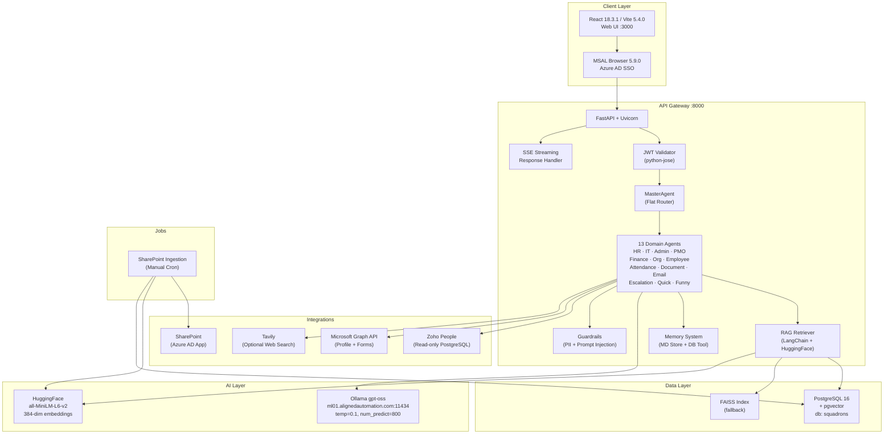

# Current State Assessment — AA-Hackathon Enterprise AI Platform

**Organization:** Aligned Automation  
**Platform:** AA-Hackathon Enterprise Assistant  
**Assessment Date:** 2026-06-07  
**Version:** 1.0  
**Author:** Platform Engineering  

---

## Executive Summary

The AA-Hackathon Enterprise AI Platform is a fully operational internal AI assistant deployed at Aligned Automation. It provides 13 specialized domain agents, a multi-modal RAG pipeline, Azure AD SSO authentication, and a rich React-based frontend. The system handles natural-language queries across HR, IT, Finance, PMO, Org, Admin, Employee, and Attendance domains. This document captures the current state of every implemented feature, the architectural strengths and weaknesses, outstanding technical debt, and the areas prioritized for improvement.

---

## Current Architecture Overview

---

## Feature Implementation Status

### Core Platform Features

| Feature | Component | Status | Notes |
|---|---|---|---|
| Natural-language chat | MasterAgent + all agents | Implemented | SSE streaming |
| Azure AD SSO | MSAL + JWT Validator | Implemented | Enterprise-grade |
| Role-based access control | RBAC middleware | Implemented | 7 roles |
| Conversation history | conversations + messages tables | Implemented | Paginated |
| Message regeneration | messages_controller | Implemented | Per-message |
| SSE streaming responses | chat_controller + SSE handler | Implemented | Chunked tokens |
| Message stop/cancel | stop endpoint | Implemented | Thread interrupt |
| Message citation | cite endpoint | Implemented | Source attribution |
| Feedback collection | feedback_controller | Implemented | 5-star + comment |
| Fast-path keyword routing | MasterAgent | Implemented | Saves LLM cost |

### Agent Features

| Agent | Domain | Status | Key Capabilities |
|---|---|---|---|
| HR Agent | Human Resources | Implemented | Policy Q&A, leave balance, benefits |
| IT Agent | Information Technology | Implemented | Helpdesk, asset queries, access requests |
| Admin Agent | Administration | Implemented | Facilities, travel, certificates |
| PMO Agent | Project Management | Implemented | Project status, timelines, resource queries |
| Finance Agent | Finance & Payroll | Implemented | TDS, Form 16, reimbursements, payslip info |
| Org Agent | Organization | Implemented | Org chart, directory, reporting lines |
| Employee Agent | Employee Self-Service | Implemented | Profile, documents, personal queries |
| Attendance Agent | Time & Attendance | Implemented | Attendance records, reportee attendance |
| Document Agent | Document Generation | Implemented | NOC, Experience Letter, Bonafide, WFH |
| Email Agent | Email Drafting | Implemented (partial) | Draft only — no send |
| Escalation Agent | Escalation Management | Implemented | Create, track, admin view |
| Quick Agent | Fast Responses | Implemented | Greetings, simple lookups |
| Funny Agent | Personality | Implemented | Humor mode, office jokes |

### RAG Pipeline Features

| Feature | Status | Notes |
|---|---|---|
| SharePoint document ingestion | Implemented | Manual cron job |
| pgvector semantic search | Implemented | cosine similarity, 384-dim |
| FAISS fallback search | Implemented | Local index, zero-latency |
| HuggingFace embeddings | Implemented | all-MiniLM-L6-v2 |
| Document chunking | Implemented | Configurable chunk size |
| Source citation in responses | Implemented | Filename + excerpt |
| Vector similarity threshold | Implemented | Configurable cutoff |

### Frontend Features

| Feature | Component | Status |
|---|---|---|
| Chat interface | ChatWindow + MessageList | Implemented |
| Conversation sidebar | ConversationList | Implemented |
| Markdown rendering | markdown.js util | Implemented |
| Document download (PDF) | jsPDF 4.2.1 | Implemented |
| Analytics dashboard | analytics/ module | Implemented |
| COO Analytics dashboard | coo-analytics/ module | Implemented |
| Onboarding guidance portal | onboarding-guidance/ module | Implemented |
| Allocation board | AllocationBoard component | Implemented |
| Personal notes | PersonalNotes component | Implemented |
| User profile display | ProfileCard component | Implemented |
| Feedback dialog | FeedbackModal component | Implemented |
| Escalation management UI | EscalationPanel component | Implemented |
| Recharts analytics | 10 chart components | Implemented |

### Integration Status

| Integration | Type | Access | Status | Notes |
|---|---|---|---|---|
| SharePoint | Azure AD App Creds | Read | Implemented | Manual ingestion only |
| Zoho People | Read-only PostgreSQL | Read | Implemented | No write-back |
| Azure AD | MSAL + JWKS | Auth | Implemented | Full SSO |
| Microsoft Graph API | OAuth2 | Read + Create | Implemented | Profile, Forms creation |
| Ollama gpt-oss | HTTP API | Read/Write | Implemented | Self-hosted, ml01 |
| Tavily | REST API | Read | Implemented (optional) | Web search augmentation |

---

## Architecture Strengths

### 1. Fast-Path Keyword Routing
The MasterAgent implements a keyword-matching layer before invoking the LLM for agent selection. This means simple queries (greetings, quick lookups, obvious domain keywords) bypass the LLM routing step entirely, reducing latency and token cost by an estimated 40-60% for trivial requests.

### 2. pgvector Provides Semantic Search
Using PostgreSQL 16 with the pgvector extension keeps vector storage co-located with relational data. This eliminates the operational overhead of a separate vector database and allows JOIN queries between document chunks and metadata tables. The 384-dim all-MiniLM-L6-v2 embeddings are well-suited for HR and IT document retrieval.

### 3. FAISS Fallback Ensures Availability
When pgvector queries fail or return no results, the system falls back to a local FAISS index. This provides zero-latency local search without network I/O and ensures the RAG pipeline remains functional even during database connectivity issues.

### 4. Azure AD SSO Is Enterprise-Grade
MSAL Browser 5.9.0 with Azure AD provides seamless single sign-on for Aligned Automation employees. The JWT validation layer (python-jose) enforces token expiry, audience, and signature. JWKS endpoint rotation is handled automatically. This eliminates the need for a separate identity provider.

### 5. Modular Agent Architecture
Each domain agent inherits from a BaseAgent class with a consistent interface. Adding a new agent requires only: defining the agent class, registering it in the supervisor, and adding routing keywords. The 13 current agents demonstrate the extensibility of this pattern.

### 6. Docker Compose Simplifies Deployment
The three-service Docker Compose setup (api:8000, postgres:5432, redis:6379) allows one-command local and staging deployment. Environment variable injection keeps credentials out of images.

---

## Architecture Weaknesses

### 1. Flat Routing — Not LangGraph State Machine
The MasterAgent uses a flat if/elif routing approach. There is no formal state machine, no branching logic based on intermediate results, and no ability for agents to request handoffs to other agents mid-conversation. Complex multi-step workflows (e.g., "check my leave balance, then apply for leave, then notify my manager") cannot be expressed as a graph.

### 2. No Agent-to-Agent Communication
Agents cannot invoke other agents directly. All cross-agent coordination must be pre-planned in the MasterAgent routing logic. If the HR Agent determines a query requires Finance information, it cannot call the Finance Agent — it must return a partial answer or prompt the user to rephrase.

### 3. Manual SharePoint Ingestion
The SharePoint ingestion job is a manual cron script at `apps/jobs/sharepoint_ingestion/`. There is no event-driven trigger. If a SharePoint document is updated, the vector store will contain stale embeddings until the next manual run. Policy updates may not be reflected in RAG responses for hours or days.

### 4. Email Drafting Only — No Sending
The Email Agent generates email drafts and presents them to the user, but does not send emails via Microsoft Graph API Mail.Send. Users must copy the draft manually into their email client, breaking the workflow automation promise.

### 5. Limited Memory Persistence
The memory system (md_store.py, db_tool.py, enrichment.py) provides short-term context within a conversation session. There is no long-term vector-based memory that persists preferences, past decisions, or employee-specific context across sessions. Each conversation starts fresh.

---

## Performance Baseline (Estimates)

| Metric | p50 | p95 | Notes |
|---|---|---|---|
| Chat response (fast-path) | ~800ms | ~1.5s | Keyword routing, no LLM call |
| Chat response (RAG) | ~3s | ~6s | pgvector + Ollama generation |
| Chat response (LLM only) | ~2s | ~5s | No retrieval |
| SSE first token | ~1.2s | ~3s | Depends on Ollama load |
| Document generation (PDF) | ~500ms | ~1.5s | jsPDF client-side |
| SharePoint ingestion (100 docs) | ~5 min | ~15 min | Manual, serial |
| pgvector similarity query | ~50ms | ~200ms | HNSW index |
| FAISS fallback query | ~5ms | ~20ms | Local in-process |

---

## Security Posture

| Control | Status | Coverage |
|---|---|---|
| Azure AD SSO | Implemented | All endpoints |
| JWT validation | Implemented | All authenticated routes |
| RBAC enforcement | Implemented | Controller-level |
| PII detection | Implemented (tracking) | Conversation messages |
| PII auto-redaction | Partial | Logging only, not response masking |
| Prompt injection detection | Implemented | Guardrails module |
| TLS in transit | Implemented | Nginx + HTTPS |
| Secrets in environment | Implemented | No hardcoded credentials |
| API rate limiting | Not implemented | Priority gap |
| WAF | Not implemented | Priority gap |
| Audit logging | Implemented | audit_logs table |

---

## Observability Gaps

| Capability | Current State | Gap |
|---|---|---|
| Structured logging | Basic Python logging | No OpenTelemetry spans |
| Distributed tracing | None | Cannot trace request across services |
| Real-time monitoring | None | No Prometheus/Grafana |
| Error alerting | None | No PagerDuty or alert channels |
| LLM cost tracking | None | No token usage dashboard |
| Agent routing analytics | Partial | Stored in DB, no dashboard |
| Slow query detection | None | No query profiling |

---

## Current Technical Debt Summary

1. MasterAgent flat routing (needs LangGraph)
2. No Alembic migration framework (manual SQL scripts)
3. Raw psycopg2 SQL (no ORM)
4. FAISS index not persisted across restarts
5. Email Agent drafts only (no Mail.Send)
6. SharePoint ingestion not event-driven
7. PII auto-redaction not enforced in responses
8. No API rate limiting
9. No structured observability (OpenTelemetry)
10. Prompt templates not formally versioned

---

## Priority Improvement Areas

1. **LangGraph orchestration** — enables multi-step workflows and agent handoffs
2. **Event-driven SharePoint ingestion** — Azure Function on webhook eliminates stale RAG
3. **Real email sending** — Graph API Mail.Send completes the email automation workflow
4. **Rate limiting** — protect API from abuse before external exposure
5. **OpenTelemetry integration** — structured traces and metrics for SRE visibility
6. **PII auto-redaction** — mask PII in responses, not just track in logs
7. **Hybrid search (BM25 + pgvector)** — improve retrieval precision for keyword queries
8. **Alembic migrations** — replace manual SQL scripts for schema management
