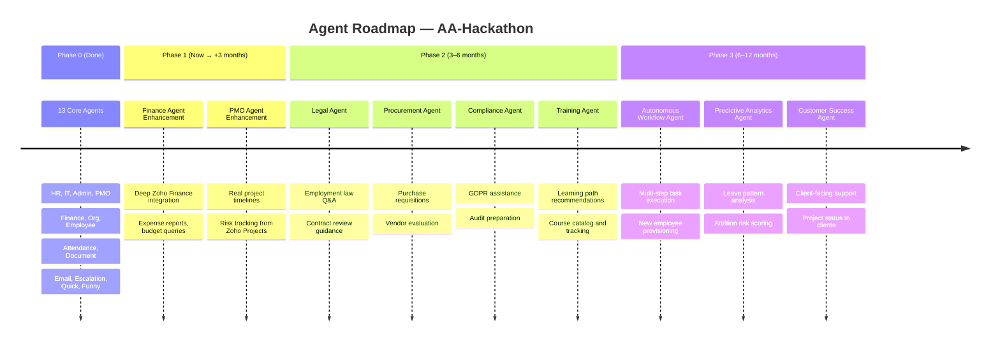

# Future Agent Roadmap — AA-Hackathon Enterprise AI Platform

**Organization:** Aligned Automation  
**Platform:** AA-Hackathon Enterprise Assistant  
**Document Date:** 2026-06-07  
**Version:** 1.0  

---

## Overview

The AA-Hackathon platform currently runs 13 operational domain agents. This document defines the roadmap for 9 additional agents across three phases, the agent development framework that will govern their construction, and the agent marketplace vision that enables third-party agent plugins.

---

## Current Agent Inventory (Baseline)

| Agent | Domain | Status |
|---|---|---|
| HR Agent | Human Resources | Operational |
| IT Agent | Information Technology | Operational |
| Admin Agent | Administration | Operational |
| PMO Agent | Project Management Office | Operational |
| Finance Agent | Finance & Payroll | Operational |
| Org Agent | Organization & Directory | Operational |
| Employee Agent | Employee Self-Service | Operational |
| Attendance Agent | Time & Attendance | Operational |
| Document Agent | Document Generation | Operational |
| Email Agent | Email Drafting | Operational |
| Escalation Agent | Escalation Management | Operational |
| Quick Agent | Fast Responses | Operational |
| Funny Agent | Personality & Humor | Operational |

---

## Agent Evolution Roadmap



---

## Phase 1 Agents — Enhancement (Now → +3 Months)

### Finance Agent Enhancement

**Current State:** The Finance Agent handles payslip queries, TDS calculations, Form 16 information, gratuity, PF, and NPS explanations via RAG over SharePoint policy documents.

**Target Enhancement:** Deep integration with Zoho Finance (Zoho Books / Zoho Expense) to provide live financial data instead of policy-only responses.

**New Capabilities:**

| Capability | Description | Data Source |
|---|---|---|
| Expense report status | Check status of submitted expense claims | Zoho Expense API |
| Reimbursement tracking | View pending and approved reimbursements | Zoho Expense API |
| Budget utilization | Query department budget vs actual spend | Zoho Books API |
| Invoice status | Check vendor invoice payment status | Zoho Books API |
| Tax liability estimate | Real-time TDS calculation from live salary data | Zoho Payroll API |
| Payslip download link | Generate secure download link for current payslip | Zoho Payroll API |

**Implementation Notes:**
- Requires Zoho Finance OAuth2 credentials (separate from Zoho People)
- Add `finance_service.py` in `api/services/`
- Finance Agent calls `finance_service` for live data, falls back to RAG for policy questions
- All financial data requests are audit-logged
- RBAC: employees see own data only, finance_admin sees all

**LangGraph Node Definition:**
```
Node: finance_agent
Inputs: user_query, user_context (employee_id, department)
Skills: get_expense_status, get_reimbursement_list, get_budget_utilization,
        get_payslip_link, get_tax_estimate, rag_policy_search
Edges: → response_formatter (on success)
       → escalation_agent (on data unavailable)
```

---

### PMO Agent Enhancement

**Current State:** The PMO Agent answers project-related questions via RAG over SharePoint project documents and status reports. It has no live data connection to project management tools.

**Target Enhancement:** Live integration with Zoho Projects for real-time project timeline, milestone, and resource data.

**New Capabilities:**

| Capability | Description | Data Source |
|---|---|---|
| Project milestone status | Check if milestones are on track, at risk, or missed | Zoho Projects API |
| Task assignment view | See tasks assigned to self or team members | Zoho Projects API |
| Project risk register | View open risks and their mitigation status | Zoho Projects API |
| Resource utilization | Check allocation vs capacity for a project | Zoho Projects API |
| Sprint progress | View sprint burndown for agile projects | Zoho Sprints API |
| Project timeline delta | Compare planned vs actual timeline | Zoho Projects API |

**RBAC:** Employees see own project data; managers see team data; PMO role sees all projects.

---

## Phase 2 Agents — New Domains (3–6 Months)

### Legal Agent

**Domain:** Employment Law, Contracts, Compliance Guidance  
**Target Users:** All employees (basic), HR Admin (advanced), COO (full)

**Capabilities:**
- Employment contract Q&A (notice periods, ESOP clauses, confidentiality obligations)
- NDA guidance (what can/cannot be shared with clients or vendors)
- Maternity/paternity leave legal rights (jurisdiction-aware: India IT sector)
- IP ownership policy (who owns work product created during employment)
- Disciplinary process guidance (what happens at each stage)
- Legal escalation path (when to involve Legal team vs HR)

**Data Sources:**
- SharePoint legal documents and policy library
- RAG over curated legal FAQ knowledge base
- External: India IT sector employment law summaries (via Tavily if enabled)

**Safety Guardrails:**
- Legal Agent always includes disclaimer: "This is informational guidance, not legal advice."
- Sensitive legal queries (active disputes, litigation) are automatically escalated to Legal team
- No specific legal advice about pending disputes

**LangGraph Node Definition:**
```
Node: legal_agent
Inputs: user_query, user_context, jurisdiction (default: India)
Skills: employment_law_qa, contract_review_guidance, nda_faq,
        ip_policy_qa, legal_escalation_trigger
Edges: → response_formatter
       → escalation_agent (if active_dispute detected)
```

---

### Procurement Agent

**Domain:** Purchase Requisitions, Vendor Evaluation, Approval Tracking  
**Target Users:** All employees (requisitions), managers (approvals), procurement_admin (full)

**Capabilities:**
- Raise purchase requisition from chat (vendor, item, cost, business justification)
- Check approval status of own requisitions
- Query vendor database (approved vendors, contact details, contract expiry)
- Vendor evaluation checklist (standard evaluation criteria)
- PO (Purchase Order) status tracking
- Procurement policy guidance (spend limits, mandatory quote thresholds)

**Data Sources:**
- Zoho Books vendor module
- SharePoint procurement policy documents
- RAG for policy guidance

**Integration Requirements:**
- Zoho Books OAuth2 write access for requisition creation
- Approval workflow integration (Zoho Cliq or email)

---

### Compliance Agent

**Domain:** Regulatory Compliance, Audit Preparation, GDPR  
**Target Users:** All employees (GDPR queries), compliance_officer, hr_admin, coo

**Capabilities:**
- GDPR data subject rights guidance (right to access, erasure, portability)
- Data retention policy Q&A (how long is data kept, by what category)
- Audit preparation checklist (what documents to prepare, who to notify)
- Information security policy Q&A (password policy, device management, VPN)
- Incident reporting guidance (how to report a data breach, who to contact)
- SOC 2 / ISO 27001 control overview (what controls we have, where gaps are)

**Safety Guardrails:**
- Compliance Agent escalates active breach reports immediately to CISO and COO
- Data subject access requests are logged in audit_logs for regulatory tracking

---

### Training Agent

**Domain:** Learning & Development, Course Catalog, Completion Tracking  
**Target Users:** All employees

**Capabilities:**
- Learning path recommendations based on role and career goals
- Course catalog search (internal courses, LinkedIn Learning, Coursera integrations)
- Training completion status (what have I completed, what is pending)
- Mandatory training tracker (compliance training, annual certifications)
- Skill gap identification (based on job description vs completed training)
- Training calendar (upcoming scheduled sessions, registration)

**Data Sources:**
- LMS (Learning Management System) API (TBD — Moodle, Totara, or Zoho Learn)
- SharePoint training schedule documents
- RAG for learning path guidance

---

## Phase 3 Agents — Intelligence (6–12 Months)

### Autonomous Workflow Agent

**Domain:** Multi-Step Task Execution  
**Target Users:** All employees (self-service workflows), managers (approval flows)

**Capabilities:**

| Workflow | Steps | Systems Involved |
|---|---|---|
| New employee provisioning | Create AAD account → Assign licenses → Set up SharePoint access → Send welcome email → Create onboarding checklist | Azure AD Graph API, SharePoint, Email |
| Leave application (end-to-end) | Check balance → Submit application in Zoho → Notify manager → Get approval → Update calendar | Zoho People API, Graph Calendar |
| IT access request | Raise request → Auto-approve for standard tools → Escalate for restricted tools → Provision access → Notify user | IT ticketing system, AAD Groups |
| Expense reimbursement | Collect receipts → Create expense report in Zoho → Submit for approval → Track payment | Zoho Expense API |

**Architecture Note:** Autonomous Workflow Agent is only viable after LangGraph orchestration (Phase 1) is complete. Each workflow is defined as a LangGraph subgraph with confirmation checkpoints before every write action.

**Confirmation Protocol:** Before any write action (create/update/delete in external systems), the agent presents a confirmation summary to the user and requires explicit "Yes, proceed" or "Cancel" response.

---

### Predictive Analytics Agent

**Domain:** HR Analytics, Workforce Intelligence  
**Target Users:** hr_admin, coo, super_admin

**Capabilities:**
- Leave pattern analysis (which teams have the highest leave consumption by month)
- Attrition risk scoring (ML model scoring each employee's 30/60/90 day flight risk)
- Engagement score trends (derived from survey data and activity patterns)
- Headcount forecast (based on project pipeline and attrition projections)
- Overtime anomaly detection (identify burnout-risk employees)
- Diversity metrics (gender balance, tenure distribution by department)

**ML Model Requirements:**
- Attrition risk model: gradient boosting on Zoho People features (tenure, role, leave patterns, performance ratings)
- Model training pipeline: monthly retrain using Zoho People data
- Explainability: SHAP values surfaced per employee risk score
- Bias audit: quarterly review by HR + Data Science team

**Data Privacy:** Predictive scores are never surfaced to employees about themselves. Only hr_admin and coo can query risk scores. All accesses logged in audit_logs.

---

### Customer Success Agent

**Domain:** Client-Facing Support, Project Status Communication  
**Target Users:** Account managers, project managers, COO (for client-ready reporting)

**Capabilities:**
- Client project status report generation (executive summary PDF)
- Milestone and deliverable status for client-facing projects
- SLA compliance status per client
- Client onboarding checklist tracker
- Escalation status visible to client account team
- Meeting summary drafting (from notes or transcript)

**Access Control:** Customer Success Agent is only available to users with `account_manager` or `project_manager` roles. No client can directly access the internal assistant.

---

## Agent Development Framework

### Standard Agent Contract (LangGraph Node Format)

Every new agent must define:

```python
class AgentDefinition:
    name: str                    # e.g., "legal_agent"
    domain: str                  # e.g., "Legal & Compliance"
    version: str                 # semantic version e.g., "1.0.0"
    skills: List[SkillRef]       # list of registered skill names
    routing_keywords: List[str]  # fast-path keywords
    requires_roles: List[str]    # RBAC gate
    rag_enabled: bool            # uses RAG retriever
    live_data: bool              # calls external APIs
    confirmation_required: bool  # write actions require user confirm
    edges: Dict[str, str]        # LangGraph conditional edges
```

### Agent Test Harness

Each agent ships with a test harness at `tests/agents/test_{agent_name}.py`:
- Golden QA dataset: 20 representative queries with expected answer patterns
- Routing test: verify keyword routing directs to correct agent
- RAG test: verify retrieval returns relevant chunks
- RBAC test: verify unauthorized roles receive 403
- Edge case test: empty query, very long query, prompt injection attempt

### Agent Skill Registration

Skills are registered in `agents/skill_registry.py`:
```python
@skill(name="get_expense_status", agent="finance_agent", version="1.0")
def get_expense_status(employee_id: str) -> ExpenseStatusResponse:
    ...
```

---

## Agent Marketplace Vision

In Phase 2, the platform will introduce an Agent Marketplace allowing:
- Third-party agent plugins packaged as Docker images
- Versioned skill contracts (agents declare what skills they offer)
- Approval workflow for adding new agents to the platform
- Sandbox testing environment for new agents before production promotion
- Agent health dashboard (response time, error rate, user satisfaction per agent)

**Plugin Interface:**
```
AgentPlugin:
  - Implements BaseAgent interface
  - Declares manifest.json (name, version, skills, permissions)
  - Runs as separate container (sidecar pattern)
  - Communicates with platform via gRPC or REST
  - Signs requests with plugin API key (issued by AI Governor)
```
