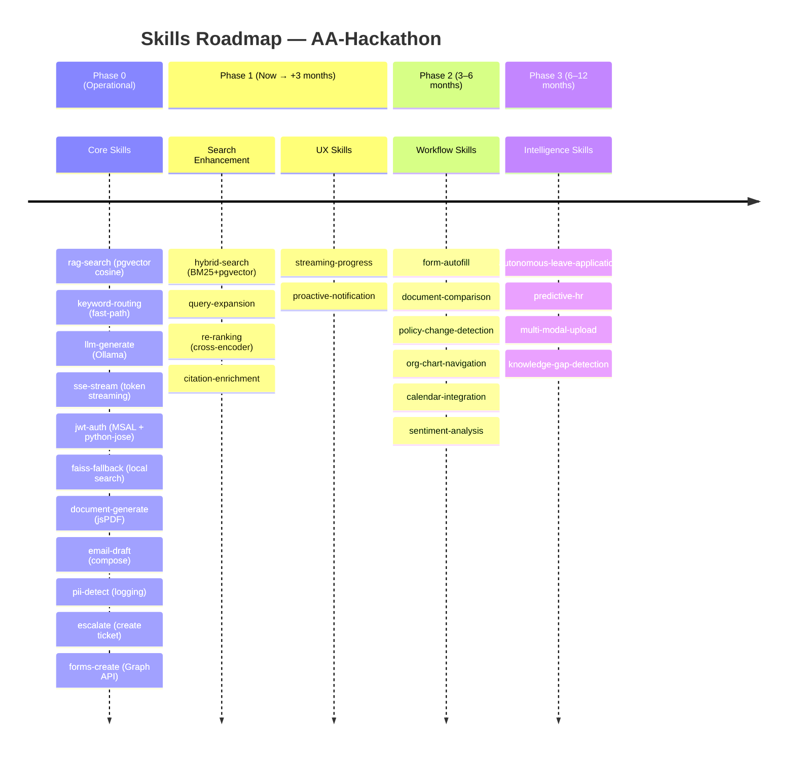
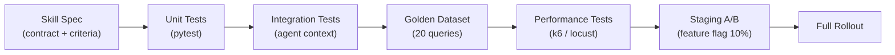

# Future Skills Roadmap — AA-Hackathon Enterprise AI Platform

**Organization:** Aligned Automation  
**Platform:** AA-Hackathon Enterprise Assistant  
**Document Date:** 2026-06-07  
**Version:** 1.0  

---

## Overview

A "skill" in the AA-Hackathon platform is a discrete, reusable capability that an agent can invoke as part of answering a query. Skills are distinct from agents: an agent is a domain expert that orchestrates skills; a skill is a low-level function (search, transform, call API, generate). This document maps the full skills roadmap across three phases.

---

## Skills Evolution Timeline



---

## Phase 0 Skills — Operational (Current)

| Skill Name | Description | Status |
|---|---|---|
| `rag-search` | pgvector cosine similarity retrieval over document_chunks | Operational |
| `keyword-routing` | Fast-path keyword matching in MasterAgent | Operational |
| `llm-generate` | Ollama gpt-oss text generation (temp=0.1, num_predict=800) | Operational |
| `sse-stream` | Server-Sent Events token streaming to client | Operational |
| `jwt-auth` | Azure AD JWT validation via python-jose + JWKS | Operational |
| `faiss-fallback` | Local FAISS in-memory vector search as pgvector fallback | Operational |
| `document-generate` | Generate PDF documents (NOC, Experience Letter, Bonafide) | Operational |
| `email-draft` | Compose email drafts from conversation context | Operational |
| `pii-detect` | Detect and log PII patterns in messages | Operational |
| `escalate` | Create escalation records in PostgreSQL | Operational |
| `forms-create` | Create Microsoft Forms via Graph API | Operational |

---

## Phase 1 Skills — Enhancement (Now → +3 Months)

### Search Enhancement Skills

#### `hybrid-search`

**Purpose:** Combine BM25 keyword scoring with pgvector cosine similarity for improved retrieval precision.

**Implementation:**
- PostgreSQL full-text search (tsvector/tsquery) produces BM25-ranked document chunk list
- pgvector cosine similarity produces semantic-ranked list
- Reciprocal Rank Fusion (RRF) merges both lists: `score = alpha * bm25_rank + (1-alpha) * semantic_rank`
- Default alpha = 0.5 (configurable per agent via `retriever_config`)
- Returns top-20 merged candidates for re-ranking

**API Contract:**
```python
def hybrid_search(
    query: str,
    top_k: int = 20,
    alpha: float = 0.5,
    filter_domain: Optional[str] = None
) -> List[DocumentChunk]:
    ...
```

**Acceptance Criteria:**
- Precision@5 ≥ 10% improvement over pgvector-only on HR policy test set
- Latency < 300ms for top-20 candidates
- BM25 index kept in sync via PostgreSQL triggers on document_chunks INSERT/UPDATE

**Owner:** ML Platform Team  
**Target:** Phase 1, July 2026

---

#### `query-expansion`

**Purpose:** Expand the user's query with synonyms and reformulations to improve recall on sparse queries.

**Implementation:**
- Use Ollama to generate 3 alternative phrasings of the query (zero-shot)
- Expand domain-specific acronyms from a curated synonym map (`YAML: synonym_map.yaml`)
- Run hybrid-search for each reformulation, union results, deduplicate by chunk_id
- Synonym map covers: HR terminology (ESOP → Employee Stock Option Plan, PF → Provident Fund), IT terms, Finance terms

**Example:**
- Input: "PF contribution rules"
- Expanded: ["Provident Fund contribution rules", "EPF contribution guidelines", "employee PF deduction policy"]

**Acceptance Criteria:**
- Recall@10 improves for acronym-heavy queries
- Synonym map covers top 100 Aligned Automation domain terms
- Expansion adds < 500ms to retrieval pipeline

**Owner:** ML Platform Team  
**Target:** Phase 1, July 2026

---

#### `re-ranking`

**Purpose:** Re-score top-20 hybrid-search candidates using a cross-encoder model for higher precision.

**Implementation:**
- Model: `cross-encoder/ms-marco-nomic-embed-text-v1.5-L-6-v2` (HuggingFace, ~22MB, runs on CPU)
- Input: (query, chunk_text) pairs for each of top-20 candidates
- Output: relevance score per pair, re-sorted descending
- Return top-5 for context assembly

**Performance Note:** Cross-encoder inference for 20 pairs takes ~50ms on CPU. Acceptable given it replaces some Ollama thinking time.

**Acceptance Criteria:**
- Top-5 precision ≥ 15% improvement over BM25+pgvector without re-ranking
- Re-ranker loads at startup, no per-request model load
- Re-ranker model version pinned in config

**Owner:** ML Platform Team  
**Target:** Phase 1, August 2026

---

#### `citation-enrichment`

**Purpose:** Extract and surface rich citation metadata from retrieved document chunks.

**Implementation:**
- Parse chunk metadata for: document title, SharePoint URL, last modified date, section header, page number (if PDF)
- Format citation as: `[Source: {title}, Section: {section}, Updated: {date}]`
- Append citations to SSE response after the main answer
- Store citation references in `messages` table for later retrieval via `/cite` endpoint

**Acceptance Criteria:**
- Every RAG-backed response includes at least one formatted citation
- `/api/messages/{id}/cite` endpoint returns full citation list
- SharePoint URL included in citation for direct document navigation

**Owner:** Backend Platform Team  
**Target:** Phase 1, July 2026

---

### UX Skills

#### `streaming-progress`

**Purpose:** Show retrieval and reasoning progress to users during longer responses.

**Implementation:**
- SSE event types extended with `type: progress` events alongside `type: token` events
- Progress events: `{type: "progress", stage: "searching", message: "Searching HR policy documents..."}`
- Stages: `searching` (RAG) → `thinking` (LLM) → `generating` (streaming tokens)
- Frontend displays stage indicator below input box
- Closes progress indicator when first token arrives

**SSE Event Format:**
```
data: {"type": "progress", "stage": "searching", "message": "Searching HR policy documents..."}
data: {"type": "progress", "stage": "thinking", "message": "Analyzing results..."}
data: {"type": "token", "content": "Based on the leave policy..."}
```

**Owner:** Frontend + Backend Team  
**Target:** Phase 1, August 2026

---

#### `proactive-notification`

**Purpose:** Push relevant information to employees without them asking (policy updates, leave balance alerts, onboarding reminders).

**Implementation:**
- Background job polls for trigger conditions every 15 minutes
- Triggers: SharePoint document updated (policy change), leave balance < 3 days, onboarding step due, escalation status changed
- Delivers notification via: SSE push to active sessions, or email via Graph Mail.Send
- User preference: notification types configurable in profile settings
- Frontend: notification bell icon with unread count

**Acceptance Criteria:**
- Policy change notifications delivered within 30 minutes of SharePoint update
- Leave balance alerts sent when balance drops below threshold
- Notification delivery logged in audit_logs

**Owner:** Backend + Frontend Team  
**Target:** Phase 1, August 2026

---

## Phase 2 Skills — Workflow Intelligence (3–6 Months)

### `form-autofill`

**Purpose:** Auto-populate form fields (Microsoft Forms, expense reports) using context extracted from the current conversation.

**Implementation:**
- After a conversation where user has stated intent (e.g., "I want to apply for 3 days leave from Monday"), extract structured data: leave_type, start_date, end_date, reason
- Pre-populate the corresponding Microsoft Form or Zoho form fields
- Present pre-filled form to user for review before submission
- Use Ollama for named entity extraction from conversation context

**Example:** User says "I need to raise a reimbursement for my Chennai trip last week, Rs 4,500 for travel and accommodation." → Finance Agent pre-fills Zoho Expense form with amount, category, date, and description.

---

### `document-comparison`

**Purpose:** Compare two versions of a policy document and highlight changes in a structured summary.

**Implementation:**
- User uploads or specifies two SharePoint document versions
- Retrieve both document texts from SharePoint or document_chunks
- Use Ollama with diff-focused prompt to identify: added sections, removed sections, changed thresholds, updated effective dates
- Return structured diff as markdown table with change type (Added/Removed/Modified) per section

**Acceptance Criteria:**
- Accurately identifies at least 90% of material policy changes in test document pairs
- Output includes section references for both old and new versions

---

### `policy-change-detection`

**Purpose:** Detect when a SharePoint policy document has been updated and alert relevant employees.

**Implementation:**
- Compare document hash or SharePoint `lastModifiedDateTime` against stored value in `documents` table
- On change detected: identify which employees are in the scope of the updated policy (e.g., leave policy → all employees, IT security policy → all employees, Finance policy → finance team)
- Trigger proactive-notification skill for scoped employees
- Store change record in `documents` table with diff summary

---

### `org-chart-navigation`

**Purpose:** Enable interactive org chart browsing and search via natural language.

**Implementation:**
- Expose hierarchical org chart query from Zoho People reporting structure data
- Natural language queries: "Who does Priya report to?", "Who are the direct reports of the CTO?", "Show me the Finance department structure"
- Return structured org chart node(s) as a visual tree in the UI
- Frontend: org chart renderer component (React tree or D3)

---

### `calendar-integration`

**Purpose:** Create, check, and manage calendar events from chat.

**Implementation:**
- Graph API Calendar permissions: `Calendars.ReadWrite` (delegated)
- Capabilities: check availability for a time slot, create meeting invite with attendees, add meeting notes
- Natural language: "Schedule a 1-on-1 with Ravi next Tuesday at 3pm"
- Parse datetime, attendee emails, meeting title from conversation context using Ollama
- Conflict detection: query attendee free/busy before creating invite

---

### `sentiment-analysis`

**Purpose:** Detect employee frustration or negative sentiment in escalations and high-priority queries.

**Implementation:**
- Apply lightweight sentiment classifier (HuggingFace `distilbert-base-uncased-finetuned-sst-2-english`) to escalation descriptions and chat messages flagged for escalation
- Sentiment score appended to escalation record: `{score: -0.7, label: "NEGATIVE"}`
- High negative sentiment automatically upgrades escalation priority
- COO Analytics dashboard: sentiment trend panel (weekly average)
- No sentiment tracking for routine queries — only escalation context

---

## Phase 3 Skills — Autonomous Intelligence (6–12 Months)

### `autonomous-leave-application`

**Purpose:** Submit a complete leave application in Zoho People end-to-end from a single chat request.

**Implementation:**
- User: "Apply for 3 days casual leave from June 15 to June 17"
- Skill extracts: leave_type, start_date, end_date, reason (optional)
- Checks leave balance via Zoho People API
- Presents confirmation summary to user: "I will apply for 3 days Casual Leave (June 15–17). Your current balance is 8 days. Shall I proceed?"
- On confirmation: POST to Zoho People leave application API
- Notifies manager via email (Graph Mail.Send)
- Returns confirmation with Zoho application reference number
- Records action in audit_logs

**Prerequisite:** Zoho People write-back API credentials, LangGraph orchestration, Graph Mail.Send.

---

### `predictive-hr`

**Purpose:** Provide ML-model-powered predictions for HR decisions.

**Sub-skills:**

| Sub-skill | ML Task | Features | Output |
|---|---|---|---|
| attrition-risk-score | Binary classification | Tenure, role level, leave patterns, performance, 1:1 frequency | Risk score 0–1 + top 3 risk factors |
| leave-prediction | Time series forecasting | Historical leave by month, team, department | Predicted leave days next 30/60/90 days |
| engagement-score | Regression | Survey responses, activity patterns, training completion | 0–100 engagement score |
| headcount-forecast | Time series | Project pipeline, attrition rate, historical growth | Headcount needed per quarter |

**Model Training:** Monthly retraining pipeline, models stored in `models/` with version tracking. SHAP explainability for attrition risk.

---

### `multi-modal-upload`

**Purpose:** Process uploaded PDFs and images as part of a chat query.

**Implementation:**
- Frontend: file upload component in chat input (PDF, PNG, JPG, max 10MB)
- Backend: multipart upload endpoint `POST /api/chat/upload`
- PDF processing: extract text using PyMuPDF, chunk, embed, add to ephemeral FAISS index for session
- Image processing: OCR via Tesseract or vision model (if Ollama vision-enabled model available)
- Agent receives extracted text as additional context alongside the user's query
- Session-scoped: uploaded documents are not permanently stored unless user explicitly saves them

---

### `knowledge-gap-detection`

**Purpose:** Identify questions the platform cannot answer well, and surface them to the content team.

**Implementation:**
- After each RAG query, record: query, top similarity score, agent response, user feedback
- Weekly batch job: cluster queries where similarity score < 0.6 (low confidence retrieval)
- Cluster low-confidence queries by semantic similarity to identify common unanswered topics
- Output: "Knowledge Gap Report" to content team — top 10 unanswered topic clusters with example queries
- Content team uses report to prioritize new SharePoint document creation
- Dashboard panel in COO Analytics: "Knowledge Coverage Score" (% of queries above threshold)

---

## Skills Development Process

### Definition Phase
1. Write skill specification (name, purpose, API contract, acceptance criteria)
2. Review with domain expert (HR Admin for HR skills, IT Admin for IT skills)
3. Estimate effort and assign to roadmap phase

### Development Phase
1. Implement skill as standalone Python function in `agents/skills/{skill_name}.py`
2. Register skill in `agents/skill_registry.py` with `@skill` decorator
3. Write unit tests in `tests/skills/test_{skill_name}.py` (10+ test cases)
4. Document in component-inventory.md

### Testing Phase
1. Unit tests: isolated skill logic
2. Integration tests: skill within agent context
3. Golden dataset evaluation: 20 representative queries
4. Performance test: latency under 10 concurrent users

### Promotion Phase
1. Feature flag enables skill in staging
2. A/B test: 10% of queries use new skill vs. baseline
3. Monitor: precision, recall, latency, user feedback
4. Full rollout after 5 business days of positive metrics

---

## Skills Testing Framework



---

## Skills Marketplace Vision

In Phase 2, skills become pluggable modules installable from a skills marketplace:
- Skills packaged as Python wheels with standardized `SkillManifest` metadata
- Version pinning and compatibility matrix per agent
- Sandbox evaluation environment: test new skills against golden dataset before production
- Skill ratings: usage frequency, user satisfaction, latency percentiles
- Third-party skill submission: external developers can submit skills for review
- Approval workflow: platform team + security review before marketplace listing
