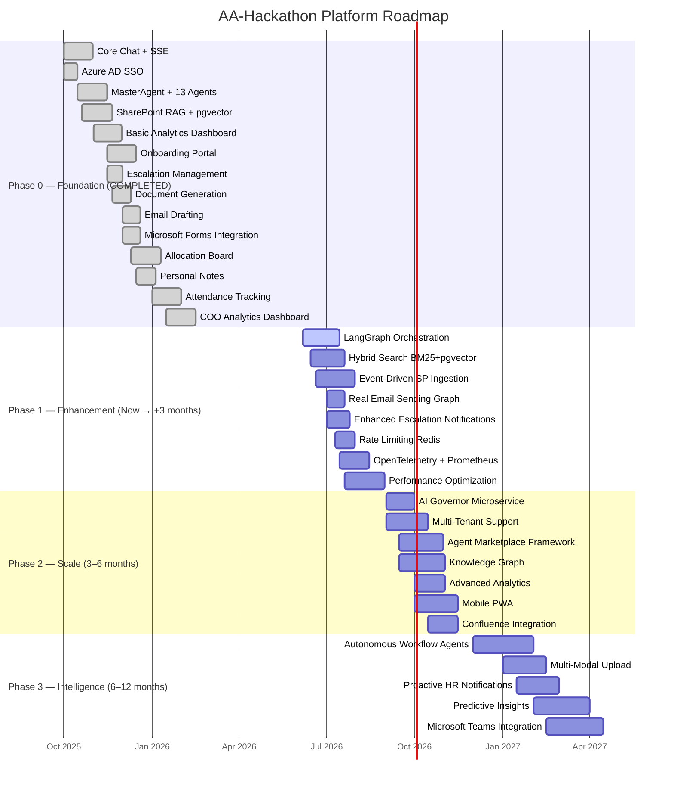
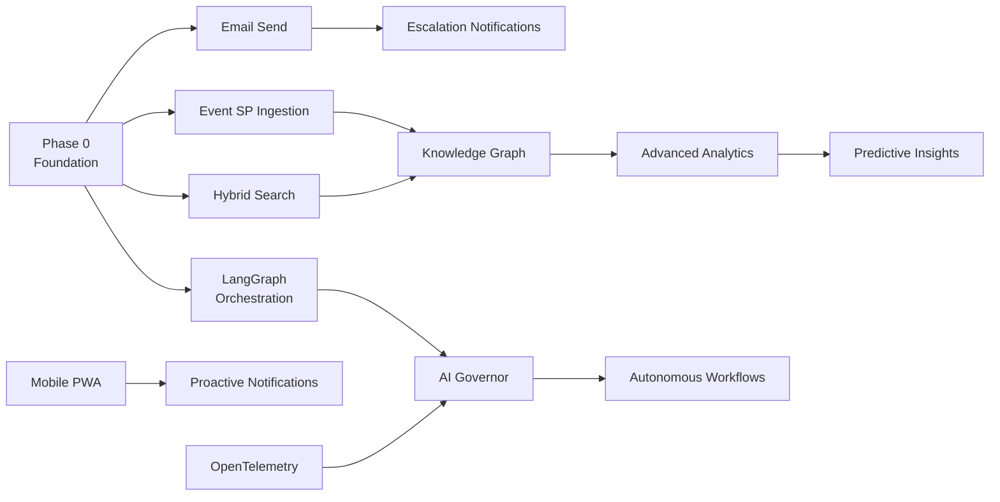

# Implementation Roadmap — AA-Hackathon Enterprise AI Platform

**Organization:** Aligned Automation  
**Platform:** AA-Hackathon Enterprise Assistant  
**Document Date:** 2026-06-07  
**Version:** 1.0  

---

## Roadmap Timeline

---

## Phase 0 — Foundation (COMPLETED)

Phase 0 delivered the minimum viable enterprise assistant. Every item below is fully operational in the current production deployment.

### Delivered Features

| Feature | Description | Component |
|---|---|---|
| Core chat + SSE | Real-time streaming responses via Server-Sent Events | chat_controller.py |
| Azure AD SSO | MSAL Browser + JWT validation + JWKS | auth_handler.py, jwt_validator.py |
| MasterAgent + 13 agents | Flat routing to HR, IT, Admin, PMO, Finance, Org, Employee, Attendance, Document, Email, Escalation, Quick, Funny | supervisor_agent.py |
| SharePoint RAG + pgvector | Document ingestion, embedding, cosine similarity search | rag/retriever.py, document_chunks table |
| FAISS fallback | Local vector index for availability when pgvector unavailable | retriever.py |
| Basic analytics dashboard | Recharts panels: query volume, agent distribution, feedback scores | analytics/ module |
| Onboarding portal | Step-by-step onboarding guidance for new employees | onboarding-guidance/ module |
| Escalation management | Create, track, admin-view escalations with priority levels | escalation_agent.py, escalations_controller.py |
| Document generation | NOC certificate, Experience Letter, Bonafide, WFH Policy PDF | document_agent.py, jsPDF |
| Email drafting | Compose email drafts from conversation context | email_agent.py |
| Microsoft Forms | Create forms via Graph API from chat | ms_forms_agent.py |
| Allocation board | Visual resource allocation tracker | AllocationBoard component |
| Personal notes | Per-user encrypted notes in DB | PersonalNotes component |
| Attendance tracking | Attendance records from Zoho People, reportee view | attendance_controller.py |
| COO analytics dashboard | Executive-level metrics, department breakdowns | coo-analytics/ module |
| RBAC enforcement | 7 roles: employee, manager, hr_admin, it_admin, admin, coo, super_admin | userConfig.js |
| Feedback collection | 5-star + comment feedback per message | feedback_controller.py |
| Conversation history | Paginated conversation and message retrieval | conversations_controller.py |
| PII detection tracking | Detect and log PII in messages | pii_controller.py, pii_events table |
| Audit logging | All admin actions recorded | audit_logs table |

### Phase 0 Success Criteria — Achieved

- All 13 agents respond to domain queries
- Azure AD SSO operational for all Aligned Automation employees
- SharePoint knowledge base searchable via RAG
- Document generation producing valid PDFs
- Analytics visible to hr_admin and coo roles

---

## Phase 1 — Enhancement (Now → +3 Months)

Phase 1 addresses the highest-impact gaps identified in the current-state assessment: orchestration, search quality, knowledge freshness, email automation, and platform reliability.

### 1.1 LangGraph Orchestration

**Goal:** Replace MasterAgent flat router with LangGraph state machine.

**Scope:**
- Define LangGraph graph with nodes: `classify → route → retrieve → generate → format → memory_update`
- Migrate all 13 agents to LangGraph node format
- Implement conditional edges for agent handoffs
- Maintain MasterAgent as fallback during migration via feature flag `LANGGRAPH_ENABLED`
- Add shared graph state: `{user_context, conversation_history, retrieved_docs, agent_outputs}`

**Acceptance Criteria:**
- All existing agent tests pass
- Multi-step queries handled in single turn
- Routing latency same or lower than current flat router
- Feature flag allows instant rollback

### 1.2 Hybrid Search (BM25 + pgvector)

**Goal:** Improve RAG retrieval precision with keyword+semantic fusion.

**Scope:**
- Implement BM25 scorer over document_chunks using PostgreSQL full-text search (tsvector/tsquery)
- Combine BM25 score and cosine similarity with configurable alpha weight
- Add cross-encoder re-ranker (HuggingFace ms-marco-nomic-embed-text-v1.5-L-6-v2) for top-20 candidates
- Expose `search_strategy` parameter in retriever (default: hybrid)
- A/B test against pure pgvector baseline

**Acceptance Criteria:**
- Retrieval precision@5 improves by ≥10% on HR policy query test set
- Hybrid search latency <300ms for top-5 results
- Re-ranker model loads on ml01 without additional GPU

### 1.3 Event-Driven SharePoint Ingestion

**Goal:** Replace manual cron job with Azure Function on SharePoint webhook.

**Scope:**
- Register SharePoint webhook subscription via Graph API for target document libraries
- Deploy Azure Function (Python) triggered by webhook POST
- Function performs delta ingestion: fetch changed docs, re-embed, upsert document_chunks
- Retry logic with exponential backoff for transient SharePoint API failures
- Webhook renewal job (subscriptions expire every 180 days)
- Keep manual `apps/jobs/sharepoint_ingestion/` as emergency fallback

**Acceptance Criteria:**
- SharePoint document update reflected in RAG within 5 minutes
- Zero manual intervention required for routine updates
- Webhook renewal automated

### 1.4 Real Email Sending (Graph API Mail.Send)

**Goal:** Allow Email Agent to dispatch emails from user's mailbox.

**Scope:**
- Add `Mail.Send` delegated permission to AAD app registration
- Implement user consent flow (MSAL acquireTokenSilent with `Mail.Send` scope)
- Add `POST /api/email-agent/send` endpoint alongside existing `/from-chat`
- Email Agent presents draft → user confirms → agent calls `POST /users/{id}/sendMail`
- Full audit trail: email dispatch recorded in audit_logs
- Fallback: if Mail.Send not consented, present draft as before

**Acceptance Criteria:**
- Sent emails appear in user's Sent Items
- Consent flow works silently if scopes pre-granted by IT admin
- Draft fallback always available

### 1.5 Enhanced Escalation Notifications

**Goal:** Notify escalation owners and admins via email when escalations are created or updated.

**Scope:**
- Escalation Agent calls Graph Mail.Send on escalation create/update events
- Email template: escalation ID, priority, description, assigned agent, SLA deadline
- Admin receives notification when new escalation arrives
- Employee receives confirmation email with tracking ID
- Configure notification rules per escalation priority

### 1.6 Rate Limiting (Redis Token Bucket)

**Goal:** Protect API from abuse and enforce per-role usage quotas.

**Scope:**
- Implement Redis token bucket middleware in FastAPI
- Limits: employee=30 req/min, manager=50 req/min, admin=100 req/min, super_admin=unlimited
- Rate limit headers: `X-RateLimit-Limit`, `X-RateLimit-Remaining`, `X-RateLimit-Reset`
- 429 response with retry-after header
- Exempt health and debug endpoints

### 1.7 OpenTelemetry + Prometheus + Grafana

**Goal:** Achieve structured observability for all platform components.

**Scope:**
- Instrument FastAPI with `opentelemetry-instrumentation-fastapi`
- Emit spans for: JWT validation, agent routing, RAG retrieval, Ollama call, DB queries
- Prometheus metrics: request count, latency histograms, agent routing distribution, error rate, RAG hit rate
- Grafana dashboard: 8 panels (RPS, p50/p95 latency, agent distribution, LLM token/s, error rate, RAG hit rate, escalations/day, active users)
- Alert rules: p95 latency >5s, error rate >1%, Ollama health check fail

---

## Phase 2 — Scale (3–6 Months)

Phase 2 adds enterprise-scale features: governance, multi-tenancy, knowledge graph, and mobile support.

### Key Deliverables

| Feature | Description |
|---|---|
| AI Governor Microservice | Dedicated service for safety scoring, PII auto-redaction, rate limiting, budget enforcement |
| Multi-tenant support | Isolate knowledge bases and conversations per department/client |
| Agent marketplace framework | Plugin interface for third-party agents with versioned skill contracts |
| Knowledge graph | Semantic clustering over document_chunks, topic taxonomy |
| Advanced analytics | Conversation clustering, intent analysis, topic heatmap, knowledge gap detection |
| Mobile PWA | Responsive UI, installable on iOS/Android, push notifications |
| Confluence integration | Ingest Confluence spaces into RAG, confluence:// source citations |
| Legal, Procurement, Compliance agents | Three new domain agents (see future-agents.md) |

---

## Phase 3 — Intelligence (6–12 Months)

Phase 3 delivers autonomous, predictive, and multi-modal AI capabilities.

### Key Deliverables

| Feature | Description |
|---|---|
| Autonomous workflow agents | Multi-step task execution: new-hire provisioning, leave approval chains, IT access requests |
| Multi-modal upload | Process uploaded PDFs/images in chat using vision model |
| Proactive HR notifications | Push policy updates, anniversary reminders, leave balance alerts |
| Predictive insights | ML models for leave patterns, attrition risk, engagement scores |
| Microsoft Teams integration | Teams Bot for query/response without leaving Teams |

---

## Milestone Definitions

| Milestone | Definition | Phase |
|---|---|---|
| M0: Foundation Complete | All 13 agents live, SSO active, RAG operational | 0 (Done) |
| M1: LangGraph Live | LangGraph handles 100% of new conversations | 1 |
| M2: Hybrid Search Live | Hybrid retriever serving all RAG queries | 1 |
| M3: Real-Time Knowledge | SP ingestion event-driven, lag <5 min | 1 |
| M4: Email Autonomous | Email Agent sends on behalf of user | 1 |
| M5: Observable Platform | Grafana dashboard live, alert rules active | 1 |
| M6: AI Governor Active | All requests pass through Governor | 2 |
| M7: Mobile PWA | PWA installable on mobile, push notifications live | 2 |
| M8: Knowledge Graph | Topic taxonomy and clustering active | 2 |
| M9: Autonomous Workflows | End-to-end leave application via chat | 3 |
| M10: Predictive AI | Attrition risk model serving COO dashboard | 3 |

---

## Dependency Graph

---

## Resource Requirements

| Phase | Dev Effort | Infra Delta | Timeline |
|---|---|---|---|
| Phase 1 | 3 engineers × 3 months = 9 dev-months | Azure Function, Redis (existing) | Jun–Aug 2026 |
| Phase 2 | 4 engineers × 3 months = 12 dev-months | +Grafana instance, +Confluence API | Sep–Nov 2026 |
| Phase 3 | 4 engineers × 6 months = 24 dev-months | +Azure Bot Service, +ML pipeline | Dec 2026–May 2027 |

---

## Risk Register

| Risk | Phase | Likelihood | Impact | Mitigation |
|---|---|---|---|---|
| LangGraph migration breaks agent contracts | 1 | Medium | High | Feature flag, parallel routing, per-agent migration |
| Ollama capacity under higher load | 1 | Medium | Medium | Add second Ollama node (ml02), load balance |
| Azure Function SP webhook reliability | 1 | Medium | Medium | Scheduled fallback poll every 30 min |
| Graph Mail.Send consent refused by IT admin | 1 | Low | Medium | Draft fallback always available |
| Multi-tenant data isolation bug | 2 | Low | Critical | Tenant isolation unit tests, row-level security |
| Autonomous workflow agent unintended actions | 3 | Medium | High | Confirmation step before every write action |
| Predictive model bias in attrition scoring | 3 | Medium | High | Bias audit, model card, explainability panel |

---

## Success Criteria Per Phase

### Phase 1 Success
- LangGraph handling 100% of new queries with zero regression
- Hybrid search shows ≥10% precision improvement on HR query test set
- SharePoint updates reflected in <5 minutes
- At least one email sent autonomously via Graph Mail.Send
- Grafana dashboard live with 8 panels and alert rules

### Phase 2 Success
- AI Governor blocking 100% of prompt injection attempts in test suite
- PWA installable and functional on iOS and Android
- Confluence space searchable via RAG
- Three new agents (Legal, Procurement, Compliance) operational

### Phase 3 Success
- End-to-end leave application workflow completes in single chat turn
- COO dashboard shows attrition risk model output
- Teams Bot answers queries for 80% of test scenarios
- Multi-modal upload handles PDF and image documents
