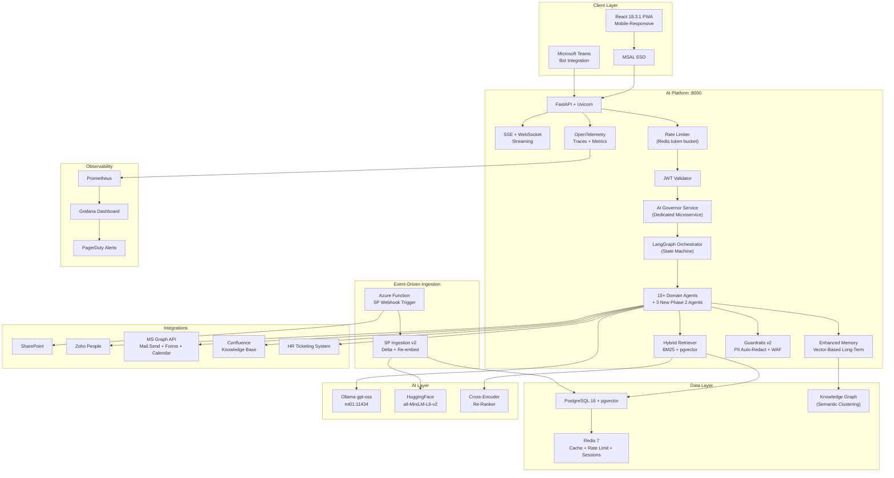

# Target State Vision — AA-Hackathon Enterprise AI Platform

**Organization:** Aligned Automation  
**Platform:** AA-Hackathon Enterprise Assistant  
**Vision Horizon:** 6-Month Target  
**Document Date:** 2026-06-07  
**Version:** 1.0  

---

## Executive Summary

This document defines the 6-month target architecture for the AA-Hackathon Enterprise AI Platform. The vision elevates the platform from a chat assistant with 13 domain agents into a full enterprise AI operating system: event-driven knowledge ingestion, LangGraph-orchestrated multi-step workflows, autonomous email dispatch, real-time monitoring, mobile-responsive PWA, and integration with Microsoft Teams and Confluence. Every target here is grounded in the existing codebase and extends — rather than replaces — the proven components.

---

## Target Architecture Overview

---

## Platform Improvements by Domain

### 1. Orchestration — LangGraph State Machine

Replace the flat MasterAgent router with a LangGraph state machine. Each conversation turn becomes a graph traversal: nodes for routing, retrieval, generation, memory update, and response formatting. Conditional edges allow agents to hand off to one another based on intermediate results.

**Target capability:** A user asks "Check my leave balance, book three days from next Monday, and email my manager." The graph routes through Attendance Agent → Zoho write-back → Email Agent → Graph Mail.Send — all in a single turn, with state shared across nodes.

### 2. AI Governor Service

A dedicated lightweight microservice sitting between the API Gateway and LangGraph. Responsibilities:
- Request classification and safety scoring
- PII detection and auto-redaction (not just tracking)
- Prompt injection detection with configurable thresholds
- Rate limit enforcement (per-user, per-role)
- Audit event emission to audit_logs
- LLM cost budget enforcement per department

### 3. Event-Driven SharePoint Ingestion

Replace the manual cron job with an Azure Function triggered by SharePoint webhook on document change events. Delta ingestion re-embeds only changed documents. Target: knowledge base reflects SharePoint updates within 5 minutes of file save.

### 4. Hybrid Vector Search

Combine BM25 keyword scoring with pgvector cosine similarity. A cross-encoder re-ranker (separate HuggingFace model) re-scores the top-20 candidates to produce a final top-5. This improves precision for queries containing exact HR policy terms (e.g., "maternity leave 26 weeks") that semantic search alone may not rank correctly.

### 5. Real Email Sending (Graph Mail.Send)

The Email Agent gains the ability to actually dispatch emails via Microsoft Graph API's Mail.Send permission. User confirms the draft in the UI, clicks Send, and the agent submits the mail on their behalf. OAuth2 delegated permissions ensure the email appears from the employee's own mailbox.

### 6. Enhanced Memory — Vector-Based Long-Term

Introduce a persistent vector memory store: each conversation turn is embedded and stored in a dedicated memory table in PostgreSQL. At the start of a new conversation, the Memory System retrieves the top-k most relevant past interactions using cosine similarity. Employees no longer need to re-explain context they have provided before.

### 7. Agent-to-Agent Communication

LangGraph edges enable formal agent-to-agent handoffs. The supervisor defines allowed transition edges. The Finance Agent can request the Attendance Agent's leave balance before answering a reimbursement-related question. Results flow through shared graph state, not through the user.

### 8. Comprehensive Monitoring Dashboard

Grafana dashboard with panels for: requests per minute, agent routing distribution, LLM token usage, p50/p95 latency, error rate, RAG hit rate, escalation volume, and active user count. Prometheus metrics emitted via OpenTelemetry SDK from FastAPI middleware.

---

## New Integration Targets

| Integration | Type | Capability |
|---|---|---|
| HR Ticketing System | REST API | Create, track, resolve HR tickets from chat |
| Microsoft Teams Bot | Bot Framework SDK | Answer queries without leaving Teams |
| Confluence | REST API | Ingest Confluence spaces into RAG pipeline |
| Graph API Mail.Send | Delegated OAuth2 | Send emails from employee mailbox |
| Zoho Projects (write) | REST API | Create tasks, update timelines |
| Calendar API | Delegated OAuth2 | Create meetings, check availability |

---

## Performance Targets

| Metric | Current Estimate (p95) | Target (p95) |
|---|---|---|
| Chat response (RAG) | ~6s | <3s |
| SSE first token | ~3s | <500ms |
| Uptime | ~99% | 99.9% |
| SharePoint sync lag | Hours | <5 minutes |
| MTTR (incident recovery) | Unknown | <30 minutes |
| Hybrid search latency | N/A | <300ms (top-5 reranked) |
| Email send round-trip | N/A (draft only) | <2s |

---

## Security Targets

| Control | Current | Target |
|---|---|---|
| PII detection | Tracking only | Auto-redact in responses |
| Rate limiting | None | Token bucket per user/role (Redis) |
| WAF | None | Azure Front Door WAF or NGINX ModSecurity |
| API abuse detection | None | AI Governor anomaly scoring |
| Audit trail | audit_logs table | OpenTelemetry trace + SIEM export |
| Secrets management | .env files | Azure Key Vault integration |

---

## Data Architecture Target

### Knowledge Graph Overlay
Build a semantic clustering layer over the document_chunks table. Cluster embeddings into topic groups (HR Policy, Benefits, IT Procedures, Finance Rules, etc.). The Knowledge Graph allows queries like "what topics haven't employees asked about?" and powers the Knowledge Gap Detection skill.

### Semantic Clustering for Analytics
Cluster conversation embeddings weekly to identify emerging question trends, unanswered intents, and high-volume topics. Feed results into the COO Analytics dashboard as "Topic Heatmap" and "Emerging Intent" panels.

---

## Frontend Target State

| Area | Current | Target |
|---|---|---|
| Mobile responsiveness | Desktop-first | Fully responsive, PWA installable |
| Streaming UX | Basic SSE tokens | Progress indicator, source loading animation |
| Analytics | Recharts panels | Advanced drill-down, date range picker |
| Notifications | None | Push notifications for escalation updates |
| Themes | Light only | Dark mode |
| Accessibility | Partial | WCAG 2.1 AA compliant |
| Document upload | None | PDF/image upload for multi-modal queries |

---

## Migration Plan Overview

| Step | Description | Risk |
|---|---|---|
| 1. Add LangGraph alongside MasterAgent | Parallel routing — new queries via LangGraph, fallback to MasterAgent | Low |
| 2. Migrate agents to LangGraph nodes one by one | Per-agent migration, tested independently | Medium |
| 3. Retire MasterAgent flat router | After all agents migrated and validated | Low |
| 4. Deploy AI Governor as sidecar | No traffic change, adds audit and rate limiting | Low |
| 5. Switch SP ingestion to Azure Function | Disable cron after Function is stable | Medium |
| 6. Enable Mail.Send after user consent flow | Requires AAD permission grant from IT admin | Medium |
| 7. Enable hybrid search | A/B test against pgvector-only | Low |

---

## Investment Required

| Area | Effort (dev-weeks) | Infra Cost Delta |
|---|---|---|
| LangGraph orchestration | 4 | None |
| AI Governor service | 3 | Minimal (sidecar) |
| Event-driven SP ingestion | 2 | Azure Function (~$5/month) |
| Hybrid search + re-ranker | 3 | Minimal (model on same GPU node) |
| Real email sending | 1 | None |
| OpenTelemetry + Grafana | 2 | Prometheus + Grafana (~$0 self-hosted) |
| PWA + mobile UI | 3 | None |
| Teams Bot integration | 3 | Azure Bot Service (~$10/month) |

---

## Risk Mitigation

| Risk | Likelihood | Impact | Mitigation |
|---|---|---|---|
| LangGraph migration breaks existing agents | Medium | High | Parallel routing, feature flag per agent |
| Graph Mail.Send permission denied by IT | Low | Medium | Draft fallback remains in place |
| Azure Function SP webhook reliability | Medium | Medium | Scheduled fallback poll every 30 min |
| Cross-encoder re-ranker adds latency | Medium | Low | Cache re-ranked results for common queries |
| Teams Bot adoption low | Low | Low | Optional integration, not blocking |
