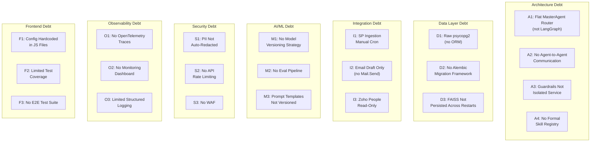

# Technical Debt Register — AA-Hackathon Enterprise AI Platform

**Organization:** Aligned Automation  
**Platform:** AA-Hackathon Enterprise Assistant  
**Document Date:** 2026-06-07  
**Version:** 1.0  

---

## Overview

This register catalogs all known technical debt items in the AA-Hackathon platform, categorizes them by domain, assesses their impact and remediation effort, and defines ownership and target resolution phases. Debt is not a sign of poor engineering — it is a conscious tradeoff made to deliver the Phase 0 foundation rapidly. This document makes those tradeoffs explicit and manageable.

---

## Debt Map

---

## Architecture Debt

### A1: Flat MasterAgent Router (Not LangGraph State Machine)

**File:** `apps/api-gateway/agents/supervisor_agent.py`  
**Description:** The MasterAgent routes queries using a flat if/elif decision tree based on keyword matching and a single LLM classification call. There is no formal state machine, no branching based on intermediate agent results, and no support for multi-step workflows that cross agent boundaries.  
**Impact:** High — prevents multi-step autonomous workflows, limits agent reuse, makes complex query handling brittle.  
**Effort:** High — requires LangGraph adoption and per-agent node migration.  
**Workaround:** Pre-planned routing handles 95% of current queries. Complex queries are split across multiple turns.  
**Target Phase:** Phase 1  
**Owner:** Backend Platform Team  
**Resolution Plan:** Introduce LangGraph as a parallel orchestrator behind a `LANGGRAPH_ENABLED` feature flag. Migrate agents one by one. Retire flat router after full migration.

---

### A2: No Agent-to-Agent Communication

**File:** `apps/api-gateway/agents/supervisor_agent.py`  
**Description:** Agents cannot invoke other agents directly. If the Finance Agent needs leave data from the Attendance Agent, it must either return a partial answer or the MasterAgent must manually combine outputs from two sequential routing calls.  
**Impact:** Medium — limits query richness, requires multiple conversation turns for cross-domain questions.  
**Effort:** Medium — LangGraph edges naturally enable this.  
**Workaround:** MasterAgent occasionally combines context from two agent calls for known cross-domain query patterns.  
**Target Phase:** Phase 1 (as part of LangGraph adoption)  
**Owner:** Backend Platform Team  

---

### A3: Guardrails Not Isolated as Service

**File:** `apps/api-gateway/` (inline in agent execution)  
**Description:** PII detection, prompt injection checks, and output filtering run in-process within the API Gateway. There is no isolated guardrail service with its own scaling, versioning, or update cadence. Any guardrail rule update requires a full API Gateway redeploy.  
**Impact:** Medium — operational brittleness, cannot update safety rules without downtime.  
**Effort:** Medium — extract to AI Governor microservice.  
**Workaround:** Guardrails are currently stable and rarely updated.  
**Target Phase:** Phase 2 (AI Governor)  
**Owner:** Security + Platform Team  

---

### A4: No Formal Skill Registry

**File:** `apps/api-gateway/agents/supervisor_agent.py`  
**Description:** Agent capabilities (which skills each agent offers) are implicitly defined in the agent class rather than registered in a formal skill catalog. Discovering what an agent can do requires reading its source code.  
**Impact:** Low — developer friction when onboarding new engineers or building the agent marketplace.  
**Effort:** Low — add a `SkillRegistry` dataclass with `@skill` decorator.  
**Workaround:** Developer documentation (component-inventory.md) covers agent capabilities.  
**Target Phase:** Phase 2 (Agent Marketplace)  
**Owner:** Backend Platform Team  

---

## Data Layer Debt

### D1: Raw psycopg2 SQL (No ORM)

**Files:** All `*_controller.py` and `*_service.py` files  
**Description:** Database access uses raw `psycopg2` with parameterized SQL strings. There is no SQLAlchemy ORM or query builder. This means all queries are hand-written SQL with manual result mapping to Pydantic models.  
**Impact:** Medium — higher risk of SQL mistakes, no compile-time query validation, difficult to refactor schema changes.  
**Effort:** High — ORM migration touches every DB-touching file.  
**Workaround:** All queries use parameterized statements (no concatenation), minimizing SQL injection risk. Code review enforces this.  
**Debt Prevention Policy:** All new DB queries must use parameterized statements. No string concatenation in SQL.  
**Target Phase:** Phase 2 (if ORM adopted) or leave as-is with Alembic for migrations only.  
**Owner:** Backend Data Team  

---

### D2: No Migration Framework — Manual SQL Scripts

**Files:** `deployments/docker/` (ad-hoc SQL)  
**Description:** Schema changes are applied via manually run SQL scripts with no version tracking. There is no Alembic, Flyway, or Liquibase. If a deployment is skipped or run out of order, the schema can diverge from the application's expectations.  
**Impact:** High — deployment risk, onboarding friction, no rollback mechanism for schema changes.  
**Effort:** Low — adding Alembic requires only an `alembic init` and migration of existing schema to auto-generated revisions.  
**Resolution Plan:** Phase 1 — add Alembic. Generate initial migration from current schema. All future schema changes require an Alembic revision file.  
**Target Phase:** Phase 1  
**Owner:** Backend Data Team  

---

### D3: FAISS Index Not Persisted Across Restarts

**File:** `apps/api-gateway/rag/retriever.py`  
**Description:** The FAISS index is built in memory at startup from embeddings fetched from PostgreSQL. On container restart, the index must be rebuilt. If the PostgreSQL connection is unavailable at startup, FAISS cannot be initialized and the fallback is unavailable.  
**Impact:** Medium — startup latency, fragile fallback availability.  
**Effort:** Low — serialize index to disk using `faiss.write_index()`, load on startup if file exists, rebuild only if stale.  
**Target Phase:** Phase 1  
**Owner:** ML Platform Team  

---

## Integration Debt

### I1: SharePoint Ingestion Is Manual Cron

**File:** `apps/jobs/sharepoint_ingestion/main.py`  
**Description:** The SharePoint document ingestion job is triggered manually or via an ad-hoc cron schedule. When a SharePoint document is updated, the vector store contains stale embeddings until the next manual run. There is no event-driven trigger.  
**Impact:** High — knowledge freshness SLA unmet, employees may receive outdated policy information.  
**Effort:** Medium — Azure Function + SharePoint webhook registration.  
**Target Phase:** Phase 1  
**Owner:** Integration Team  

---

### I2: Email Agent Drafts Only — No Sending

**File:** `apps/api-gateway/agents/email_agent.py`  
**Description:** The Email Agent generates email drafts and returns them as chat messages. It does not dispatch emails via Microsoft Graph API Mail.Send. Users must manually copy the draft.  
**Impact:** Medium — breaks workflow automation promise, user friction.  
**Effort:** Low — add `Mail.Send` scope to AAD app, call `POST /users/{id}/sendMail`.  
**Target Phase:** Phase 1  
**Owner:** Integration Team  

---

### I3: Zoho People Read-Only (No Write-Back)

**File:** `apps/api-gateway/agents/` (Attendance, Employee agents)  
**Description:** The Zoho People integration reads attendance and employee data via a direct PostgreSQL replica connection. There is no write-back to Zoho People APIs, so actions like leave application or profile updates cannot be completed from chat.  
**Impact:** Medium — limits autonomous workflow capability.  
**Effort:** High — Zoho People REST API integration for write operations, OAuth2 setup.  
**Target Phase:** Phase 3 (Autonomous Workflows)  
**Owner:** Integration Team  

---

## AI/ML Debt

### M1: No Model Versioning Strategy

**Files:** Ollama config, embedding model usage  
**Description:** There is no tracking of which Ollama model version or HuggingFace embedding model version is in use. A model update (e.g., Ollama gpt-oss bump) could silently change response quality without alerting the team.  
**Impact:** Medium — silent quality regressions, inability to roll back model changes.  
**Effort:** Low — pin model versions in config, add model version to health check response, log model version in audit_logs.  
**Target Phase:** Phase 1  
**Owner:** ML Platform Team  

---

### M2: No Automated Evaluation Pipeline

**Description:** There is no automated system for evaluating agent response quality. Quality assessment is entirely manual and anecdotal.  
**Impact:** High — cannot objectively measure improvement from changes like hybrid search or LangGraph migration.  
**Effort:** Medium — build an evaluation harness using a golden QA dataset and automated scoring (ROUGE, BERTScore, exact match).  
**Target Phase:** Phase 2  
**Owner:** ML Platform Team  

---

### M3: Prompt Templates Not Formally Versioned

**Files:** All agent files (inline prompts)  
**Description:** System prompts and few-shot examples are embedded as Python string literals in agent files. There is no template registry, no version history of prompt changes, and no A/B testing framework.  
**Impact:** Medium — prompt changes have unknown quality impact, no rollback capability.  
**Effort:** Low — extract prompts to YAML template files in `agents/prompts/`, load at startup, track version in git.  
**Target Phase:** Phase 1  
**Owner:** ML Platform Team  

---

## Security Debt

### S1: PII Not Auto-Redacted in Responses

**File:** `apps/api-gateway/api/controllers/pii_controller.py`  
**Description:** PII events are detected and logged to the `pii_events` table, but PII is not automatically masked in the response sent to the client. A query that inadvertently retrieves an employee's personal data will surface that data in the chat response.  
**Impact:** High — GDPR/privacy compliance risk.  
**Effort:** Medium — intercept Ollama response stream, apply regex/model-based PII masker before forwarding to SSE.  
**Target Phase:** Phase 1 (partial), Phase 2 (AI Governor full solution)  
**Owner:** Security Team  

---

### S2: No API Rate Limiting

**Description:** The FastAPI application has no rate limiting middleware. A single user can send unlimited requests per minute, potentially overwhelming Ollama or PostgreSQL.  
**Impact:** High — availability risk, cost risk if token-based LLM.  
**Effort:** Low — Redis token bucket middleware, 20 lines of FastAPI middleware code.  
**Target Phase:** Phase 1  
**Owner:** Platform Reliability Team  

---

### S3: No WAF

**Description:** There is no Web Application Firewall in front of the API gateway. The platform is currently behind internal Nginx, but if exposed externally, there is no SQL injection, XSS, or OWASP Top 10 protection at the network layer.  
**Impact:** Medium (internal only today, High if externally exposed).  
**Effort:** Medium — Azure Front Door WAF or NGINX ModSecurity.  
**Target Phase:** Phase 2  
**Owner:** Security Team  

---

## Observability Debt

### O1: No Distributed Tracing

**Description:** Requests cannot be traced across FastAPI → Agent → Ollama → PostgreSQL. Debugging latency spikes requires manual log correlation.  
**Impact:** Medium — MTTR for latency incidents is high, root cause identification is slow.  
**Effort:** Medium — OpenTelemetry SDK, propagate trace context to Ollama and PostgreSQL calls.  
**Target Phase:** Phase 1  
**Owner:** Platform Reliability Team  

### O2: No Real-Time Monitoring Dashboard

**Description:** There is no Grafana or equivalent dashboard for operational visibility. Monitoring is reactive (users report issues).  
**Impact:** High — SRE blind, no early warning of degradation.  
**Effort:** Medium — Prometheus + Grafana setup, instrument FastAPI with metrics.  
**Target Phase:** Phase 1  
**Owner:** Platform Reliability Team  

### O3: Limited Structured Logging

**File:** `apps/api-gateway/utils/logging_config.py`  
**Description:** Logging uses Python's standard library logger with basic formatting. Logs are not structured JSON, making them difficult to query in log aggregation systems (Splunk, Loki, CloudWatch).  
**Effort:** Low — switch to `structlog` or `python-json-logger`, output JSON to stdout for container log collection.  
**Target Phase:** Phase 1  
**Owner:** Platform Reliability Team  

---

## Frontend Debt

### F1: Some Config Hardcoded in JS Files

**File:** `apps/web-ui/src/config/`  
**Description:** Some API base URLs and Azure AD client IDs are partially hardcoded in config files rather than fully environment-variable driven via Vite's `VITE_*` env system.  
**Impact:** Low — deployment friction, risk of wrong config in production.  
**Effort:** Low — audit all config files, move to `.env` + `import.meta.env.VITE_*`.  
**Target Phase:** Phase 1  
**Owner:** Frontend Team  

### F2: Limited Unit Test Coverage

**Description:** Frontend components have limited Jest/Vitest test coverage. State management (Redux slices) has no automated tests.  
**Impact:** Medium — regressions in UI can go undetected.  
**Effort:** Medium — write component tests using React Testing Library.  
**Target Phase:** Phase 2  

### F3: No E2E Test Suite

**Description:** There is no Playwright or Cypress end-to-end test suite covering critical user journeys (login → chat → document generation).  
**Impact:** Medium — deployment confidence is low.  
**Effort:** Medium — Playwright setup, 10–15 critical path tests.  
**Target Phase:** Phase 2  

---

## Debt Prioritization Matrix

| ID | Debt Item | Impact | Effort | Priority | Phase |
|---|---|---|---|---|---|
| S2 | No API Rate Limiting | High | Low | P0 | 1 |
| D2 | No Alembic Migrations | High | Low | P0 | 1 |
| I1 | Manual SP Ingestion | High | Medium | P1 | 1 |
| A1 | Flat MasterAgent Router | High | High | P1 | 1 |
| O2 | No Monitoring Dashboard | High | Medium | P1 | 1 |
| S1 | PII Not Auto-Redacted | High | Medium | P1 | 1 |
| I2 | Email Draft Only | Medium | Low | P2 | 1 |
| M3 | Prompts Not Versioned | Medium | Low | P2 | 1 |
| D3 | FAISS Not Persisted | Medium | Low | P2 | 1 |
| O1 | No Distributed Tracing | Medium | Medium | P2 | 1 |
| M1 | No Model Versioning | Medium | Low | P2 | 1 |
| A2 | No Agent-to-Agent Comm | Medium | Medium | P3 | 1 |
| F1 | Config Hardcoded | Low | Low | P4 | 1 |
| D1 | Raw psycopg2 | Medium | High | P4 | 2 |
| S3 | No WAF | Medium | Medium | P3 | 2 |
| A3 | Guardrails Not Isolated | Medium | Medium | P3 | 2 |
| M2 | No Eval Pipeline | High | Medium | P3 | 2 |
| F2 | Limited Test Coverage | Medium | Medium | P4 | 2 |
| F3 | No E2E Tests | Medium | Medium | P4 | 2 |
| I3 | Zoho Read-Only | Medium | High | P4 | 3 |
| A4 | No Skill Registry | Low | Low | P5 | 2 |

---

## Debt Prevention Policies

1. **No raw SQL string concatenation.** All database queries must use parameterized statements. Enforced in code review checklist.
2. **All schema changes require an Alembic revision.** No ad-hoc `ALTER TABLE` in production.
3. **All new agents must implement BaseAgent interface.** No inline LLM calls outside the agent framework.
4. **Prompts must be in YAML templates.** No prompt strings embedded in Python files after Phase 1.
5. **All new endpoints require OpenTelemetry instrumentation.** Latency, error rate, and payload size recorded.
6. **Model versions pinned in config.** No `latest` tag for Ollama models in production.
7. **Rate limiting applied to all new endpoints.** No endpoint bypasses the Redis token bucket middleware.
