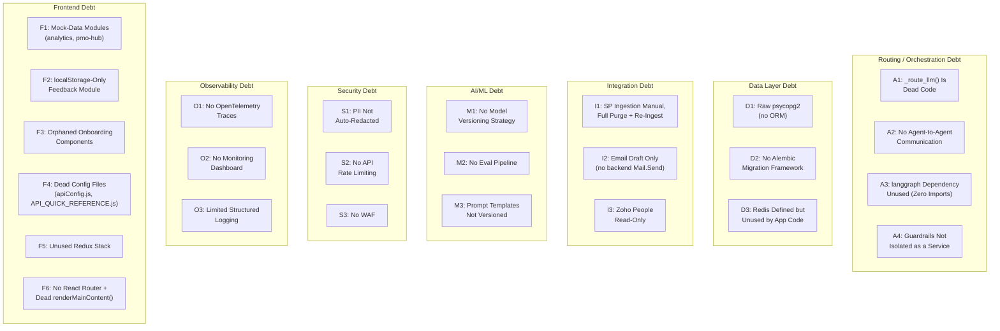

# Technical Debt Register — AURA (AA-Hackathon Enterprise Assistant)

**Organization:** Aligned Automation
**Platform:** AURA — AA-Hackathon Enterprise Assistant
**Document Date:** 2026-07-02 (revised — corrected against live codebase)
**Version:** 2.0

> **Accuracy note:** The 2026-06-07 version of this register described the architecture using a fixed
> "13 agents" / "3-tier routing" / Ollama-only baseline that does not match the code, and its debt
> items were written against that inaccurate baseline. This revision corrects the baseline facts
> throughout and adds real debt items surfaced by a source-code audit (see `README.md` for the
> corrected platform-wide facts). Genuinely still-valid debt items from the previous version are
> preserved; items that only existed because of a wrong architectural premise have been corrected or
> removed.

---

## Overview

This register catalogs known technical debt items in the AURA platform, categorizes them by domain,
and assesses impact, effort, and ownership. Debt is not a sign of poor engineering — it is a conscious
tradeoff made to deliver functionality rapidly. This document makes those tradeoffs explicit and
manageable.

---

## Debt Map

---

## Routing / Orchestration Debt

### A1: `_route_llm()` Is Dead Code

**File:** `apps/api-gateway/app/agents/supervisor_agent.py`
**Description:** A method for LLM-based intent classification, `_route_llm()`, exists in the source
file. Grep confirms it has **zero call sites** anywhere in the codebase. The real `_route()` method
never invokes it — routing today relies entirely on (1) an active-document-session check, (2) an
escalation keyword check, (3) a sequence of regex fast-paths (MS Forms, email-draft, attendance,
employee-directory, document-request, plus apply-leave and name-query regexes checked even earlier),
(4) a greeting/small-talk fast-path, and (5) `DOMAIN_KEYWORDS` keyword scoring, defaulting to
`QuickAgent` if every domain scores zero. There is no live LLM-classification routing tier.
**Impact:** Medium — the router cannot resolve ambiguous queries that don't match a regex or keyword,
falling through to `QuickAgent` more often than a working classification tier would. Also creates
confusion for engineers who read the method and assume it runs.
**Effort:** Medium — either wire `_route_llm()` into `_route()` with proper fallback handling and
latency budget, or remove it and document why classification-based routing was abandoned.
**Target Phase:** Phase 1
**Owner:** Backend Platform Team

---

### A2: No Agent-to-Agent Communication

**File:** `apps/api-gateway/app/agents/supervisor_agent.py`
**Description:** Handlers cannot invoke other handlers directly. If, for example, a finance-related
query needs attendance data, the MasterAgent must either dispatch twice across turns or the handler
must return a partial answer.
**Impact:** Medium — limits query richness, requires multiple conversation turns for cross-domain
questions.
**Effort:** Medium — would require either a graph-based orchestrator (see Target State) or an explicit
internal dispatch API.
**Target Phase:** Phase 2
**Owner:** Backend Platform Team

---

### A3: `langgraph` Dependency Installed, Zero Usage

**File:** `apps/api-gateway/requirements.txt`
**Description:** `langgraph` is listed as a dependency. There is **no import of it anywhere in
`apps/api-gateway`**. The planned migration to a graph-based orchestrator has not started in code —
there is no prototype, no parallel routing path, and no partial implementation to build on. Any
document that describes this as an in-progress migration is inaccurate; see `09-roadmap/target-state.md`
for how the aspirational item should be framed.
**Impact:** Low today (unused dependency adds install time and surface area, no functional impact) —
would become High-value if actually built, given the routing/orchestration limitations above.
**Effort:** N/A for cleanup (remove from `requirements.txt` if not planned soon) or High if pursuing the
full migration.
**Target Phase:** Decide in Phase 1 whether to remove the dependency or actually begin implementation.
**Owner:** Backend Platform Team

---

### A4: Guardrails Not Isolated as a Service

**File:** `apps/api-gateway/app/agents/guardrails.py`
**Description:** `check_input()` runs in-process within the API Gateway: a static regex tier
(jailbreak, harmful-content, security-threat patterns — immediate block, no LLM) followed by an
LLM-contextual tier used only for distress signals and org-scope violations (another employee's
salary/PII, legal advice, competitor intelligence, medical diagnosis). There is no isolated guardrail
microservice with independent scaling or update cadence; any rule change requires a full API Gateway
redeploy.
**Impact:** Medium — operational brittleness, cannot update safety rules without downtime.
**Effort:** Medium — extract to a separate service if warranted by scale.
**Target Phase:** Phase 2
**Owner:** Security + Platform Team

---

## Data Layer Debt

### D1: Raw psycopg2 SQL (No ORM)

**Files:** All `*_controller.py` and `*_service.py` files
**Description:** Database access uses raw `psycopg2` with parameterized SQL strings. There is no
SQLAlchemy ORM or query builder.
**Impact:** Medium — higher risk of hand-written SQL mistakes, no compile-time query validation.
**Effort:** High — touches every DB-accessing file.
**Workaround:** Parameterized statements only (no string concatenation), enforced in code review.
**Target Phase:** Phase 2 (if ORM adopted) or leave as-is with Alembic for migrations only.
**Owner:** Backend Data Team

---

### D2: No Migration Framework — Manual SQL Scripts

**Files:** `apps/jobs/sharepoint_ingestion/create_schema.py`, `create_communications_schema.py`, plus
two manual SQL files in `apps/api-gateway/migrations/`
**Description:** Schema is created and changed via standalone DDL scripts with no version tracking.
There is no Alembic, Flyway, or Liquibase.
**Impact:** High — deployment risk, onboarding friction, no rollback mechanism for schema changes.
**Effort:** Low — `alembic init` plus an auto-generated initial revision from the current schema.
**Target Phase:** Phase 1
**Owner:** Backend Data Team

---

### D3: Redis Defined in Docker Compose but Unused by Application Code

**File:** `deployments/docker/docker-compose.yml`
**Description:** A `redis` service is defined alongside `api` and `postgres`. No Redis client library
appears in `requirements.txt`, and no application code imports or connects to it. It is currently
vestigial infrastructure — running, but doing nothing for the application.
**Impact:** Low today (no functional impact), but any documentation describing Redis as an active
cache, rate-limit store, or session store is inaccurate until it is actually wired in.
**Effort:** Low to remove from Compose if not planned soon; Medium to actually adopt it for caching or
rate limiting (see Target State).
**Target Phase:** Phase 1 — decide whether to wire it in (e.g. for rate limiting, per Target State) or
remove it from the Compose file to avoid the false impression of an active cache layer.
**Owner:** Platform Reliability Team

---

## Integration Debt

### I1: SharePoint Ingestion Is Manual and Fully Re-Ingests Every Run

**File:** `apps/jobs/sharepoint_ingestion/`
**Description:** The ingestion job is run manually (no event-driven trigger). Each run purges and fully
re-ingests all documents into `document_chunks` rather than performing an incremental update at the
database level — even though the run does classify each file as NEW/CHANGED/UNCHANGED/DELETED
internally. When a SharePoint document is updated, the vector store contains stale embeddings until
the next manual run.
**Impact:** High — knowledge freshness SLA unmet; employees may receive outdated policy information.
**Effort:** Medium — Azure Function + SharePoint webhook registration, plus reworking the ingestion job
to support true incremental (not full-purge) updates.
**Target Phase:** Phase 1
**Owner:** Integration Team

---

### I2: Email Drafting Only — No Backend Sending

**File:** `apps/api-gateway/app/agents/email_agent.py`
**Description:** The email-draft function generates a draft (TO/SUBJECT/BODY) and returns it as a chat
message. It does not call Microsoft Graph `sendMail` from the backend. The frontend builds a `mailto:`
link, and a separate Graph `sendMail` code path exists in the frontend's `authService.js`, but there is
no backend-driven send today.
**Impact:** Medium — breaks the workflow-automation promise, adds user friction.
**Effort:** Low — add `Mail.Send` scope to the AAD app, call `POST /users/{id}/sendMail` from the
backend with user consent.
**Target Phase:** Phase 1
**Owner:** Integration Team

---

### I3: Zoho People Read-Only (No Write-Back)

**File:** `apps/api-gateway/app/agents/employee/*.py`
**Description:** Zoho People data (attendance, employee profile) is read via a read-only PostgreSQL
replica. There is no write-back to Zoho People APIs, so actions like leave application cannot be
completed from chat.
**Impact:** Medium — limits autonomous workflow capability.
**Effort:** High — Zoho People REST API integration for write operations, OAuth2 setup.
**Target Phase:** Phase 3
**Owner:** Integration Team

---

## AI/ML Debt

### M1: No Model Versioning Strategy

**Files:** `apps/api-gateway/app/agents/working/config.py` and ingestion embedding config
**Description:** There is no explicit tracking of which LLM model version (across Claude, Groq, or
Ollama, depending on active provider) or embedding model version (`nomic-embed-text-v1.5`) is in use at
a given time beyond the config defaults. A silent upstream model change could alter response quality
without alerting the team.
**Impact:** Medium — silent quality regressions, no easy rollback.
**Effort:** Low — pin model versions explicitly in config, surface active model/provider in a health
check response, log it in `audit_logs`.
**Target Phase:** Phase 1
**Owner:** ML Platform Team

---

### M2: No Automated Evaluation Pipeline

**Description:** There is no automated system for evaluating agent response quality across the
different LLM providers or across retrieval-vs-fallback paths. Quality assessment is manual.
**Impact:** High — cannot objectively measure the impact of changes like a routing rewrite or a new
retrieval strategy.
**Effort:** Medium — build an evaluation harness using a golden QA dataset and automated scoring.
**Target Phase:** Phase 2
**Owner:** ML Platform Team

---

### M3: Prompt Templates Not Formally Versioned

**Files:** Agent files under `agents/working/` and `agents/personalities.py`
**Description:** System prompts and personality text are embedded as Python string literals. There is
no template registry, no version history independent of the surrounding code diff, and no A/B testing
framework.
**Impact:** Medium — prompt changes have unknown quality impact, no targeted rollback.
**Effort:** Low — extract prompts to template files, load at startup, track version in git.
**Target Phase:** Phase 1
**Owner:** ML Platform Team

---

## Security Debt

### S1: PII Not Auto-Redacted in Responses

**File:** `apps/api-gateway/app/api/controllers/pii_controller.py`
**Description:** PII events are detected and logged, but PII is not automatically masked in the
response sent to the client. A query that inadvertently retrieves an employee's personal data can
surface that data verbatim in the chat response.
**Impact:** High — privacy/compliance risk.
**Effort:** Medium — intercept the LLM response stream, apply a regex/model-based PII masker before
forwarding to SSE.
**Target Phase:** Phase 1 (partial), Phase 2 (full solution)
**Owner:** Security Team

---

### S2: No API Rate Limiting

**Description:** The FastAPI application has no rate-limiting middleware. A single user can send
unlimited requests per minute, potentially overwhelming the active LLM provider or PostgreSQL. Note
that Redis — a natural building block for a token-bucket limiter — is present in `docker-compose.yml`
but not currently wired into any application code (see D3), so this cannot be a trivial "just use the
existing Redis" fix without also adding a Redis client and connection handling.
**Impact:** High — availability risk, cost risk for cloud LLM providers (Claude/Groq) if usage spikes.
**Effort:** Low-to-Medium — requires both middleware and, if Redis-backed, wiring in an actual Redis
client for the first time.
**Target Phase:** Phase 1
**Owner:** Platform Reliability Team

---

### S3: No WAF

**Description:** There is no Web Application Firewall in front of the API gateway. The platform is
currently behind internal Nginx; if exposed externally, there is no SQL injection, XSS, or OWASP Top 10
protection at the network layer.
**Impact:** Medium today (internal only), High if externally exposed.
**Effort:** Medium — Azure Front Door WAF or NGINX ModSecurity.
**Target Phase:** Phase 2
**Owner:** Security Team

---

## Observability Debt

### O1: No Distributed Tracing

**Description:** Requests cannot be traced across FastAPI → handler → LLM provider → PostgreSQL.
Debugging latency spikes requires manual log correlation.
**Impact:** Medium — high MTTR for latency incidents.
**Effort:** Medium — OpenTelemetry SDK, propagate trace context.
**Target Phase:** Phase 1
**Owner:** Platform Reliability Team

### O2: No Real-Time Monitoring Dashboard

**Description:** There is no Grafana or equivalent dashboard for operational visibility. Monitoring is
reactive.
**Impact:** High — no early warning of degradation.
**Effort:** Medium — Prometheus + Grafana setup, instrument FastAPI with metrics.
**Target Phase:** Phase 1
**Owner:** Platform Reliability Team

### O3: Limited Structured Logging

**File:** `apps/api-gateway/app/utils/`
**Description:** Logging uses Python's standard library logger with basic formatting, not structured
JSON — difficult to query in log aggregation systems.
**Impact:** Medium
**Effort:** Low — switch to `structlog` or `python-json-logger`.
**Target Phase:** Phase 1
**Owner:** Platform Reliability Team

---

## Frontend Debt

### F1: Two Modules Present Entirely Mock Data

**Files:** `apps/web-ui/src/modules/analytics/` (`analyticsApi.js`), `apps/web-ui/src/modules/pmo-hub/`
**Description:** The chatbot usage analytics dashboard (`modules/analytics/`) has `analyticsApi.js`
hardcoding constants and returning them as if they were live data — it is not wired to any backend
endpoint. The PMO project/risk dashboard (`modules/pmo-hub/`) is 100% hardcoded mock data with
fictional example projects and makes zero API calls. Both present a UI that looks live but isn't.
**Impact:** High if used to plan a demo or stakeholder review without this caveat — numbers shown are
not real.
**Effort:** Medium-High — requires new backend endpoints (for analytics) or wiring to existing
`allocation`/`pmo` data (for pmo-hub), plus frontend rework to consume real data.
**Target Phase:** Phase 1 (disclose clearly in any demo), Phase 2 (build real backend wiring)
**Owner:** Frontend Team + Backend Platform Team

---

### F2: In-App Feedback Form Is localStorage-Only

**File:** `apps/web-ui/src/modules/feedback/`
**Description:** The in-app suggestion/survey form saves submissions to `localStorage` only — it never
reaches the backend. This is distinct from the real, backend-persisted per-message thumbs-up/down
feedback (`/api/messages/{id}/feedback`), which does work correctly.
**Impact:** Medium — employee feedback submitted through this form is silently lost from the
organization's perspective (it only persists on the submitting employee's own browser).
**Effort:** Low-Medium — add a backend endpoint and wire the existing form to it.
**Target Phase:** Phase 1
**Owner:** Frontend Team + Backend Platform Team

---

### F3: Orphaned Onboarding Component Files

**Files:** `apps/web-ui/src/modules/onboarding-guidance/` — `ChecklistPanel.jsx`, `DocumentPanel.jsx`,
`HRNotes.jsx`, `TimelinePanel.jsx`, `TrainingGrid.jsx`, `WelcomeHeader.jsx`, `useOnboardingState.js`
**Description:** These files are not imported anywhere in the codebase and reference constants that no
longer exist in `constants/onboardingData.js`. They would throw immediately if anything ever imported
them. The live 8-step onboarding flow (welcome → profile → it-access → policy → induction → team →
documents → all-set) does not use these files.
**Impact:** Low functional impact (dead code doesn't run), but a real maintenance/confusion hazard —
an engineer could reasonably try to reuse or "fix" one of these files without realizing it's already
broken and unreferenced.
**Effort:** Low — delete the files, or fix and re-integrate them if the intended UI is still wanted.
**Target Phase:** Phase 1 (cleanup)
**Owner:** Frontend Team

---

### F4: Dead/Stale Frontend Config Files

**Files:** `apps/web-ui/src/config/apiConfig.js`, `apps/web-ui/src/config/API_QUICK_REFERENCE.js`
**Description:** `apiConfig.js` defines an endpoints map that nothing in the codebase imports — the
real API layer (`services/api.js`) hardcodes its own paths independently, so the two can silently
drift out of sync. `API_QUICK_REFERENCE.js` documents functions (`getLeaves`, `requestLeave`,
`getPayroll`, `getITTickets`, `createITTicket`, `getDirectory`, `apiGet`, `apiPost`) that **do not
exist anywhere in the codebase** — a stale, misleading example file.
**Impact:** Medium — new engineers following `API_QUICK_REFERENCE.js` will write code against
functions that don't exist; `apiConfig.js` gives a false sense that endpoint changes are centralized
when they aren't.
**Effort:** Low — delete or rewrite both files to reflect `services/api.js` as the actual source of
truth.
**Target Phase:** Phase 1
**Owner:** Frontend Team

---

### F5: Unused Redux Stack

**Files:** `apps/web-ui/package.json` (redux, react-redux, redux, redux-thunk — Redux Toolkit and
related packages)
**Description:** Redux Toolkit, react-redux, redux, and redux-thunk are installed dependencies with
**zero usage** anywhere in the codebase — no `<Provider>`, no `useSelector`/`useDispatch`, no slices.
All frontend state is local `useState`/`useEffect` plus `localStorage`.
**Impact:** Low — inflates bundle size and dependency surface for no functional benefit; misleads
engineers into thinking Redux is the state-management pattern to follow.
**Effort:** Low — remove the packages, or actually adopt Redux if state complexity grows enough to
justify it.
**Target Phase:** Phase 1 (cleanup) or defer to when state complexity genuinely warrants it
**Owner:** Frontend Team

---

### F6: No React Router; Dead Duplicate Navigation Logic

**File:** `apps/web-ui/src/App.jsx`
**Description:** There is no React Router despite meaningful navigation complexity — all navigation is
a manual `activeNav` string switch with a large if/else-if chain in `App.jsx`. Additionally, `App.jsx`
contains a duplicate, unused `renderMainContent()` helper that partially re-implements the same
switch logic and is never called — dead code sitting alongside the live navigation path.
**Impact:** Medium — harder to deep-link, harder to reason about navigation state, and the dead
duplicate function is a maintenance trap (an engineer could edit the wrong one and see no effect).
**Effort:** Medium — introduce React Router and migrate the `activeNav` switch incrementally; delete
`renderMainContent()` immediately regardless (zero risk, it's unreferenced).
**Target Phase:** Phase 2 (Router migration), Phase 1 (delete dead helper)
**Owner:** Frontend Team

---

## Debt Prioritization Matrix

| ID | Debt Item | Impact | Effort | Priority | Phase |
|---|---|---|---|---|---|
| S2 | No API Rate Limiting | High | Low-Medium | P0 | 1 |
| D2 | No Alembic Migrations | High | Low | P0 | 1 |
| I1 | Manual, Full-Reingest SP Ingestion | High | Medium | P1 | 1 |
| O2 | No Monitoring Dashboard | High | Medium | P1 | 1 |
| S1 | PII Not Auto-Redacted | High | Medium | P1 | 1 |
| F1 | Mock-Data Frontend Modules (analytics, pmo-hub) | High (if undisclosed) | Medium-High | P1 | 1 (disclose) / 2 (build) |
| A1 | `_route_llm()` Dead Code | Medium | Medium | P2 | 1 |
| A3 | `langgraph` Unused Dependency | Low (Medium if pursued) | N/A / High | P2 | 1 (decide) |
| D3 | Redis Defined but Unused | Low | Low / Medium | P2 | 1 (decide) |
| I2 | Email Draft Only | Medium | Low | P2 | 1 |
| M3 | Prompts Not Versioned | Medium | Low | P2 | 1 |
| O1 | No Distributed Tracing | Medium | Medium | P2 | 1 |
| M1 | No Model Versioning | Medium | Low | P2 | 1 |
| F2 | Feedback Module localStorage-Only | Medium | Low-Medium | P2 | 1 |
| F3 | Orphaned Onboarding Components | Low | Low | P2 | 1 |
| F4 | Dead Config Files (apiConfig.js, API_QUICK_REFERENCE.js) | Medium | Low | P2 | 1 |
| F5 | Unused Redux Stack | Low | Low | P3 | 1 |
| F6 | No React Router + Dead `renderMainContent()` | Medium | Medium | P3 | 2 |
| A2 | No Agent-to-Agent Comm | Medium | Medium | P3 | 2 |
| S3 | No WAF | Medium | Medium | P3 | 2 |
| A4 | Guardrails Not Isolated | Medium | Medium | P3 | 2 |
| M2 | No Eval Pipeline | High | Medium | P3 | 2 |
| D1 | Raw psycopg2 | Medium | High | P4 | 2 |
| I3 | Zoho Read-Only | Medium | High | P4 | 3 |

---

## Debt Prevention Policies

1. **No raw SQL string concatenation.** All database queries must use parameterized statements.
2. **All schema changes require an Alembic revision** once Alembic is adopted (D2).
3. **New handlers should state their type explicitly in documentation** (`BaseDeepAgent` subclass,
   lightweight direct-LLM, plain class, or plain function) — the mixed roster is a real design choice,
   not a bug, but it must stay documented accurately (see `04-agents/agent-framework.md`).
4. **Prompts should move to template files, not stay embedded as Python string literals**, once M3 is
   addressed.
5. **New endpoints should not silently duplicate `apiConfig.js`/`API_QUICK_REFERENCE.js`-style parallel
   documentation** — `services/api.js` is the single source of truth for frontend API paths.
6. **Do not add new frontend state to Redux** unless the unused-dependency question (F5) has been
   explicitly revisited and Redux adoption decided on.
7. **Any new "dashboard" or "analytics" frontend module must be wired to a real backend endpoint before
   merging**, or explicitly labeled as a mock/preview in its own UI — to avoid repeating F1.
