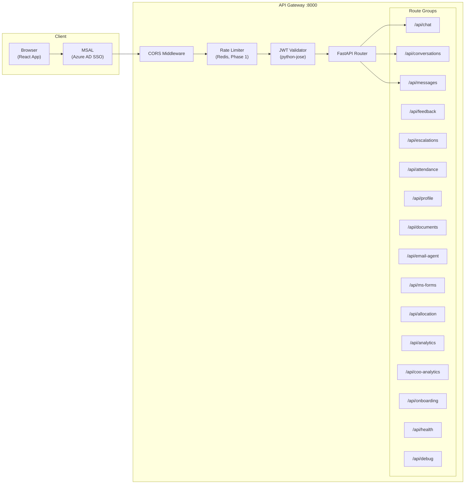

# API Catalog — AA-Hackathon Enterprise AI Platform

**Organization:** Aligned Automation  
**Platform:** AA-Hackathon Enterprise Assistant  
**Base URL:** `https://hackathon.alignedautomation.com/api`  
**Document Date:** 2026-06-07  
**Version:** 1.0  
**API Version:** v1 (no versioning prefix currently)  

---

## API Architecture



---

## Authentication

All endpoints except `GET /api/health` require a valid Azure AD Bearer token:

```
Authorization: Bearer <access_token>
```

Tokens are acquired via MSAL Browser PKCE flow. Token lifetime: 1 hour (with silent refresh).

**Error responses when auth fails:**
- `401 Unauthorized` — missing, expired, or invalid token
- `403 Forbidden` — valid token but insufficient role

---

## Error Response Format

All error responses follow this schema:

```json
{
  "detail": "Human-readable error message",
  "code": "ERROR_CODE",
  "request_id": "uuid"
}
```

### Error Code Reference

| HTTP Status | Code | Meaning |
|---|---|---|
| 400 | VALIDATION_ERROR | Request body fails Pydantic validation |
| 401 | TOKEN_EXPIRED | JWT token has expired |
| 401 | TOKEN_INVALID | JWT signature or claims invalid |
| 403 | INSUFFICIENT_ROLE | User role does not have required permission |
| 404 | NOT_FOUND | Resource does not exist |
| 409 | CONFLICT | Resource already exists (e.g., duplicate conversation title) |
| 422 | UNPROCESSABLE | Request structure valid but semantically invalid |
| 429 | RATE_LIMITED | Too many requests — see Retry-After header |
| 500 | INTERNAL_ERROR | Unhandled server error |
| 503 | LLM_UNAVAILABLE | Ollama endpoint unreachable |

---

## Chat Endpoints

### POST /api/chat

Synchronous chat — sends a message and receives the full response in one request. Use for non-streaming clients.

**Auth:** Required  
**Roles:** All authenticated users

**Request Body:**
```json
{
  "message": "What is the maternity leave policy?",
  "conversation_id": "uuid-or-null",
  "agent_override": null
}
```

| Field | Type | Required | Description |
|---|---|---|---|
| message | string | Yes | User's natural language query (max 2000 chars) |
| conversation_id | UUID | No | Existing conversation ID. If null, creates new conversation. |
| agent_override | string | No | Force routing to specific agent (admin use only) |

**Response 200:**
```json
{
  "response": "Maternity leave at Aligned Automation provides 26 weeks of paid leave...",
  "agent_used": "hr_agent",
  "conversation_id": "550e8400-e29b-41d4-a716-446655440000",
  "message_id": "660f8400-e29b-41d4-a716-446655440001",
  "sources": [
    {
      "title": "HR Policy — Maternity Leave.pdf",
      "excerpt": "...26 weeks of paid maternity leave effective from...",
      "url": "https://alignedautomation.sharepoint.com/..."
    }
  ],
  "processing_time_ms": 2340
}
```

**Status Codes:** 200 OK, 400 Validation Error, 401 Unauthorized, 503 LLM Unavailable

---

### POST /api/chat/stream

Streaming chat via Server-Sent Events (SSE). Returns tokens as they are generated. Preferred for the web UI.

**Auth:** Required  
**Roles:** All authenticated users

**Request Body:** Same as POST /api/chat

**Response:** `Content-Type: text/event-stream`

**SSE Event Types:**

| Event Type | Payload | Description |
|---|---|---|
| `token` | `{"type":"token","content":"Based "}` | Incremental token from Ollama |
| `progress` | `{"type":"progress","stage":"searching","message":"Searching documents..."}` | Retrieval progress indicator |
| `sources` | `{"type":"sources","sources":[...]}` | Source citations after generation |
| `done` | `{"type":"done","message_id":"uuid","agent_used":"hr_agent"}` | Stream complete |
| `error` | `{"type":"error","code":"LLM_UNAVAILABLE","message":"..."}` | Error occurred |

**Example stream:**
```
data: {"type":"progress","stage":"searching","message":"Searching HR policy documents..."}

data: {"type":"token","content":"Maternity "}

data: {"type":"token","content":"leave "}

data: {"type":"sources","sources":[{"title":"HR Policy.pdf","excerpt":"..."}]}

data: {"type":"done","message_id":"uuid","agent_used":"hr_agent"}
```

**Status Codes:** 200 SSE stream, 401 Unauthorized, 503 LLM Unavailable

---

## Conversation Endpoints

### GET /api/conversations

List conversations for the authenticated user. Paginated.

**Auth:** Required | **Roles:** All

**Query Parameters:**
| Param | Type | Default | Description |
|---|---|---|---|
| page | int | 1 | Page number |
| page_size | int | 20 | Items per page (max 100) |

**Response 200:**
```json
{
  "conversations": [
    {
      "id": "uuid",
      "title": "Maternity leave query",
      "created_at": "2026-06-07T10:00:00Z",
      "updated_at": "2026-06-07T10:05:00Z",
      "message_count": 4
    }
  ],
  "total": 42,
  "page": 1,
  "page_size": 20
}
```

---

### POST /api/conversations

Create a new conversation.

**Request Body:**
```json
{ "title": "My new conversation" }
```

**Response 201:** Conversation object with generated UUID.

---

### PUT /api/conversations/{id}

Rename a conversation.

**Request Body:** `{ "title": "Updated title" }`  
**Response 200:** Updated conversation object.  
**Status Codes:** 200, 404 (conversation not found or not owned by user)

---

### DELETE /api/conversations/{id}

Delete a conversation and all its messages. Irreversible.

**Response 204:** No content.  
**Status Codes:** 204, 404

---

### GET /api/conversations/{id}/messages

Get all messages in a conversation. Ordered chronologically.

**Response 200:**
```json
{
  "messages": [
    {
      "id": "uuid",
      "role": "user",
      "content": "What is the leave policy?",
      "created_at": "2026-06-07T10:00:00Z",
      "citations": []
    },
    {
      "id": "uuid",
      "role": "assistant",
      "content": "The leave policy provides...",
      "created_at": "2026-06-07T10:00:03Z",
      "agent_used": "hr_agent",
      "citations": [{"title": "Leave Policy.pdf", "excerpt": "..."}]
    }
  ]
}
```

---

## Message Endpoints

### POST /api/messages/{id}/regenerate

Regenerate the assistant's response for a given message. Deletes the existing assistant message and re-invokes the agent.

**Auth:** Required | **Roles:** All  
**Response 200:** New message object with regenerated content.

---

### POST /api/messages/{id}/stop

Stop an in-progress streaming generation. Marks the message as stopped.

**Response 200:** `{ "status": "stopped" }`

---

### POST /api/messages/{id}/cite

Get full citation list for a message (source documents used in RAG retrieval).

**Response 200:**
```json
{
  "citations": [
    {
      "title": "HR Policy — Leave.pdf",
      "sharepoint_url": "https://alignedautomation.sharepoint.com/...",
      "section": "Section 4.2 — Casual Leave",
      "page": 12,
      "excerpt": "Employees are entitled to 12 days of casual leave per year...",
      "last_modified": "2026-03-15T00:00:00Z"
    }
  ]
}
```

---

## Feedback Endpoints

### POST /api/feedback

Submit feedback for an assistant message.

**Request Body:**
```json
{
  "message_id": "uuid",
  "rating": 4,
  "comment": "Accurate answer but could be more concise"
}
```

| Field | Type | Validation |
|---|---|---|
| message_id | UUID | Must be own message |
| rating | int | 1–5 |
| comment | string | Optional, max 500 chars |

**Response 201:** Feedback object.

---

### GET /api/feedback

List own submitted feedback.

**Response 200:** Array of feedback objects with message context.

---

### PUT /api/feedback/{id}

Update own feedback (change rating or comment).

**Response 200:** Updated feedback object.

---

### GET /api/feedback/admin

Admin view of all feedback. Includes aggregate statistics.

**Auth:** Roles: hr_admin, admin, super_admin

**Response 200:**
```json
{
  "feedback": [...],
  "aggregates": {
    "avg_rating": 4.2,
    "total_feedback": 142,
    "by_agent": {
      "hr_agent": {"avg_rating": 4.5, "count": 67},
      "it_agent": {"avg_rating": 3.9, "count": 43}
    }
  }
}
```

---

## Escalation Endpoints

### POST /api/escalations

Create a new escalation.

**Request Body:**
```json
{
  "title": "Cannot access VPN",
  "description": "VPN client fails to connect after Windows update",
  "priority": "high",
  "category": "IT"
}
```

**Response 201:**
```json
{
  "id": "uuid",
  "ticket_number": "ESC-2026-0042",
  "status": "open",
  "priority": "high",
  "created_at": "2026-06-07T10:00:00Z",
  "sla_deadline": "2026-06-08T10:00:00Z"
}
```

---

### GET /api/escalations

List own escalations.

**Query Params:** `status` (open/in_progress/resolved/closed), `priority` (low/medium/high/critical)

**Response 200:** Paginated list of escalation objects.

---

### GET /api/escalations/{id}

Get a specific escalation by ID.

**Response 200:** Full escalation object including timeline of status changes.

---

### GET /api/escalations/admin

Admin view of all escalations. Roles: hr_admin, it_admin, admin, super_admin.

**Query Params:** `status`, `priority`, `category`, `assigned_to`, `date_from`, `date_to`

**Response 200:** Paginated list with assignee and SLA compliance data.

---

## Attendance Endpoints

### GET /api/attendance

Get own attendance records.

**Query Params:** `month` (YYYY-MM, default current month)

**Response 200:**
```json
{
  "records": [
    {
      "date": "2026-06-01",
      "status": "present",
      "check_in": "09:02",
      "check_out": "18:15",
      "hours_worked": 9.2,
      "late_arrival": false
    }
  ],
  "summary": {
    "present_days": 5,
    "absent_days": 1,
    "late_arrivals": 0,
    "total_hours": 46.0
  }
}
```

---

### GET /api/attendance/reportee

Get attendance for direct reports. Roles: manager, hr_admin, admin.

**Query Params:** `month`, `employee_id` (optional — specific reportee)

**Response 200:** Same structure as /api/attendance, with `employee_name` added per record.

---

## Profile Endpoint

### GET /api/profile

Fetch the authenticated user's profile from Microsoft Graph API.

**Response 200:**
```json
{
  "display_name": "Prashant Dikonda",
  "email": "Prashant.Dikonda@alignedautomation.com",
  "job_title": "Senior Engineer",
  "department": "Engineering",
  "manager": {
    "display_name": "Siddharth Mandre",
    "email": "Sidhharth.Mandre@alignedautomation.com"
  },
  "photo_url": "/api/profile/photo",
  "roles": ["employee", "manager"]
}
```

---

## Document Endpoints

### GET /api/documents

List previously generated documents for the authenticated user.

**Response 200:** Array of `{ id, type, generated_at, download_url }`.

---

### POST /api/documents/generate

Generate a document from a template.

**Request Body:**
```json
{
  "document_type": "noc_certificate",
  "context": {
    "purpose": "Bank loan application",
    "destination_country": null
  }
}
```

**Supported document_type values:**
- `noc_certificate` — No Objection Certificate
- `experience_letter` — Employment experience letter
- `bonafide_certificate` — Bonafide employment certificate
- `wfh_policy_acknowledgement` — WFH policy acknowledgement letter

**Response 200:**
```json
{
  "document_id": "uuid",
  "filename": "NOC_Prashant_Dikonda_2026-06-07.pdf",
  "content_base64": "JVBERi0xLjUK...",
  "download_url": "/api/documents/uuid/download"
}
```

---

## Email Endpoints

### POST /api/email-agent/from-chat

Compose an email draft from the current conversation context.

**Request Body:**
```json
{
  "conversation_id": "uuid",
  "instructions": "Draft an email to my manager requesting approval for 3 days leave next week"
}
```

**Response 200:**
```json
{
  "draft": {
    "to": ["manager@alignedautomation.com"],
    "subject": "Leave Request — June 15–17, 2026",
    "body": "Dear Siddharth,\n\nI would like to request..."
  }
}
```

---

## Forms Endpoint

### POST /api/ms-forms/create

Create a Microsoft Form via Graph API.

**Auth:** Required | **Roles:** hr_admin, admin, super_admin

**Request Body:**
```json
{
  "title": "Employee Satisfaction Survey Q2 2026",
  "description": "Anonymous quarterly survey",
  "questions": [
    {
      "type": "rating",
      "text": "How satisfied are you with onboarding support?",
      "scale": 5
    },
    {
      "type": "text",
      "text": "What one thing would most improve your experience?"
    }
  ]
}
```

**Response 201:**
```json
{
  "form_id": "graph-form-id",
  "form_url": "https://forms.office.com/r/xxxxxxxx",
  "title": "Employee Satisfaction Survey Q2 2026"
}
```

---

## Analytics Endpoints

### GET /api/analytics/overview

Get analytics overview for the authenticated user's accessible scope.

**Auth:** Required | **Roles:** hr_admin, admin, coo, super_admin

**Query Params:** `date_from` (ISO date), `date_to` (ISO date), `department` (optional filter)

**Response 200:**
```json
{
  "query_volume": [{"date": "2026-06-01", "count": 142}, ...],
  "agent_distribution": [{"agent": "hr_agent", "count": 89, "pct": 32.5}, ...],
  "feedback_by_agent": [{"agent": "hr_agent", "avg_rating": 4.5, "count": 67}, ...],
  "top_queries": [{"topic": "maternity leave", "count": 23}, ...],
  "active_users": [{"date": "2026-06-01", "count": 34}, ...],
  "rag_hit_rate": [{"date": "2026-06-01", "rate": 0.87}, ...]
}
```

---

### GET /api/coo-analytics/metrics

Executive metrics dashboard data.

**Auth:** Required | **Roles:** coo, super_admin

**Response 200:**
```json
{
  "summary": {
    "total_queries_mtd": 3420,
    "active_users_mtd": 89,
    "open_escalations": 7,
    "avg_response_time_ms": 2800
  },
  "department_heatmap": [
    {"department": "Engineering", "day": "2026-06-01", "count": 42}
  ],
  "escalation_by_priority": [
    {"priority": "high", "count": 3},
    {"priority": "medium", "count": 4}
  ]
}
```

---

## Onboarding Endpoints

### GET /api/onboarding/steps

Get onboarding steps and completion status for the authenticated user.

**Response 200:**
```json
{
  "steps": [
    {
      "id": "step-001",
      "title": "Complete IT Setup",
      "description": "Set up your laptop, VPN, and email",
      "completed": true,
      "completed_at": "2026-06-02T09:00:00Z",
      "resources": [{"title": "IT Setup Guide", "url": "..."}]
    }
  ],
  "progress": {"completed": 4, "total": 10, "pct": 40}
}
```

---

### PUT /api/onboarding/steps/{step_id}

Mark an onboarding step as complete or incomplete.

**Request Body:** `{ "completed": true }`  
**Response 200:** Updated step object.

---

## System Endpoints

### GET /api/health

Health check. No authentication required.

**Response 200:**
```json
{
  "status": "healthy",
  "components": {
    "api": "healthy",
    "database": "healthy",
    "ollama": "healthy",
    "faiss_index": "healthy",
    "redis": "healthy"
  },
  "version": "1.0.0",
  "timestamp": "2026-06-07T10:00:00Z"
}
```

**Response 503:** If any critical component is unhealthy. Same schema, status = "degraded" or "unhealthy".

---

### GET /api/debug/config

Debug configuration endpoint. Returns sanitized (no secrets) config. For troubleshooting only.

**Auth:** Required | **Roles:** super_admin only

**Response 200:**
```json
{
  "ollama_model": "gpt-oss",
  "ollama_base_url": "http://ml01.alignedautomation.com:11434",
  "embedding_model": "all-MiniLM-L6-v2",
  "embedding_dim": 384,
  "db_pool_min": 1,
  "db_pool_max": 8,
  "faiss_index_size": 14823,
  "rag_top_k": 5,
  "rag_similarity_threshold": 0.5,
  "azure_tenant_id": "****-****-****-****",
  "features": {
    "pii_tracking": true,
    "tavily_enabled": false
  }
}
```

---

## Rate Limiting Policy (Phase 1 Target)

| Role | Limit | Window |
|---|---|---|
| employee | 30 requests | 1 minute |
| manager | 50 requests | 1 minute |
| hr_admin | 80 requests | 1 minute |
| admin | 100 requests | 1 minute |
| coo | 100 requests | 1 minute |
| super_admin | Unlimited | — |

**Rate limit response headers:**
```
X-RateLimit-Limit: 30
X-RateLimit-Remaining: 12
X-RateLimit-Reset: 1749286860
```

**429 Response body:**
```json
{
  "detail": "Rate limit exceeded",
  "code": "RATE_LIMITED",
  "retry_after_seconds": 23
}
```

---

## API Endpoint Summary Table

| Method | Path | Auth | Min Role | Description |
|---|---|---|---|---|
| POST | /api/chat | Yes | employee | Sync chat |
| POST | /api/chat/stream | Yes | employee | SSE streaming chat |
| GET | /api/conversations | Yes | employee | List conversations |
| POST | /api/conversations | Yes | employee | Create conversation |
| PUT | /api/conversations/{id} | Yes | employee | Rename conversation |
| DELETE | /api/conversations/{id} | Yes | employee | Delete conversation |
| GET | /api/conversations/{id}/messages | Yes | employee | Get messages |
| POST | /api/messages/{id}/regenerate | Yes | employee | Regenerate response |
| POST | /api/messages/{id}/stop | Yes | employee | Stop generation |
| POST | /api/messages/{id}/cite | Yes | employee | Get citations |
| POST | /api/feedback | Yes | employee | Submit feedback |
| GET | /api/feedback | Yes | employee | List own feedback |
| PUT | /api/feedback/{id} | Yes | employee | Update feedback |
| GET | /api/feedback/admin | Yes | hr_admin | All feedback + aggregates |
| POST | /api/escalations | Yes | employee | Create escalation |
| GET | /api/escalations | Yes | employee | List own escalations |
| GET | /api/escalations/{id} | Yes | employee | Get escalation |
| GET | /api/escalations/admin | Yes | hr_admin | All escalations |
| GET | /api/profile | Yes | employee | User profile |
| GET | /api/attendance | Yes | employee | Own attendance |
| GET | /api/attendance/reportee | Yes | manager | Reportee attendance |
| GET | /api/documents | Yes | employee | List documents |
| POST | /api/documents/generate | Yes | employee | Generate document |
| POST | /api/email-agent/from-chat | Yes | employee | Draft email |
| POST | /api/ms-forms/create | Yes | hr_admin | Create MS Form |
| GET | /api/analytics/overview | Yes | hr_admin | Analytics overview |
| GET | /api/coo-analytics/metrics | Yes | coo | COO dashboard metrics |
| GET | /api/onboarding/steps | Yes | employee | Onboarding steps |
| PUT | /api/onboarding/steps/{id} | Yes | employee | Complete onboarding step |
| GET | /api/health | No | — | Health check |
| GET | /api/debug/config | Yes | super_admin | Debug config |
