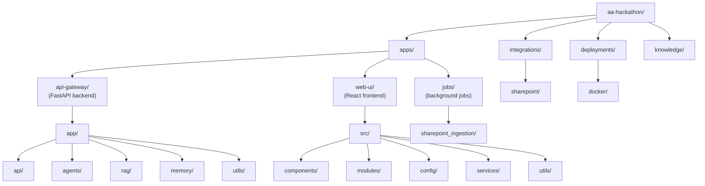

# Application Map — AA-Hackathon Enterprise AI Platform

**Organization:** Aligned Automation  
**Platform:** AA-Hackathon Enterprise Assistant  
**Document Date:** 2026-06-07  
**Version:** 1.0  

---

## Repository Structure Overview

---

## Backend Map — `apps/api-gateway/`

### Entry Point

| File | Purpose |
|---|---|
| `app/main.py` | FastAPI application factory. CORS middleware configuration (allowed origins from env). Router inclusion for all 15 controllers. Startup event: FAISS index initialization, embedding model load, database pool open. Uvicorn server entrypoint. |

### Authentication — `app/api/auth/`

| File | Purpose |
|---|---|
| `auth_handler.py` | FastAPI dependency that validates Authorization header. Calls jwt_validator, builds UserContext, injects into route handlers. Raises HTTP 401 on failure. |
| `jwt_validator.py` | Validates Azure AD JWT tokens. Fetches JWKS from Azure AD endpoint (cached with TTL). Verifies signature, expiry, audience, and issuer claims. Returns decoded payload. |
| `user_context.py` | Pydantic model for authenticated user: employee_id, email, display_name, roles, department. Populated from JWT claims and optionally enriched from Zoho People. |
| `auth_config.py` | Azure AD tenant ID, client ID, authority URL, JWKS endpoint URL. Loaded from environment variables. |

### Configuration — `app/api/config/`

| File | Purpose |
|---|---|
| `db_config.py` | Synchronous PostgreSQL connection pool using psycopg2. ThreadedConnectionPool(minconn=1, maxconn=8). Connection string from env. Context manager for connection borrow/return. |
| `async_db_config.py` | Async variant of DB config using asyncpg. Used by SSE streaming endpoints that must not block the event loop. |

### Models — `app/api/models/`

Pydantic v2 models for all request/response schemas. Key models:
- `ChatRequest`: message, conversation_id, stream flag
- `ChatResponse`: response text, agent_used, sources, citations
- `ConversationModel`: id, title, created_at, message_count
- `MessageModel`: id, conversation_id, role, content, created_at, citations
- `EscalationModel`: id, title, description, priority, status, assignee
- `FeedbackModel`: message_id, rating (1-5), comment
- `DocumentGenerationRequest`: document_type, employee_context
- `AttendanceRecord`: date, status, check_in, check_out, hours

### Controllers — `app/api/controllers/`

| File | Prefix | Purpose |
|---|---|---|
| `chat_controller.py` | `/api/chat` | Core chat endpoint (POST sync) and SSE streaming endpoint (POST /stream). Invokes MasterAgent. Persists conversation and messages. |
| `conversations_controller.py` | `/api/conversations` | CRUD for conversations. Paginated list (GET), create (POST), rename (PUT), delete (DELETE). |
| `messages_controller.py` | `/api/messages` | Get messages for a conversation. Regenerate (POST /{id}/regenerate). Stop (POST /{id}/stop). Cite (POST /{id}/cite). |
| `feedback_controller.py` | `/api/feedback` | Submit feedback (POST), list own feedback (GET), admin view all feedback (GET /admin), update feedback (PUT /{id}). |
| `escalations_controller.py` | `/api/escalations` | Create escalation (POST), list own (GET), get one (GET /{id}), admin view all (GET /admin). |
| `attendance_controller.py` | `/api/attendance` | Own attendance records (GET), reportee attendance for managers (GET /reportee). Reads from Zoho People DB. |
| `profile_controller.py` | `/api/profile` | Fetch user profile from Microsoft Graph API (display_name, photo, job_title, department, manager). |
| `documents_controller.py` | `/api/documents` | List generated documents (GET). Generate document (POST /generate). Returns PDF as base64 or download URL. |
| `email_controller.py` | `/api/email-agent` | Create email draft from chat context (POST /from-chat). Future: send email (POST /send). |
| `forms_controller.py` | `/api/ms-forms` | Create Microsoft Form via Graph API (POST /create). Returns form URL. |
| `allocation_controller.py` | `/api/allocation` | Get allocation board data (GET). Update allocation entry (PUT /{id}). Admin-only write. |
| `pii_controller.py` | `/api/pii` | Get PII events log (GET). Admin only. PII redaction rules management. |
| `coo_analytics_controller.py` | `/api/coo-analytics` | COO-level metrics: department query distribution, agent usage, escalation trends, active users. COO role required. |
| `health_controller.py` | `/api/health` | Health check. Returns: API status, DB connectivity, Ollama reachability, FAISS index status. No auth required. |
| `debug_controller.py` | `/api/debug` | Debug config endpoint (super_admin only). Returns sanitized config (no secrets). |
| `onboarding.py` | `/api/onboarding` | Onboarding steps and progress (GET /steps). Mark step complete (PUT /steps/{id}). |

### Services — `app/api/services/`

| File | Purpose |
|---|---|
| `conversation_service.py` | Business logic for conversation CRUD. Generates conversation title from first message. Enforces conversation ownership. |
| `message_service.py` | Persist assistant and user messages. Enforce maximum message length. Handle regeneration (delete last assistant message, re-invoke agent). |
| `escalation_service.py` | Escalation lifecycle: create, update status, SLA deadline calculation, assignee resolution. |
| `feedback_service.py` | Store and aggregate feedback. Compute average rating per agent. |
| `document_service.py` | Document generation orchestration. Calls agent for content, formats as PDF metadata. |
| `analytics_service.py` | Compute analytics aggregates: query volume by day, agent routing distribution, top queries, feedback score trends. |
| `pii_service.py` | PII detection using regex patterns and NER. Log pii_events. Partial redaction in audit_logs. |
| `sharepoint_service.py` | SharePoint API calls via Azure AD app credentials. List documents, download file content. |
| `zoho_service.py` | Zoho People data access via read-only PostgreSQL connection. Employee records, attendance, leave balances. |
| `memory_service.py` | Conversation memory management. Store/retrieve session context. Interface to memory/ module. |

### Agents — `app/agents/`

| File | Purpose |
|---|---|
| `supervisor_agent.py` | MasterAgent. Keyword fast-path routing. LLM-based routing for ambiguous queries. Dispatch to domain agents. Combine results if multi-domain. |
| `org_agent.py` | Org chart and directory queries. Reads Zoho People org structure. |
| `escalation_agent.py` | Escalation creation and management from conversation context. |
| `document_agent.py` | Generate document content (NOC, Experience Letter, etc.) using Ollama + employee context. |
| `email_agent.py` | Compose email drafts from conversation context. |
| `ms_forms_agent.py` | Create Microsoft Forms via Graph API. |
| `allocation_agent.py` | Resource allocation queries and updates. |
| `employee/` | Employee self-service agent subdirectory. |
| `working/` | Working agents in development / experimental agents. |

### RAG — `app/rag/`

| File | Purpose |
|---|---|
| `retriever.py` | Core RAG retriever. pgvector cosine similarity query. FAISS fallback. Chunk assembly into context string. Source citation extraction. Similarity threshold enforcement. |

### Memory — `app/memory/`

| File | Purpose |
|---|---|
| `client.py` | Memory system public interface. Get/set session memory, retrieve relevant past context. |
| `complexity.py` | Query complexity scorer. Determines if a query warrants long-context retrieval. |
| `md_store.py` | Markdown-based in-session memory store. Structured notes from conversation. |
| `db_tool.py` | Database-backed memory: persist memory fragments to PostgreSQL between sessions. |
| `enrichment.py` | Enrich memory with user context (role, department) for personalized responses. |

### Utils — `app/utils/`

| File | Purpose |
|---|---|
| `logging_config.py` | Python logging configuration. Log level from env. Format: timestamp, level, module, message. |

---

## Frontend Map — `apps/web-ui/src/`

### Entry Points

| File | Purpose |
|---|---|
| `main.jsx` | React 18 app entry. Renders `<App />` into `#root`. Wraps with MSAL `PublicClientApplication` provider. Redux `<Provider store={store}>`. |
| `App.jsx` | Root component. MSAL authentication state check. Route definitions (React Router). Layout wrapper (sidebar + main content). |

### Components — `src/components/`

| Component | Purpose |
|---|---|
| `ChatWindow.jsx` | Main chat UI container. Manages message send, SSE stream reading, stop button, loading state. |
| `MessageList.jsx` | Renders conversation messages. Handles user/assistant message distinction. Markdown rendering for assistant messages. |
| `MessageItem.jsx` | Single message bubble. Displays role, content (markdown), timestamp, citation list, feedback button. |
| `ConversationList.jsx` | Left sidebar. Lists conversations. Create new conversation, rename, delete. Highlights active conversation. |
| `ChatInput.jsx` | Text input + send button. Enter to send (Shift+Enter for newline). Character limit display. |
| `FeedbackModal.jsx` | 5-star rating + optional comment. Submits to POST /api/feedback. |
| `EscalationPanel.jsx` | Create escalation form. Lists own escalations with status badges. Admin view toggle for hr_admin. |
| `ProfileCard.jsx` | Displays user profile: photo, name, title, department, manager. Fetched from Graph API. |
| `AllocationBoard.jsx` | Resource allocation visualization. Table of employees × projects × allocation percentage. |
| `PersonalNotes.jsx` | Per-user notes editor. Auto-save on blur. Markdown preview toggle. |
| `DocumentPanel.jsx` | Document generation UI. Select document type, review generated content, download PDF. |
| `Sidebar.jsx` | Navigation sidebar. Links to all modules. Role-aware: hides admin-only sections. |
| `Header.jsx` | Top bar. User avatar, display name, logout button, notification bell (future). |
| `LoadingSpinner.jsx` | Reusable loading indicator for async operations. |

### Modules — `src/modules/`

#### `analytics/`

| Component | Purpose |
|---|---|
| `AnalyticsDashboard.jsx` | Main analytics layout. Date range picker. Refresh button. |
| `QueryVolumeChart.jsx` | Line chart: queries per day (last 30 days). |
| `AgentDistributionChart.jsx` | Pie chart: routing distribution across 13 agents. |
| `FeedbackScoreChart.jsx` | Bar chart: average feedback rating by agent. |
| `TopQueriesTable.jsx` | Table: top 20 most frequent query topics. |
| `ResponseTimeChart.jsx` | Line chart: p50 and p95 response time by day. |
| `EscalationTrendChart.jsx` | Bar chart: escalation volume by priority by week. |
| `ActiveUsersChart.jsx` | Area chart: daily active users. |
| `RagHitRateChart.jsx` | Line chart: RAG retrieval hit rate (queries with retrieved docs / total). |
| `useAnalyticsData.js` | Custom hook: fetches analytics data from GET /api/analytics/overview. Caches in Redux. |

#### `onboarding-guidance/`

| Component | Purpose |
|---|---|
| `OnboardingPortal.jsx` | Main onboarding layout. Step list + detail panel. |
| `StepList.jsx` | Ordered list of onboarding steps with completion status. |
| `StepDetail.jsx` | Detail view for selected step: instructions, resources, checklist. |
| `ProgressBar.jsx` | Visual progress: X of Y steps complete. |
| `ResourceLink.jsx` | External link to SharePoint resources for each step. |
| `ChecklistItem.jsx` | Individual checklist item with checkbox. Persists completion to API. |
| `WelcomeCard.jsx` | Welcome message personalized with employee name and start date. |
| `TaskCard.jsx` | Onboarding task card: title, due date, assigned to, status. |
| `useOnboardingState.js` | Custom hook: fetches and manages onboarding step state. Calls GET/PUT /api/onboarding/steps. |

#### `coo-analytics/`

| Component | Purpose |
|---|---|
| `COODashboard.jsx` | Executive analytics dashboard. Requires coo or super_admin role. |
| `DepartmentHeatmap.jsx` | Heatmap: query volume by department × day. |
| `MetricsSummary.jsx` | KPI cards: total queries, active users, escalations, avg response time. |

---

## Integration Map — `integrations/`

| File | Purpose |
|---|---|
| `sharepoint/client.py` | SharePoint API client. Authenticates with Azure AD app credentials (client_credentials flow). Lists document libraries. Downloads file content (binary). Converts to text for embedding. |

---

## Jobs Map — `apps/jobs/`

| File | Purpose |
|---|---|
| `sharepoint_ingestion/main.py` | Manual SharePoint ingestion job. Connects to SharePoint via `integrations/sharepoint/client.py`. Downloads documents, chunks text, generates embeddings (all-MiniLM-L6-v2), upserts into `document_chunks` table in PostgreSQL. Logs ingestion stats. |

---

## Configuration Map — `apps/web-ui/src/config/`

| File | Purpose |
|---|---|
| `msalConfig.js` | MSAL PublicClientApplication configuration: clientId, authority (AAD tenant), redirectUri, scopes. |
| `apiConfig.js` | API base URL (`VITE_API_BASE_URL`). Axios instance with default headers and interceptors. |
| `userConfig.js` | Role hierarchy definitions. Role-to-feature access mapping. RBAC helper functions (hasRole, hasAnyRole). |
| `chartConfig.js` | Recharts theme: color palette, font, axis defaults. Shared across all analytics charts. |
| `routeConfig.js` | React Router route definitions. Route guards using userConfig RBAC. |

---

## Infrastructure Map — `deployments/docker/`

| File | Purpose |
|---|---|
| `docker-compose.yml` | Defines three services: api (custom Dockerfile), postgres (postgres:16 + pgvector extension init), redis (redis:7-alpine). Shared bridge network. Volume mounts for postgres data persistence. |
| `api/Dockerfile` | Python 3.11 slim base. Installs requirements.txt. Copies app/. Runs `uvicorn app.main:app --host 0.0.0.0 --port 8000`. |
| `postgres/init.sql` | Database initialization: CREATE EXTENSION vector; CREATE TABLE conversations, messages, feedback, escalations, audit_logs, documents, document_chunks (vector[384]), pii_redactions, pii_events. |

---

## Environment Variables Reference

| Variable | Service | Purpose |
|---|---|---|
| `AZURE_TENANT_ID` | API | Azure AD tenant for JWT validation |
| `AZURE_CLIENT_ID` | API | AAD app client ID |
| `AZURE_CLIENT_SECRET` | API | AAD app secret (SharePoint, Graph) |
| `DATABASE_URL` | API | PostgreSQL connection string (db: squadrons) |
| `ZOHO_DB_URL` | API | Zoho People read-only PostgreSQL URL |
| `REDIS_URL` | API | Redis connection string |
| `OLLAMA_BASE_URL` | API | `http://ml01.alignedautomation.com:11434` |
| `OLLAMA_MODEL` | API | `gpt-oss` |
| `TAVILY_API_KEY` | API | Optional Tavily web search key |
| `VITE_API_BASE_URL` | Web UI | Backend API URL for Vite build |
| `VITE_AZURE_CLIENT_ID` | Web UI | AAD client ID for MSAL |
| `VITE_AZURE_TENANT_ID` | Web UI | AAD tenant ID for MSAL |
