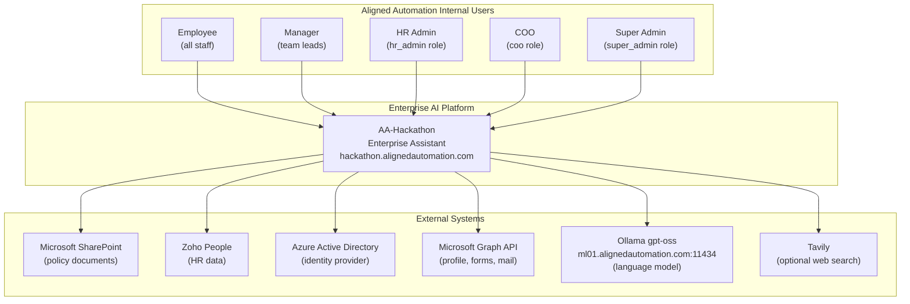
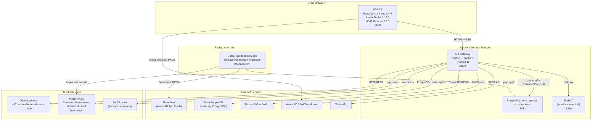
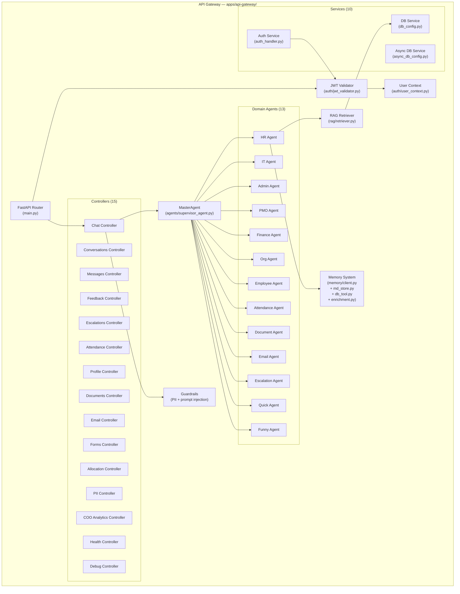
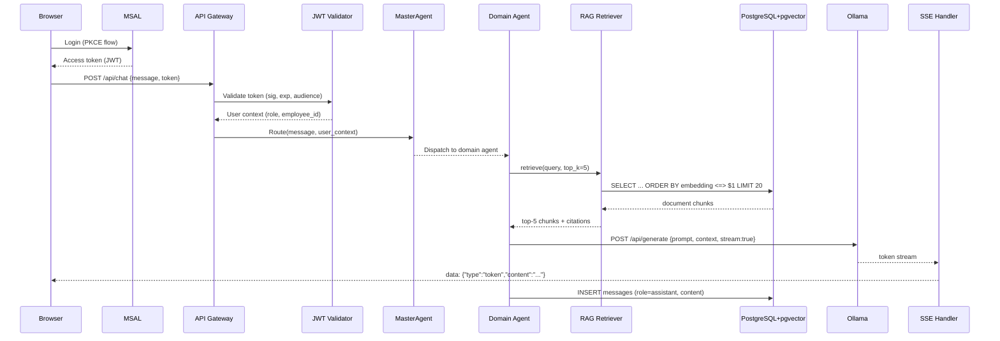

# Architecture Overview — AA-Hackathon Enterprise AI Platform

**Organization:** Aligned Automation  
**Platform:** AA-Hackathon Enterprise Assistant  
**Document Date:** 2026-06-07  
**Version:** 1.0  

---

## Purpose

This document provides the authoritative architectural reference for the AA-Hackathon Enterprise AI Platform. It covers all four C4 model levels, deployment topology, data flows, security boundaries, and Architecture Decision Records (ADRs).

---

## System Context (C4 Level 1)

The Enterprise Assistant is an internal AI platform used exclusively by Aligned Automation employees. It connects to corporate data systems (SharePoint, Zoho People), the Microsoft 365 ecosystem (Azure AD, Graph API), a self-hosted language model (Ollama), and an optional web search service (Tavily).

---

## Container Diagram (C4 Level 2)

---

## Component Diagram (C4 Level 3) — API Gateway

---

## Deployment Topology

### Development / Staging — Docker Compose

| Service | Image | Port | Purpose |
|---|---|---|---|
| api | Custom Python 3.11 Dockerfile | 8000 | FastAPI + Uvicorn |
| postgres | postgres:16 + pgvector | 5432 | Primary database |
| redis | redis:7-alpine | 6379 | Cache + sessions |

All services run on a shared Docker bridge network. Environment variables injected via `.env` file (never committed to git).

### Production — AKS (Target)

| Workload | Replicas | Resources |
|---|---|---|
| api-gateway | 2–4 (HPA) | 2 CPU, 4GB RAM |
| postgres | 1 (StatefulSet) + read replica | 4 CPU, 8GB RAM |
| redis | 1 (or Redis Cluster) | 1 CPU, 2GB RAM |

Ollama runs on a dedicated GPU node (`ml01.alignedautomation.com`) — not containerized in Docker Compose. The API Gateway calls it over HTTP.

---

## Data Flow — Query Lifecycle

---

## Security Architecture

### Authentication Boundary

All API endpoints (except `/api/health`) require a valid Azure AD JWT. The JWT Validator checks:
- Token signature against JWKS endpoint (`login.microsoftonline.com/{tenant_id}/discovery/v2.0/keys`)
- Token expiry (`exp` claim)
- Audience (`aud` claim must match AAD App client ID)
- Issuer (`iss` claim must match AAD tenant)

### RBAC Enforcement

| Role | Access Level |
|---|---|
| employee | Own data, chat, documents (self) |
| manager | Own data + direct reports |
| hr_admin | All HR data, escalation admin, feedback admin |
| it_admin | IT-specific admin views |
| admin | Platform administration |
| coo | COO analytics dashboard, all department aggregates |
| super_admin | Full platform access |

### TLS

All external traffic: HTTPS via Nginx reverse proxy with TLS termination. Internal Docker network: plain HTTP (trusted network boundary).

### Secrets Management

All credentials (Azure AD client secret, Zoho DB password, Ollama endpoint, Tavily API key) are stored in `.env` files injected at container start. Production target: Azure Key Vault with MSI.

---

## Architecture Decision Records

### ADR-001: Why Ollama Self-Hosted?

**Decision:** Use Ollama running gpt-oss model on ml01.alignedautomation.com rather than Azure OpenAI or Anthropic Claude API.

**Rationale:**
- **Data sovereignty:** Employee HR queries contain sensitive personal data. Self-hosted LLM ensures data never leaves the Aligned Automation network.
- **Cost:** No per-token billing. Fixed infrastructure cost for ml01.
- **Control:** Model version, temperature, and context window controlled without API provider changes.
- **Latency:** No internet round-trip for generation — ml01 is on the internal network.

**Trade-offs:** Model capability may lag frontier models. No automatic model updates. Requires GPU maintenance.

---

### ADR-002: Why pgvector Over Pinecone or Qdrant?

**Decision:** Store document embeddings in PostgreSQL 16 with the pgvector extension rather than a dedicated vector database.

**Rationale:**
- **Operational simplicity:** One database service instead of two. No additional managed service cost.
- **JOIN capability:** Document metadata (title, source, created_at) lives in the same database as vector embeddings. JOIN queries are trivial.
- **Transactions:** Vector insert and metadata insert are atomic within a PostgreSQL transaction.
- **Existing expertise:** Team already manages PostgreSQL. No new operational skillset needed.

**Trade-offs:** Not optimized for very large scale (>100M vectors). HNSW index rebuild required for major embedding model changes.

---

### ADR-003: Why FAISS as Fallback?

**Decision:** Maintain a FAISS in-memory index as fallback when pgvector queries fail.

**Rationale:**
- **Zero-latency:** FAISS queries execute in <5ms in-process, no network I/O.
- **Availability:** RAG pipeline remains functional even during PostgreSQL connectivity issues.
- **Simplicity:** FAISS requires no external service — it is a Python library.

**Trade-offs:** Index is rebuilt at every API Gateway restart. Not persistent across deployments. May be slightly stale compared to pgvector.

---

### ADR-004: Why FastAPI?

**Decision:** Use FastAPI + Uvicorn as the API framework rather than Django REST Framework or Flask.

**Rationale:**
- **Async support:** Native asyncio for non-blocking SSE streaming and concurrent requests.
- **Pydantic validation:** Request and response models validated automatically.
- **Auto-documentation:** OpenAPI docs at `/docs` generated without additional work.
- **Performance:** Uvicorn ASGI server handles high concurrency for SSE connections.

---

### ADR-005: Why LangChain?

**Decision:** Use LangChain + LangChain-Ollama for agent abstractions and LLM integration.

**Rationale:**
- **Streaming support:** LangChain's Ollama integration supports token-level streaming natively.
- **Prompt management:** PromptTemplate and ChatPromptTemplate provide structured prompt composition.
- **Ecosystem:** Rich set of document loaders, text splitters, and retriever abstractions for RAG.
- **Ollama integration:** LangChain-Ollama provides a clean interface to the self-hosted Ollama endpoint.

**Trade-offs:** LangChain abstractions add indirection. Complex LangChain Expression Language (LCEL) chains can be hard to debug. Phase 1 will introduce LangGraph for state machine orchestration.

---

## Architecture Review Process

1. **Quarterly architecture review:** Platform Engineering team reviews ADRs, identifies new debt, updates roadmap.
2. **ADR creation trigger:** Any change affecting: database schema, external integrations, authentication flow, or LLM model requires a new ADR.
3. **ADR format:** Context → Decision → Rationale → Trade-offs → Review date.
4. **Review participants:** Backend Lead, ML Lead, Security representative, COO sponsor.
