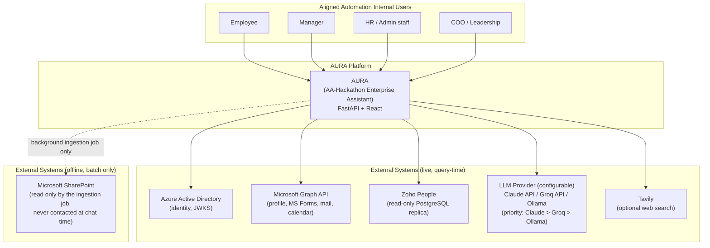
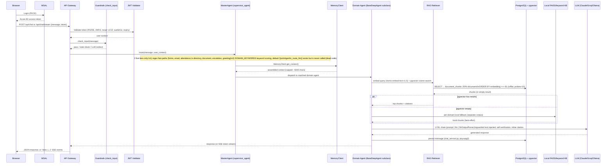

# Architecture Overview — AURA (AA-Hackathon Enterprise Assistant)

**Organization:** Aligned Automation
**Platform:** AURA (in-app name), AA-Hackathon Enterprise Assistant (project/repo codename)
**Document Date:** 2026-07-02
**Version:** 2.0 — Corrected against live codebase

> **Accuracy note:** This document was previously found to contain fabricated files, invented endpoint counts, an incorrect "3-tier routing" claim, an "Ollama-only" LLM narrative, and an unimplemented AKS/Nginx deployment topology described as if it were current. All of that has been corrected below against a direct audit of `apps/api-gateway`, `apps/web-ui`, and `apps/jobs`. See [`../README.md`](../README.md) and [`folder-structure.md`](folder-structure.md) for consistent, equally-corrected context.

---

## Purpose

This document provides the architectural reference for AURA: C4-style context/container/component views, the actual (not idealized) deployment footprint, the real query data-flow, the security boundary as implemented, and Architecture Decision Records reflecting what the code actually does today.

---

## System Context (C4 Level 1)

AURA is an internal AI platform used by Aligned Automation employees. It talks to Azure AD for identity, Microsoft Graph for profile/forms/mail/calendar actions, a configurable LLM backend (Anthropic Claude, Groq, or a self-hosted Ollama instance — selectable, not fixed), an optional web-search provider (Tavily), and a read-only replica of Zoho People for HR data. SharePoint is **not** contacted live during a chat request — it is only read by a separate background ingestion job that populates the PostgreSQL/pgvector store AURA actually queries at chat time.



---

## Container Diagram (C4 Level 2)

```mermaid
graph TD
    subgraph "Client Browser"
        WEBUI["Web UI (aura-ui)\nReact 18.3.1 + Vite 5.4.0\nMSAL Browser 5.9.0\nNo Redux, no React Router\n(dev :3000, base path /project-aura/)"]
    end

    subgraph "Docker Compose (deployments/docker/docker-compose.yml)"
        API["API Gateway\nFastAPI + Uvicorn (title: \"AURA\")\n:8000"]
        PG["PostgreSQL 16 + pgvector\nimage: pgvector/pgvector:pg16\ndb: squadrons\n:5432"]
        REDIS["Redis\nimage: redis\n:6379\n(defined, NOT used by any app code)"]
    end

    subgraph "In-Process (inside API Gateway)"
        EMBED["HuggingFace Embeddings\nnomic-embed-text-v1.5 (768-dim)"]
        FAISS_C["Local FAISS / keyword index\n(per-domain fallback only,\nnot the pgvector corpus)"]
    end

    subgraph "Configurable LLM Backend"
        CLAUDE["Anthropic Claude API\n(claude-sonnet-4-6 default)"]
        GROQ["Groq API\n(llama3-70b-8192 default)"]
        OLLAMA_C["Ollama (self-hosted)\nml01.alignedautomation.com:11434\ngpt-oss (default/fallback)"]
    end

    subgraph "Background Job (manual / cron, not a compose service)"
        SPJOB["SharePoint Ingestion Job\napps/jobs/sharepoint_ingestion/\npurges + fully re-ingests each run"]
    end

    subgraph "External Services"
        SP_E["SharePoint\n(Microsoft Graph API,\nmsal ConfidentialClientApplication)"]
        ZOHO_E["Zoho People\n(read-only PostgreSQL replica)"]
        GRAPH_E["Microsoft Graph API\n(profile, MS Forms, mail, calendar)"]
        AZAD_E["Azure AD / JWKS endpoint"]
        TAVILY_E["Tavily API (optional)"]
    end

    WEBUI -- "fetch, /aura-api or /api\n(Vite dev proxy → :8000)" --> API
    WEBUI -- "MSAL OAuth2/PKCE" --> AZAD_E
    WEBUI -- "Graph calls direct from frontend\n(login, Planner, Calendar, sendMail)" --> GRAPH_E
    API -- "psycopg2 (sync SQL, no ORM)" --> PG
    API -. "defined in compose, unused" .-> REDIS
    API -- "in-process" --> EMBED
    API -- "in-process, fallback only" --> FAISS_C
    API -- "priority: Claude, else Groq, else Ollama" --> CLAUDE
    API --> GROQ
    API --> OLLAMA_C
    API -- "JWKS fetch (python-jose)" --> AZAD_E
    API -- "Graph API REST" --> GRAPH_E
    API -- "read-only SQL" --> ZOHO_E
    API -- "optional" --> TAVILY_E
    SPJOB -- "Graph API, app-only MSAL auth" --> SP_E
    SPJOB -- "in-process embed (same model)" --> EMBED
    SPJOB -- "psycopg2, purge + full re-ingest" --> PG
```

**Note on Redis:** it is one of exactly three services in `docker-compose.yml`, but no Python package in `requirements.txt` provides a Redis client and no code imports one. It is present-but-unused/vestigial infrastructure, not an active cache or session store.

---

## Component Diagram (C4 Level 3) — API Gateway (`apps/api-gateway/app/`)

```mermaid
graph TD
    subgraph "app/main.py"
        ROUTER["FastAPI app, title \"AURA\"\nCORS allow_origins=[\"*\"]\nRegisters 26 routers\n(form_builder_controller import\naccidentally duplicated 3x — harmless)"]
    end

    subgraph "api/auth/"
        AUTHH["auth_handler.py\nFastAPI Depends: get_current_user"]
        JWTV["jwt_validator.py\nRS256 via JWKS, python-jose\nchecks v1+v2 issuer, audience, expiry"]
        UCTX["user_context.py"]
        ACFG["auth_config.py\nrequires AZURE_TENANT_ID/AZURE_CLIENT_ID\n(RuntimeError if missing)"]
    end

    subgraph "api/config/"
        DBCFG["db_config.py\npsycopg2 connection to PostgreSQL"]
        ADBCFG["async_db_config.py"]
    end

    subgraph "api/controllers/ (20 files) + api/onboarding.py"
        CTRLS["21 route files\n~110+ endpoints total\nlargest: form_builder_controller.py (~45 endpoints)"]
    end

    subgraph "api/services/ (17 files, all raw psycopg2 SQL, no ORM)"
        SVCS["allocation_service, attendance_service, chat_service,\ncommunications_service, conversations_service,\ncoo_analytics_service, escalations_service, feedback_service,\nform_builder_ai_service, form_builder_service, messages_service,\nparking_service, pii_service, rule_engine_service,\nskills_service, slash_command_service, user_service,\nworkflow_engine_service"]
    end

    subgraph "api/repositories/"
        REPOS["Effectively empty\n(__init__.py only)"]
    end

    subgraph "agents/"
        SUPER["supervisor_agent.py\nMasterAgent — 2 live routing tiers\n(regex fast-paths, then keyword scoring)\n_route_llm() defined but DEAD CODE"]
        GUARD["guardrails.py\nsingle check_input() function"]
        subgraph "agents/working/ — BaseDeepAgent subclasses"
            BASE["base_deep_agent.py\n(the real BaseDeepAgent)"]
            HR["hr_agent.py"]
            IT["it_agent.py"]
            ADM["admin_agent.py"]
            FIN["finance_agent.py"]
            PMO["pmo_agent.py"]
        end
        ORG["org_agent.py\n(OrgDeepAgent, top-level)"]
        subgraph "agents/working/ — lightweight (NOT BaseDeepAgent)"
            FUNNY["funny_agent.py"]
            QUICK["quick_agent.py"]
        end
        subgraph "Plain classes / functions"
            DOC["document_agent.py"]
            EMAIL["email_agent.py"]
            FORMSA["ms_forms_agent.py"]
            ALLOC["allocation_agent.py"]
            EMP["employee/employee_agent.py\nemployee/attendance_agent.py"]
            ESC["escalation_agent.py"]
            LIC["license_agent.py"]
            PARK["parking_config.py (static data)"]
        end
    end

    subgraph "rag/"
        RAG["retriever.py\nONLY data source at query time is pgvector\n(own docstring: \"SharePoint is never contacted here\")\nnomic-embed-text-v1.5, cosine <=>, ivfflat probes=10"]
    end

    subgraph "memory/"
        MEMC["client.py — MemoryClient.get_context()\nsingle entry point, capped at 5000 chars"]
        COMPLEX["complexity.py — classify() simple/deep"]
        MDSTORE["md_store.py — flat markdown files, atomic writes"]
        DBTOOL["db_tool.py — DB context for 'deep' queries"]
        ENRICH["enrichment.py — updates history after response"]
    end

    subgraph "utils/"
        LOG["logging_config.py"]
    end

    ROUTER --> AUTHH
    AUTHH --> JWTV
    JWTV --> UCTX
    ROUTER --> CTRLS
    CTRLS --> SVCS
    SVCS --> DBCFG
    CTRLS --> SUPER
    SUPER --> GUARD
    SUPER --> HR
    SUPER --> IT
    SUPER --> ADM
    SUPER --> FIN
    SUPER --> PMO
    SUPER --> ORG
    SUPER --> FUNNY
    SUPER --> QUICK
    SUPER --> DOC
    SUPER --> EMAIL
    SUPER --> FORMSA
    SUPER --> ALLOC
    SUPER --> EMP
    SUPER --> ESC
    SUPER --> LIC
    HR --> BASE
    IT --> BASE
    ADM --> BASE
    FIN --> BASE
    PMO --> BASE
    ORG --> BASE
    BASE --> RAG
    BASE --> MEMC
    RAG --> DBCFG
```

---

## Deployment Topology

### Current State — Docker Compose (the only deployment topology defined in this repository)

`deployments/docker/docker-compose.yml` defines exactly **three services**:

| Service | Image / Build | Port | Notes |
|---|---|---|---|
| `api` | `build: ../../apps/api-gateway` | 8000:8000 | FastAPI + Uvicorn |
| `postgres` | `pgvector/pgvector:pg16` | (default) | `POSTGRES_PASSWORD` env only |
| `redis` | `redis` | (default) | No configuration; unused by app code |

This is a **minimal** compose file: there are no explicit health checks, no volume declarations, no resource limits, no Nginx, and no Kubernetes/AKS manifests anywhere in this repository.

### Not Implemented — No Target-State Topology Exists in This Repo

Earlier drafts of this document described an AKS deployment with HPA-scaled replicas, a StatefulSet PostgreSQL with a read replica, a Redis cluster, and an Nginx TLS-terminating reverse proxy. **None of that exists in this codebase** — no Kubernetes manifests, no Helm charts, no Nginx config, and no infrastructure-as-code for AKS were found anywhere in the repository. If such a target state is planned, it should be tracked in `09-roadmap/` as a future item and clearly labeled as aspirational, not documented here as current architecture.

Ollama, when it is the active LLM provider, runs on a separate GPU host (`ml01.alignedautomation.com`) reached over plain HTTP — it is not containerized by this compose file.

---

## Data Flow — Query Lifecycle



---

## Security Architecture

### Authentication Boundary

All endpoints except the health checks (`GET /health`, `GET /health/db`) require a valid Azure AD Bearer JWT. `jwt_validator.py` (using `python-jose`, **not** `msal` — MSAL is never imported anywhere under `apps/api-gateway`) checks:

- Signature (RS256) against JWKS fetched from `https://login.microsoftonline.com/{TENANT_ID}/discovery/v2.0/keys`
- Issuer — accepts both the v1 (`sts.windows.net/...`) and v2 (`login.microsoftonline.com/...`) issuer formats
- Audience (must match the configured AAD app client ID)
- Expiry (`exp` claim)

`auth_config.py` requires `AZURE_TENANT_ID` and `AZURE_CLIENT_ID` to be set and raises `RuntimeError` at startup if either is missing.

MSAL usage in this codebase is otherwise split as follows: **frontend** uses MSAL Browser 5.9.0 for user sign-in; the **SharePoint ingestion job** (`apps/jobs/sharepoint_ingestion/connectors/sharepoint.py`) uses `msal.ConfidentialClientApplication` for its own app-only Graph auth. The API gateway backend does not use MSAL at all for validating incoming requests.

### Access Control

Route naming shows a real convention of admin-scoped prefixes — `/api/admin/pii`, `/api/admin/escalations`, `/api/admin/feedback`, `/api/admin/communications`, `/api/admin/ncl` — separate from their public counterparts. This documentation set does not assert a verified, complete server-side role matrix beyond that convention.

On the frontend, `config/userConfig.js` defines a client-side role/permission table, but `isUserAuthorized()` is **hardcoded to always return `true`** — the frontend does not block access to any organization member; only which UI affordances are shown varies by role. Any enforcement that matters must therefore live at the API layer, not the client.

### TLS

No reverse proxy (Nginx or otherwise) or TLS-termination configuration exists anywhere in this repository. `docker-compose.yml` exposes the `api` container directly on port 8000. TLS, if applied in a real deployment, is handled outside the code in this repo (e.g., at a load balancer or hosting platform) and is not something this codebase configures.

### Secrets Management

Credentials (Azure AD client secret, LLM provider API keys, Tavily key, DB connection details, SharePoint app credentials) are supplied via `.env` files at container/process start, not committed to git. No secrets-manager integration (e.g., Azure Key Vault) exists in the current codebase.

---

## Known Gaps — Documented Aspiration vs. Current Reality

Transparency matters more than a tidy narrative here. The following are real files/features that exist in the code but do not do what a casual reading of their names or surrounding docs might suggest:

| Area | Looks like | Actually is |
|---|---|---|
| `modules/analytics/` (frontend) | Live chatbot usage dashboard | `analyticsApi.js` returns hardcoded constants with a fake delay — **no backend endpoint is called** |
| `modules/pmo-hub/` (frontend) | Live PMO project/risk dashboard | Entirely hardcoded mock project data — **zero API calls** |
| `modules/feedback/` (frontend) | Backend-persisted survey/feedback tool | **localStorage only** — distinct from per-message thumbs up/down, which *is* persisted via `/api/messages/{id}/feedback` |
| `redis` service (`docker-compose.yml`) | Cache / session store | Defined, but **no Redis client library exists in `requirements.txt`** and no code connects to it |
| `langgraph` (`requirements.txt`) | State-machine agent orchestration | Listed as a dependency; **no import of it exists anywhere** in the codebase |
| `_route_llm()` (`supervisor_agent.py`) | An LLM-based routing tier | Defined, fully implemented — but **never called** from anywhere; dead code |
| Onboarding orphan files (`ChecklistPanel.jsx`, `DocumentPanel.jsx`, `HRNotes.jsx`, `TimelinePanel.jsx`, `TrainingGrid.jsx`, `WelcomeHeader.jsx`, `useOnboardingState.js`) | Part of the working onboarding module | **Not imported anywhere**; reference constants that no longer exist; would error if wired up |
| `config/apiConfig.js` (frontend) | The API endpoint map used by the app | Defines an endpoints map that **nobody imports** — the real API layer hardcodes its own paths in `services/api.js` |
| `config/API_QUICK_REFERENCE.js` (frontend) | A reference list of available API functions | **Stale/aspirational** — describes functions (`getLeaves`, `requestLeave`, `getPayroll`, `getITTickets`, `apiGet`, `apiPost`, etc.) that do not exist anywhere in the codebase |
| `main.py` router registration | 26 distinct, clean router imports | The `form_builder_controller` router import line is accidentally duplicated three times — harmless, but sloppy and worth cleaning up |
| `isUserAuthorized()` (`config/userConfig.js`) | A client-side access gate | Hardcoded to always return `true` |

---

## Architecture Decision Records

### ADR-001: Why a Multi-Provider LLM Strategy (Claude → Groq → Ollama)?

**Decision:** `create_llm()` in `app/agents/working/config.py` selects the active LLM provider at startup, in priority order: **Anthropic Claude** (default model `claude-sonnet-4-6`, if `USE_Claude_API_Key` is set) → **Groq** (default model `llama3-70b-8192`, if `USE_Groq_API_Key` is set) → **Ollama** (`gpt-oss` at `ml01.alignedautomation.com:11434`, the default/fallback via `Use_Ollama_LLM`).

**Rationale:**
- **Flexibility across environments:** deployments without external API access can run entirely on the self-hosted Ollama endpoint; others can opt into stronger hosted models.
- **Quality:** Claude and Groq generally out-perform the self-hosted `gpt-oss` model on reasoning-heavy queries when available.
- **No hard vendor lock-in:** the platform is not architecturally tied to any single LLM vendor's availability or pricing.
- **Cost control:** Ollama remains a zero-marginal-cost fallback when external providers are not configured.

**Trade-offs:** three provider integrations (`langchain-anthropic`, `langchain-groq`, `langchain-ollama`) must be kept working; response quality, latency, and cost vary by which provider is actually active in a given deployment; when Claude or Groq is selected, query content leaves the internal network — this is a configuration choice per deployment and should be called out explicitly in governance documentation, not assumed to be "self-hosted only."

**Correction note:** earlier drafts of this ADR described the platform as deliberately Ollama-only for data-sovereignty reasons. That is not what the code implements — Ollama is the *default fallback*, not an exclusive choice.

---

### ADR-002: Why pgvector Over a Dedicated Vector Database?

**Decision:** Store document embeddings in PostgreSQL 16 with the `pgvector` extension (database `squadrons`) rather than a dedicated vector database (e.g., Pinecone, Qdrant).

**Rationale:**
- **Operational simplicity:** one database service instead of two.
- **JOIN capability:** `document_chunks` and `documents` metadata live in the same database, so retrieval is a single SQL join with a cosine-distance (`<=>`) order-by against an `ivfflat` index (`probes=10`).
- **Existing expertise:** the team already operates PostgreSQL for all other application data; no new operational skillset is required.

**Trade-offs:** not optimized for very large scale (hundreds of millions of vectors); index rebuilds are needed if the embedding model changes. This is also the **only** data source `rag/retriever.py` queries at chat time — its own docstring states SharePoint is never contacted from that code path.

---

### ADR-003: Why a Local Per-Domain FAISS/Keyword Fallback?

**Decision:** Each `BaseDeepAgent` subclass (HR, IT, Admin, Finance, PMO, Org) falls back to a local, per-domain FAISS-or-keyword index (`agents/working/knowledge_base.py`, built from local document folders) **only when** the primary pgvector query returns zero results.

**Rationale:**
- Keeps the pipeline able to answer *something* if the shared pgvector corpus has a temporary gap for a given domain.
- No extra service dependency — FAISS is an in-process Python library (`faiss-cpu`, present in `requirements.txt`).
- A domain owner can drop files into a local folder without needing to run the full SharePoint ingestion job.

**Trade-offs:** the local knowledge base is a **separate, smaller corpus** from the pgvector data and can drift out of sync with it; it is consulted only as a sequential fallback, never in parallel with pgvector; it is rebuilt from local files at agent startup, not centrally managed.

**Correction note:** earlier drafts described this as a global fallback mirroring the entire pgvector corpus, retrieved in parallel via `asyncio.gather` alongside multiple other sources. That design does not exist in the code — it is a conditional, per-domain, sequential fallback consulted only after pgvector comes back empty.

---

### ADR-004: Why FastAPI?

**Decision:** Use FastAPI + Uvicorn as the API framework (the app's own title is literally `"AURA"`).

**Rationale:**
- **Async support:** native `asyncio` for non-blocking SSE streaming (`POST /api/chat/stream`) and concurrent requests.
- **Pydantic validation:** request/response models validated automatically.
- **Auto-documentation:** OpenAPI docs generated without extra work.
- **Performance:** Uvicorn's ASGI server handles concurrent SSE connections well.

**Trade-offs:** none specific to this codebase have surfaced beyond the general FastAPI/async-Python operational learning curve.

---

### ADR-005: Why LangChain (and Why LangGraph Is Not Actually Used)

**Decision:** Use LangChain packages — `langchain-huggingface`, `langchain-ollama`, `langchain-groq`, `langchain-anthropic`, `langchain-community`, `langchain-text-splitters`, `langchain_core` — for prompt templates, LCEL chains, the FAISS vectorstore wrapper, and document loading/text splitting.

**Rationale:**
- A consistent `prompt | llm | StrOutputParser` LCEL chain shape works regardless of which provider (Claude/Groq/Ollama) is active.
- `RecursiveCharacterTextSplitter` is reused for both the ingestion job and any in-process chunking needs.
- `HuggingFaceEmbeddings` gives one consistent interface to `nomic-embed-text-v1.5` at both query time and ingestion time.

**Current status of LangGraph:** `langgraph` is listed in `requirements.txt` but **no import of it exists anywhere in `apps/api-gateway`**. It is an unused/aspirational dependency. Routing today is handled entirely by the plain-Python `_route()` method in `supervisor_agent.py` (regex fast-paths, then keyword scoring) — there is no graph-based or state-machine agent orchestration live in this system. Any future move to LangGraph should be tracked as a roadmap item, not described as current architecture.

---

## Architecture Review Process

1. Treat every factual claim in this document set (file paths, table names, model names, dimensions, endpoint counts) as needing a code citation before it is trusted or repeated elsewhere.
2. Any change affecting database schema, external integrations, authentication flow, or the active LLM provider strategy should be reflected here and in `application-map.md`.
3. When updating an ADR: Context → Decision → Rationale → Trade-offs. Note the date of verification against the code, not just the date the document was edited.
4. Keep this document and [`../README.md`](../README.md) in agreement; where they conflict, verify against the code and correct both.
