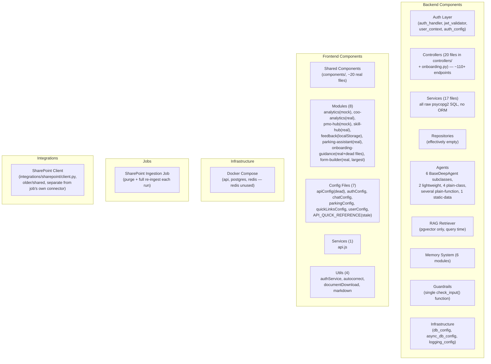

# Component Inventory — AURA (AA-Hackathon Enterprise Assistant)

**Organization:** Aligned Automation
**Platform:** AURA (in-app name), AA-Hackathon Enterprise Assistant (project/repo codename)
**Document Date:** 2026-07-02
**Version:** 2.0 — Corrected against live codebase

> Ownership/team mapping (e.g. "Platform Team owns X") is **not tracked anywhere in this repository or documentation set** and has been removed from this version rather than invented. If a CODEOWNERS file or team wiki exists outside this repo, treat that as authoritative for ownership, not this document.

---

## Component Hierarchy

---

## Backend Components

### Auth Layer

| Component | File | Type | Purpose |
|---|---|---|---|
| Auth Handler | `app/api/auth/auth_handler.py` | FastAPI Dependency | Extracts and validates JWT from Authorization header, builds user context |
| JWT Validator | `app/api/auth/jwt_validator.py` | Service | Validates Azure AD JWT via `python-jose`: RS256 signature (JWKS), issuer (v1 + v2 forms), audience, expiry |
| User Context | `app/api/auth/user_context.py` | Model | Authenticated user data derived from JWT claims |
| Auth Config | `app/api/auth/auth_config.py` | Config | Requires `AZURE_TENANT_ID`/`AZURE_CLIENT_ID`; raises `RuntimeError` if missing |

**Note:** MSAL is never imported anywhere under `apps/api-gateway`. The only real MSAL usage in the repository is (a) the React frontend (MSAL Browser) and (b) the SharePoint ingestion job's own app-only Graph auth (`msal.ConfidentialClientApplication`).

---

### Controllers (20 files in `controllers/` + `onboarding.py`)

| Component | File | Path prefix | Endpoint count (approx.) |
|---|---|---|---|
| Onboarding | `app/api/onboarding.py` | `/api/onboarding` | 2 |
| Chat | `chat_controller.py` | `/api` | 2 |
| Conversations | `conversations_controller.py` | `/api/conversations` | 5 |
| Messages | `messages_controller.py` | `/api/conversations/{id}/messages`, `/api/messages/{id}` | ~7 |
| Feedback | `feedback_controller.py` | `/api/messages/{id}/feedback`, `/api/feedback/{id}`, `/api/admin/feedback` | ~5 |
| Escalations | `escalations_controller.py` | `/api/escalations`, `/api/admin/escalations` | ~5 |
| PII | `pii_controller.py` | `/api/admin/pii` | 8 |
| Allocation | `allocation_controller.py` | `/api/allocation` | 5 |
| Email | `email_controller.py` | `/api/email-agent` | 3 |
| Attendance | `attendance_controller.py` | `/api/attendance` | 2 |
| Profile | `profile_controller.py` | `/api/users` | 3 |
| Documents | `documents_controller.py` | `/api/documents` | 1 |
| COO Analytics | `coo_analytics_controller.py` | `/api/coo-analytics` | 3 |
| Forms | `forms_controller.py` | `/api/ms-forms` | 1 |
| Communications | `communications_controller.py` | `/api/communications`, `/api/admin/communications` | 13 (5 public + 8 admin) |
| Graph Calendar | `graph_calendar_controller.py` | `/api/communications` | 1 |
| Parking | `parking_controller.py` | `/api/parking` | 3 |
| Skills | `skills_controller.py` | `/api/skills` | 1 |
| Form Builder | `form_builder_controller.py` | `/api/ncl`, `/api/admin/ncl` | **~45 — largest controller in the codebase** |
| Health | `health_controller.py` | `/health` | 2 |
| Debug | `debug_controller.py` | `/api/test`, `/api/debug/agents` | 2 |

**Total:** 21 route files, ~110+ endpoints, registered from 26 router imports in `main.py` (some controllers register more than one `APIRouter`, e.g. `communications_controller.py` and `form_builder_controller.py` each register a public + admin router).

---

### Services (17 files, `app/api/services/`)

All services access PostgreSQL directly via parameterized `psycopg2` SQL. There is no ORM (no SQLAlchemy models) anywhere in this layer.

`allocation_service.py` · `attendance_service.py` · `chat_service.py` · `communications_service.py` · `conversations_service.py` · `coo_analytics_service.py` · `escalations_service.py` · `feedback_service.py` · `form_builder_ai_service.py` · `form_builder_service.py` · `messages_service.py` · `parking_service.py` · `pii_service.py` · `rule_engine_service.py` · `skills_service.py` · `slash_command_service.py` · `user_service.py` · `workflow_engine_service.py`

---

### Repositories (`app/api/repositories/`)

Exists as a folder, but is effectively empty — contains only `__init__.py`. Not an active architectural layer.

---

### Agents

Agents fall into distinct implementation categories — this distinction matters more than a flat "13 agents" count used in earlier drafts:

| Category | Agents | File(s) |
|---|---|---|
| Orchestrator | MasterAgent | `agents/supervisor_agent.py` |
| `BaseDeepAgent` subclasses (pgvector RAG + local FAISS/keyword fallback + single LLM call) | HR, IT, Admin, Finance, PMO | `agents/working/hr_agent.py`, `it_agent.py`, `admin_agent.py`, `finance_agent.py`, `pmo_agent.py` |
| `BaseDeepAgent` subclass, no local doc folders | Org | `agents/org_agent.py` |
| Lightweight, direct LLM call (NOT `BaseDeepAgent`) | Funny, Quick | `agents/working/funny_agent.py`, `quick_agent.py` |
| Plain class, stateful | Document (in-memory sessions) | `agents/document_agent.py` |
| Plain class | Allocation, MS Forms | `agents/allocation_agent.py`, `agents/ms_forms_agent.py` |
| Plain functions, adapter-wrapped for dispatch | Employee, Attendance, Escalation, License | `agents/employee/employee_agent.py`, `agents/employee/attendance_agent.py`, `agents/escalation_agent.py`, `agents/license_agent.py` |
| Static data (not an agent) | Parking config | `agents/parking_config.py` |
| Cross-cutting | Guardrails | `agents/guardrails.py` |

**Shared support code (`agents/working/`):** `base_deep_agent.py` (the real `BaseDeepAgent` pipeline), `knowledge_base.py` (local per-domain FAISS/keyword fallback — a separate corpus from pgvector), `personalities.py` (tone text), `config.py` (`create_llm()` — Claude → Groq → Ollama provider selection), `tools/tavily_search.py` (optional web search).

---

### RAG Component

| Component | File | Purpose |
|---|---|---|
| RAG Retriever | `app/rag/retriever.py` | The **only** data source consulted at chat time — confirmed by the file's own docstring ("SharePoint is never contacted here"). |

**Key parameters (verified):**
- Embedding model: `nomic-embed-text-v1.5`, **768 dimensions** (not `all-MiniLM-L6-v2`/384)
- Similarity: pgvector cosine distance (`<=>` operator)
- Index: `ivfflat` with `probes = 10`
- Fallback: local per-domain FAISS/keyword knowledge base (`agents/working/knowledge_base.py`), consulted only when pgvector returns zero results — not a parallel or global fallback

---

### Memory System (6 files, `app/memory/`)

| Component | File | Purpose |
|---|---|---|
| Memory Client | `client.py` | `MemoryClient.get_context()` — single entry point, assembles context capped at 5000 characters |
| Complexity Scorer | `complexity.py` | `classify()` → `"simple"` or `"deep"`, based on query length/regex |
| MD Store | `md_store.py` | Flat markdown files per user under `var/memory`, atomic writes |
| DB Tool | `db_tool.py` | DB-backed context fetch, only for `"deep"`-classified queries |
| Enrichment | `enrichment.py` | Updates `post_history.md`/`conversation_memory.md` after each response |
| Config | `config.py` | Storage paths; `AURA_MEMORY_DIR` env override |

---

### Guardrails

| Component | File | Purpose |
|---|---|---|
| `check_input()` | `agents/guardrails.py` | Single function, evaluated in order: jailbreak regex → harmful-content regex → security-threat regex (all three: static, immediate block) → distress signals (LLM empathetic response) → org-scope violations (e.g. another employee's salary/PII, legal advice, competitor intel, medical diagnosis — LLM contextual redirect) |

Exports `GENERIC_GUARDRAIL`/`ORG_GUARDRAIL` text blocks, injected into every `BaseDeepAgent` prompt. This is a single-function design, not a multi-component "guardrails system."

---

### Infrastructure Components

| Component | File | Purpose |
|---|---|---|
| DB Config (sync) | `app/api/config/db_config.py` | `psycopg2` connection to PostgreSQL (exact pool-size parameters are not asserted here — avoid citing a specific `ThreadedConnectionPool(min, max)` figure unless verified directly against the current source) |
| DB Config (async) | `app/api/config/async_db_config.py` | Async database configuration counterpart |
| Logging Config | `app/utils/logging_config.py` | Python logging setup |

---

## Frontend Components

### Shared Components — `src/components/`

| Component | File | Purpose |
|---|---|---|
| ChatWindow | `ChatWindow.jsx` | Main chat UI, SSE consumer, message state |
| TopBar | `TopBar.jsx` | Top navigation bar |
| Sidebar | `Sidebar.jsx` | Left navigation |
| RightPanel | `RightPanel.jsx` | Right-hand info panel |
| LoginPage | `LoginPage.jsx` | Microsoft sign-in screen |
| MessageBubble | `MessageBubble.jsx` | Single message: markdown content, citations, feedback, document download |
| AdminPage | `AdminPage.jsx` | Admin settings screen |
| AllocationBoard | `AllocationBoard.jsx` | Resource allocation table/chart |
| AnnouncementBanner | `AnnouncementBanner.jsx` | Announcement banner strip |
| AnnouncementOverlay | `AnnouncementOverlay.jsx` | Announcement welcome pop-up |
| AttendancePage | `AttendancePage.jsx` | Personal/team attendance view |
| CommunicationsAdmin | `CommunicationsAdmin.jsx` | Announcements/events admin editor |
| CommunicationsPage | `CommunicationsPage.jsx` | Announcements/events viewer |
| CommunicationsWidget | `CommunicationsWidget.jsx` | Home-screen communications preview |
| DocumentsPage | `DocumentsPage.jsx` | Library of generated HR documents |
| EmailAgentPage | `EmailAgentPage.jsx` | Standalone email-drafting tool |
| EscalationDrawer | `EscalationDrawer.jsx` | Escalation slide-in panel |
| FormsDrawer | `FormsDrawer.jsx` | MS Forms slide-in panel |
| ParkingDrawer | `ParkingDrawer.jsx` | Parking request slide-in panel |
| PersonalNotes | `PersonalNotes.jsx` | Private notes editor (client-side only) |
| QuickLinksAdmin | `QuickLinksAdmin.jsx` | Admin quick-links editor |

**Removed from this inventory (fabricated in earlier drafts, do not exist):** `Header.jsx`, `ConversationList.jsx`, `ChatInput.jsx`, `FeedbackModal.jsx`, `EscalationPanel.jsx`, `ProfileCard.jsx`, a shared `DocumentPanel.jsx`, `LoadingSpinner.jsx`, `MessageList.jsx`, `MessageItem.jsx`.

---

### Modules (8, `src/modules/`)

| Module | Key components | Live or mock? |
|---|---|---|
| `analytics/` | `ActiveUsersAreaChart`, `DailyLineChart`, `DateRangeFilter`, `OverviewCards`, `PeakHoursBarChart`, `QueryPieChart`, `RecentActivities`, `SuccessFailedChart`, `TabsBarChart`, `TopQueriesTable` (10 components) | **Mock** — `analyticsApi.js` returns hardcoded constants, no backend call |
| `coo-analytics/` | `COODashboard.jsx` | Real — `/api/coo-analytics/*` |
| `pmo-hub/` | `PMODashboard.jsx` | **Mock** — hardcoded fictional data, zero API calls |
| `skill-hub/` | `SkillRadarDashboard.jsx` | Real — `/api/skills/analytics` |
| `feedback/` | `FeedbackPage`, `FeedbackAdmin` | **localStorage only**, not backend-persisted |
| `parking-assistant/` | API wrapper only | Real (UI is `components/ParkingDrawer.jsx`) |
| `onboarding-guidance/` | 8-step flow (welcome → profile → it-access → policy → induction → team → documents → all-set) | Real — `/api/onboarding/employee`, `/peers`. Also contains dead files: `ChecklistPanel.jsx`, `DocumentPanel.jsx`, `HRNotes.jsx`, `TimelinePanel.jsx`, `TrainingGrid.jsx`, `WelcomeHeader.jsx`, `useOnboardingState.js` (unimported, would crash if used) |
| `form-builder/` | `FormBuilderAdmin`, `FormDesignerPage`, `SlashCommandAdmin`, `SubmissionsAdmin`, `DynamicFormRenderer`, `FormChatPanel`, `WorkflowDesigner`, `AiFormDesigner` (~40 API functions) | Real — largest module in the frontend |

---

### Config Files (7, `src/config/`)

| File | Purpose |
|---|---|
| `apiConfig.js` | **Dead** — unused endpoints map |
| `authConfig.js` | Real MSAL config (clientId/tenantId from env, redirectUri, scope sets) |
| `chatConfig.js` | Theme + nav array (some nav items commented out, admin-only reachable) |
| `parkingConfig.js` | Parking static config |
| `quickLinksConfig.js` | localStorage-backed quick links |
| `userConfig.js` | Client-side RBAC table; `isUserAuthorized()` hardcoded to `true` |
| `API_QUICK_REFERENCE.js` | **Stale** — describes nonexistent functions (`getLeaves`, `requestLeave`, `getPayroll`, `getITTickets`, `apiGet`, `apiPost`); only `askBot` from its examples is real |

There is no `msalConfig.js`, `routeConfig.js`, or a Recharts-theme file named `chartConfig.js` — those names were fabricated in earlier drafts.

---

### Services (1, `src/services/`)

| File | Purpose |
|---|---|
| `api.js` | Custom `HTTPClient` wrapping `fetch`; base URL `/aura-api` (dev, Vite-proxied) or `VITE_API_URL` (prod); injects Azure AD bearer token via `msalInstance.acquireTokenSilent` per call |

---

### Utils (4, `src/utils/`)

| File | Purpose |
|---|---|
| `authService.js` | All MSAL/Graph glue — login, profile enrichment, Planner tasks, Calendar events, `sendMail` via Graph (calls go **directly** to `graph.microsoft.com`, not through the AURA backend) |
| `autocorrect.js` | Hardcoded typo-correction dictionary |
| `documentDownload.js` | `jsPDF`-based PDF generation + `window.print()` fallback, for AI-generated HR documents only |
| `markdown.js` | Minimal custom markdown renderer, used only for static/config content, not for user input |

**Confirmed dependencies:** React 18.3.1, Vite 5.4.0, MSAL Browser 5.9.0, Recharts 3.8.1, jsPDF 4.2.1 — all real and in use. `@reduxjs/toolkit`, `react-redux`, `redux`, `redux-thunk` — listed in `package.json`, zero imports anywhere, no `<Provider>`. No Tailwind/CSS framework; one global `styles.css` (~7,900 lines) + inline styles + externally-loaded Font Awesome (not an npm dependency).

---

## Infrastructure Components

| Service | Image / Build | Port | Notes |
|---|---|---|---|
| `api` | `build: ../../apps/api-gateway` | 8000:8000 | FastAPI + Uvicorn, title `"AURA"` |
| `postgres` | `pgvector/pgvector:pg16` | (default) | `POSTGRES_PASSWORD` env only |
| `redis` | `redis` | (default) | Defined but **not used by any application code** — no Redis client library in `requirements.txt`, no import anywhere |

This is a minimal `docker-compose.yml`: no explicit health checks, no volume declarations, no resource limits, no Nginx, and no Kubernetes/AKS manifests exist anywhere in this repository.

---

## Job Components

| Component | File | Notes |
|---|---|---|
| SharePoint Ingestion | `apps/jobs/sharepoint_ingestion/main.py` | Manual/ad-hoc run. Purges all documents/chunks then fully re-ingests each run. |
| Primary connector | `apps/jobs/sharepoint_ingestion/connectors/sharepoint.py` | Microsoft Graph API, `msal.ConfidentialClientApplication` app-only auth |
| Secondary connector | `apps/jobs/sharepoint_ingestion/connectors/sharepoint_web_scraper.py` | Playwright-based, disabled by default (`SCRAPE_PAGES_ENABLED`/`SCRAPE_LISTS_ENABLED` both default `false`), commented out in `main.py` |
| Schema scripts | `create_schema.py`, `create_communications_schema.py` | Standalone DDL, no migration framework |
| Data loaders | `apps/jobs/Data_Files/`, `run_all_ingestion.py` | CSV-based reference data loads (employee records, AI tool license lists, allocation data) |

---

## Integration Components

| Component | File | Notes |
|---|---|---|
| SharePoint Client | `integrations/sharepoint/client.py` | An older/shared connector, separate from the ingestion job's own connector code |

---

## Summary Counts (verified)

| Category | Count |
|---|---|
| Backend controllers/route files | 21 (20 in `controllers/` + `onboarding.py`) |
| Backend routers registered in `main.py` | 26 (some controllers register 2 routers each) |
| Backend services | 17 |
| Backend Pydantic model files | 4 |
| Memory modules | 6 |
| Frontend shared components | ~20 real files |
| Frontend modules | 8 (2 mock, 1 localStorage-only, 5 real/backend-connected) |
| Frontend config files | 7 |
| Docker Compose services | 3 (1 unused: redis) |
| Document generation types | 12 + 1 free-text `custom` mode |
