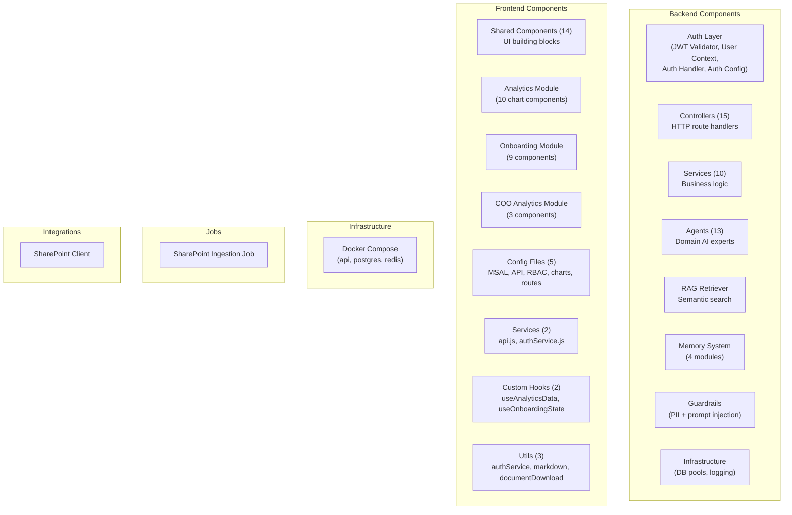

# Component Inventory — AA-Hackathon Enterprise AI Platform

**Organization:** Aligned Automation  
**Platform:** AA-Hackathon Enterprise Assistant  
**Document Date:** 2026-06-07  
**Version:** 1.0  

---

## Component Hierarchy

---

## Backend Components

### Auth Layer

| Component | File | Type | Purpose | Owner |
|---|---|---|---|---|
| Auth Handler | `app/api/auth/auth_handler.py` | FastAPI Dependency | Extracts and validates JWT from Authorization header. Builds UserContext. | Platform Team |
| JWT Validator | `app/api/auth/jwt_validator.py` | Service | Validates Azure AD JWT: signature (JWKS), expiry, audience, issuer. | Platform Team |
| User Context | `app/api/auth/user_context.py` | Pydantic Model | Authenticated user data: employee_id, email, roles, department. | Platform Team |
| Auth Config | `app/api/auth/auth_config.py` | Config | Azure AD tenant_id, client_id, JWKS URL, authority. From env vars. | Platform Team |

**Health Status:** Operational. JWKS caching in place. Token validation latency <10ms.

---

### Controllers

| Component | File | Method Count | Auth | Owner |
|---|---|---|---|---|
| Chat Controller | `app/api/controllers/chat_controller.py` | 2 (POST /chat, POST /chat/stream) | Yes | Backend Team |
| Conversations Controller | `app/api/controllers/conversations_controller.py` | 4 (GET, POST, PUT/{id}, DELETE/{id}) | Yes | Backend Team |
| Messages Controller | `app/api/controllers/messages_controller.py` | 4 (GET, POST/regenerate, POST/stop, POST/cite) | Yes | Backend Team |
| Feedback Controller | `app/api/controllers/feedback_controller.py` | 4 (POST, GET, PUT/{id}, GET/admin) | Yes | Backend Team |
| Escalations Controller | `app/api/controllers/escalations_controller.py` | 4 (POST, GET, GET/{id}, GET/admin) | Yes | Backend Team |
| Attendance Controller | `app/api/controllers/attendance_controller.py` | 2 (GET, GET/reportee) | Yes | Backend Team |
| Profile Controller | `app/api/controllers/profile_controller.py` | 1 (GET) | Yes | Backend Team |
| Documents Controller | `app/api/controllers/documents_controller.py` | 2 (GET, POST/generate) | Yes | Backend Team |
| Email Controller | `app/api/controllers/email_controller.py` | 1 (POST /from-chat) | Yes | Backend Team |
| Forms Controller | `app/api/controllers/forms_controller.py` | 1 (POST /create) | Yes | Backend Team |
| Allocation Controller | `app/api/controllers/allocation_controller.py` | 2 (GET, PUT/{id}) | Yes (PUT: admin) | Backend Team |
| PII Controller | `app/api/controllers/pii_controller.py` | 1 (GET) | Yes (admin) | Security Team |
| COO Analytics Controller | `app/api/controllers/coo_analytics_controller.py` | 1 (GET /metrics) | Yes (coo/super_admin) | Analytics Team |
| Health Controller | `app/api/controllers/health_controller.py` | 1 (GET) | No | Platform Team |
| Debug Controller | `app/api/controllers/debug_controller.py` | 1 (GET /config) | Yes (super_admin) | Platform Team |
| Onboarding Controller | `app/api/controllers/onboarding.py` | 2 (GET /steps, PUT /steps/{id}) | Yes | Backend Team |

**Total Controllers:** 16 route files, 33 endpoints

---

### Services

| Component | File | Purpose | Dependencies | Owner |
|---|---|---|---|---|
| Conversation Service | `app/api/services/conversation_service.py` | Conversation CRUD, title generation | PostgreSQL | Backend Team |
| Message Service | `app/api/services/message_service.py` | Message persistence, regeneration logic | PostgreSQL | Backend Team |
| Escalation Service | `app/api/services/escalation_service.py` | Escalation lifecycle, SLA computation | PostgreSQL | Backend Team |
| Feedback Service | `app/api/services/feedback_service.py` | Feedback storage, rating aggregation | PostgreSQL | Analytics Team |
| Document Service | `app/api/services/document_service.py` | Document generation orchestration | Document Agent | Backend Team |
| Analytics Service | `app/api/services/analytics_service.py` | Analytics aggregation queries | PostgreSQL | Analytics Team |
| PII Service | `app/api/services/pii_service.py` | PII detection, event logging | PostgreSQL | Security Team |
| SharePoint Service | `app/api/services/sharepoint_service.py` | SharePoint API calls | integrations/sharepoint/client.py | Integration Team |
| Zoho Service | `app/api/services/zoho_service.py` | Zoho People data access | Zoho DB (read-only PostgreSQL) | Integration Team |
| Memory Service | `app/api/services/memory_service.py` | Memory read/write interface | memory/ module | ML Platform Team |

---

### Agents (13)

| Agent | File | Domain | RAG | Live Data | RBAC Gate | Owner |
|---|---|---|---|---|---|---|
| HR Agent | `app/agents/` | Human Resources | Yes | Yes (Zoho) | employee+ | HR Team |
| IT Agent | `app/agents/` | Information Technology | Yes | No | employee+ | IT Team |
| Admin Agent | `app/agents/` | Administration | Yes | No | employee+ | Admin Team |
| PMO Agent | `app/agents/` | Project Management | Yes | No | employee+ | PMO Team |
| Finance Agent | `app/agents/` | Finance & Payroll | Yes | Yes (Zoho) | employee+ | Finance Team |
| Org Agent | `app/agents/org_agent.py` | Organization & Directory | No | Yes (Zoho) | employee+ | Platform Team |
| Employee Agent | `app/agents/employee/` | Employee Self-Service | Yes | Yes (Zoho) | employee+ | HR Team |
| Attendance Agent | `app/agents/` | Time & Attendance | No | Yes (Zoho) | employee+ | HR Team |
| Document Agent | `app/agents/document_agent.py` | Document Generation | No | Yes (employee context) | employee+ | Platform Team |
| Email Agent | `app/agents/email_agent.py` | Email Drafting | No | No | employee+ | Platform Team |
| Escalation Agent | `app/agents/escalation_agent.py` | Escalation Management | No | Yes (PostgreSQL) | employee+ | Platform Team |
| Quick Agent | `app/agents/` | Fast Responses | No | No | employee+ | Platform Team |
| Funny Agent | `app/agents/` | Humor / Personality | No | No | employee+ | Platform Team |

**Total Agents:** 13 operational

---

### RAG Component

| Component | File | Purpose | Dependencies | Owner |
|---|---|---|---|---|
| RAG Retriever | `app/rag/retriever.py` | pgvector cosine similarity search, FAISS fallback, chunk assembly, citation extraction | PostgreSQL, FAISS, HuggingFace sentence_transformers | ML Platform Team |

**Key Parameters:**
- Embedding model: `all-MiniLM-L6-v2` (384 dimensions)
- Similarity metric: cosine similarity (`<=>` operator in pgvector)
- Default top_k: 5 (after similarity threshold filter)
- Similarity threshold: configurable (default ~0.5)
- FAISS index type: Flat (brute force, rebuilt at startup)

---

### Memory System

| Component | File | Purpose | Owner |
|---|---|---|---|
| Memory Client | `app/memory/client.py` | Public interface to memory system. get_context(), set_context(), clear_context(). | ML Platform Team |
| Complexity Scorer | `app/memory/complexity.py` | Determines if query needs long-context retrieval vs. short-context. Score 0–1. | ML Platform Team |
| MD Store | `app/memory/md_store.py` | In-session markdown structured notes. Built from conversation turns. | ML Platform Team |
| DB Tool | `app/memory/db_tool.py` | Persists memory fragments to PostgreSQL for cross-session recall. | ML Platform Team |
| Enrichment | `app/memory/enrichment.py` | Enriches memory context with user role, department, and profile data. | ML Platform Team |

---

### Guardrails

| Component | File | Purpose | Owner |
|---|---|---|---|
| PII Detector | (inline, `app/api/services/pii_service.py`) | Regex + NER-based PII detection in incoming messages. | Security Team |
| Prompt Injection Guard | (inline, agent processing) | Detects common prompt injection patterns. Sanitizes user input before LLM. | Security Team |

**Health Status:** Operational. PII detection logging active. Auto-redaction not yet applied to responses (Phase 1 debt).

---

### Infrastructure Components

| Component | File | Purpose | Owner |
|---|---|---|---|
| DB Config (sync) | `app/api/config/db_config.py` | psycopg2 ThreadedConnectionPool(1, 8) | Platform Team |
| DB Config (async) | `app/api/config/async_db_config.py` | asyncpg pool for non-blocking DB calls | Platform Team |
| Logging Config | `app/utils/logging_config.py` | Python logging setup. Level from env. | Platform Team |

---

## Frontend Components

### Shared Components (14)

| Component | File | Purpose | Tests |
|---|---|---|---|
| ChatWindow | `components/ChatWindow.jsx` | Main chat UI, SSE consumer, message state | Partial |
| MessageList | `components/MessageList.jsx` | Message rendering, scroll-to-bottom | Partial |
| MessageItem | `components/MessageItem.jsx` | Individual message bubble with markdown | Partial |
| ConversationList | `components/ConversationList.jsx` | Sidebar conversation list, CRUD UI | None |
| ChatInput | `components/ChatInput.jsx` | Text input, send, char limit | Partial |
| FeedbackModal | `components/FeedbackModal.jsx` | 5-star rating + comment modal | None |
| EscalationPanel | `components/EscalationPanel.jsx` | Escalation create/list UI | None |
| ProfileCard | `components/ProfileCard.jsx` | User profile display | None |
| AllocationBoard | `components/AllocationBoard.jsx` | Resource allocation table | None |
| PersonalNotes | `components/PersonalNotes.jsx` | Notes editor with auto-save | None |
| DocumentPanel | `components/DocumentPanel.jsx` | Document generation UI | None |
| Sidebar | `components/Sidebar.jsx` | Navigation with RBAC-aware links | None |
| Header | `components/Header.jsx` | Top bar, avatar, logout | None |
| LoadingSpinner | `components/LoadingSpinner.jsx` | Reusable spinner | None |

---

### Analytics Module (10 components)

| Component | Chart Type | Data Source |
|---|---|---|
| AnalyticsDashboard | Layout | GET /api/analytics/overview |
| QueryVolumeChart | Line | queries_by_day |
| AgentDistributionChart | Pie | agent_routing_counts |
| FeedbackScoreChart | Bar | avg_rating_by_agent |
| TopQueriesTable | Table | top_query_topics |
| ResponseTimeChart | Line | p50_p95_by_day |
| EscalationTrendChart | Bar | escalations_by_week_priority |
| ActiveUsersChart | Area | daily_active_users |
| RagHitRateChart | Line | rag_hit_rate_by_day |
| useAnalyticsData (hook) | — | Fetches + caches analytics data |

---

### Onboarding Module (9 components)

| Component | Purpose |
|---|---|
| OnboardingPortal | Main layout |
| StepList | Ordered step list |
| StepDetail | Step instructions and resources |
| ProgressBar | X of Y steps complete |
| ResourceLink | SharePoint external links |
| ChecklistItem | Per-step checklist with completion state |
| WelcomeCard | Personalized welcome |
| TaskCard | Task due date and status |
| useOnboardingState (hook) | Fetches/manages step state via API |

---

### COO Analytics Module (3 components)

| Component | Purpose |
|---|---|
| COODashboard | Executive layout, coo/super_admin gate |
| DepartmentHeatmap | Query volume heatmap by department × day |
| MetricsSummary | KPI cards: queries, users, escalations, latency |

---

### Config Files (5)

| File | Purpose |
|---|---|
| `config/msalConfig.js` | MSAL configuration |
| `config/apiConfig.js` | API base URL, Axios instance |
| `config/userConfig.js` | RBAC role hierarchy and helper functions |
| `config/chartConfig.js` | Recharts theme (colors, fonts) |
| `config/routeConfig.js` | React Router routes + RBAC guards |

---

### Services (2)

| File | Purpose |
|---|---|
| `services/api.js` | Axios wrapper with auth header injection and error handling |
| `services/authService.js` | MSAL token acquisition helpers. acquireTokenSilent, acquireTokenPopup. |

---

### Utils (3)

| File | Purpose |
|---|---|
| `utils/authService.js` | User role resolution from MSAL account claims |
| `utils/markdown.js` | Markdown-to-HTML renderer using marked.js. Sanitized output. |
| `utils/documentDownload.js` | jsPDF 4.2.1 document generation. PDF download from base64 content. |

---

## Infrastructure Components

| Service | Image | Port | Volume | Health Check |
|---|---|---|---|---|
| api | Custom Python 3.11 | 8000 | `./apps/api-gateway:/app` | GET /api/health |
| postgres | postgres:16 | 5432 | `pgdata:/var/lib/postgresql/data` | `pg_isready` |
| redis | redis:7-alpine | 6379 | None | `redis-cli ping` |

---

## Job Components

| Component | File | Schedule | Owner |
|---|---|---|---|
| SharePoint Ingestion | `apps/jobs/sharepoint_ingestion/main.py` | Manual / ad-hoc cron | Integration Team |

---

## Integration Components

| Component | File | Auth Method | Access | Owner |
|---|---|---|---|---|
| SharePoint Client | `integrations/sharepoint/client.py` | Azure AD client_credentials | Read (document libraries) | Integration Team |

---

## Component Ownership Matrix

| Team | Owns |
|---|---|
| Platform Team | API Gateway core, Auth, DB Config, Logging, Health, Debug, Guardrails, Docker Compose |
| Backend Team | All controllers, Conversation/Message/Escalation/Feedback/Document services |
| ML Platform Team | Agents (all 13), RAG Retriever, Memory System, Embedding model |
| Security Team | JWT Validator, PII Service, PII Controller, Guardrails |
| Integration Team | SharePoint Client, SharePoint Ingestion Job, Zoho Service, SharePoint Service |
| Analytics Team | Feedback Service, Analytics Service, Analytics Module, COO Analytics Module |
| Frontend Team | All React components, Config files, Services, Utils, Hooks |
